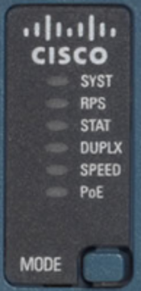
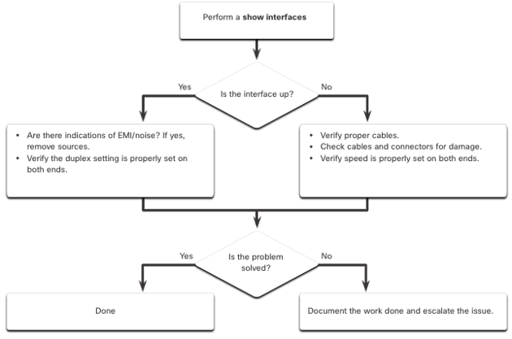
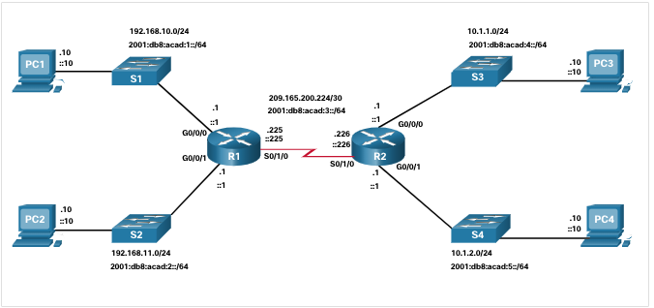

<style>
img[alt~="center"] {
  display: block;
  margin: 0 auto;
}
</style>

<style scoped>
h1 {
  font-size: 80px;
}
</style>

<!-- _class: invert -->

<!-- _paginate: false -->

# Basic Device Configuration

<!-- _footer: CCNA2v7 Module 1\nPedro Durán -->

---
<!-- _header: "Configure a Switch with Initial Settings" -->

# Switch Boot Sequence

1. **Loads a POST** (power-on self-test) program stored in ROM. Checks CPU, DRAM, flash
2. **Loads the boot loader** software (stored in ROM)
3. Boot loader performs **low-level CPU initialization** (CPU registers)
4. Boot loader **initializes the flash file system**
5. Boot loader locates and **loads a default IOS**
   - BOOT variable set in `startup-config` -> `flash:/config.text`
     - Loads that IOS. To set an IOS:
   `S1(config)# boot system flash:/folder/iosfile.bin`
   - BOOT variable not set:
     - Attempts to load the 1st executable file it can find


---

<!-- _header: "Configure a Switch with Initial Settings" -->

# Switch LED Indicators




* ⚠️ The **MODE** button is used to move between the different modes – STAT, DUPLX, SPEED, and PoE
* **SYST** (System): 🟢 Power and functioning properly. 
* **RPS** (Redundant Power Supply):
  - ⚫: No RPS
  - 🟢: RPS ready
  - 🟢 🟢 🟢: RPS up but not available
  - 🟠: RPS Standby or fault
  - 🟠 🟠 🟠: Internal PS fault. RPS providing power

---

<!-- _header: "Configure a Switch with Initial Settings" -->

# Switch LED Indicators


* **STAT** (Port Status): 🟢 Selected mode
  - ⚫: No link or shutdown
  - 🟢: Link Up
  - 🟢 🟢 🟢: Activity
  - 🟠 / 🟠 🟠 🟠: Port blocked preventing loop
  - 🟢 🟠 🟢 🟠: Link fault

> Port status can then be understood by the light associated with each port.

---

<!-- _header: "Configure a Switch with Initial Settings" -->

# Switch LED Indicators


* **DUPLX** (Port Duplex): 🟢 Selected mode
  - ⚫: Half-duplex
  - 🟢: Full-duplex
  
* **SPEED** (Port Speed): 🟢 Selected mode
  - ⚫: 10 Mbps
  - 🟢: 100 Mbps
  - 🟢 🟢 🟢: 1000 Mbps (1 Gbps)

> Port duplex and speed can then be understood by the light associated with each port.

---

<!-- _header: "Configure a Switch with Initial Settings" -->

# Switch LED Indicators


* **PoE** (Power over Ethernet LED):
  - ⚫: PoE off
  - 🟢: PoE on
  - 🟠: PoE disabled
  - 🟠 🟠 🟠: PoE off due to fault
  - 🟢 🟠 🟢 🟠: PoE denied (over budget)

---

<!-- _header: "Configure a Switch with Initial Settings" -->

# Recovery from a System Crash

1. **Connect a PC by console cable to the switch console port using PuTTY**.
2. **Unplug the switch power cord**.
3. **Reconnect the power** cord to the switch and, **within 15 seconds**, **press and hold down the Mode button** while the System LED is still flashing green (🟢 🟢 🟢).
4. **Continue pressing the Mode button** until the System LED turns briefly amber (🟠) and then **solid green** (🟢); then **release the Mode button.**
5. The boot loader `switch:` prompt appears in PuTTY on the PC.
> The boot loader command line supports commands to format the flash file system, reinstall the operating system software, and recover a lost or forgotten password.

---

<!-- _header: "Configure a Switch with Initial Settings" -->

# Switch Management Access
1. **Configure the Management Interface**
   - **VLAN 1** or **VLAN 99** for security purposes
2. **Configure the Default Gateway**
3. **Verify Configuration**
```
S1# configure terminal
S1(config)# interface vlan 99
S1(config-if)# ip address 172.17.99.11 255.255.255.0
S1(config-if)# ipv6 address 2001:db8:acad:99::1/64
S1(config-if)# no shutdown
S1(config-if)# exit
S1(config)# ip default-gateway 172.17.99.1
S1(config)# exit
S1# show ip interface brief
S1# show ipv6 interface brief
```
---

<!-- _header: "Configure Switch Ports" -->

# Duplex Communication

```
S1# configure terminal
S1(config)# interface f0/1
S1(config-if)# duplex full
S1(config-if)# speed 100
```

# Auto-MDIX

Automatic Medium-Dependent Interface Crossover. **Enabled by default Cisco 2960+**

```
S1# configure terminal
S1(config)# interface f0/1
S1(config-if)# duplex auto
S1(config-if)# speed auto
S1(config-if)# mdix auto
```

---

# Switch Verification Commands

```
S1# show interfaces [interface-id]
S1# show startup-config
S1# show running-config
S1# show flash
S1# show version
S1# show history
S1# show ip interface [interface-id]
S1# show ipv6 interface [interface-id]
S1# show mac-address-table
S1# show mac address-table
```
---
<!-- _header: "Configure Switch Ports" -->

# Troubleshooting Network Access Layer Issues



---

<!-- _header: "Secure Remote Access" -->

# Configure SSH Remote Access

```
S1# show ip ssh
S1# configure terminal
S1(config)# ip ssh version 2
S1(config)# ip domain-name cisco.com
S1(config)# crypto key generate rsa
S1(config)# username admin secret ccna
S1(config)# line vty 0 15
S1(config-line)# transport input ssh
S1(config-line)# login local
```

Delete RSA key pairs
```
S1(config)# crypto key zeroize rsa
```

---

<!-- _header: "Basic Router Configuration" -->

# Configure Basic Router Settings

```
Router# configure terminal
Router(config)# hostname R1
R1(config)# enable secret class
R1(config)# line console 0
R1(config-line)# password cisco
R1(config-line)# login
R1(config-line)# line vty 0 4
R1(config-line)# password cisco
R1(config-line)# login
R1(config-line)# exit
R1(config)# service password-encryption
R1(config)# banner motd $Authorized Access Only!$
R1(config)# do wr
```

---

<!-- _header: "Basic Router Configuration" -->

# Dual Stack Topology - Configure Router Interfaces


```
R1(config)# interface g0/0/0
R1(config-if)# description Link to LAN 1
R1(config-if)# ip address 192.168.10.1 255.255.255.0
R1(config-if)# ipv6 address 2001:db8:acad:1::1/64
R1(config-if)# no shutdown
```

---

# Router Verification Commands

```
R1# show ip interface brief
R1# show ipv6 interface brief
R1# show running-config interface interface-id
R1# show interfaces
R1# show ip interface
R1# show ipv6 interface
R1# show ip route
R1# show ipv6 route
R1# show history
```