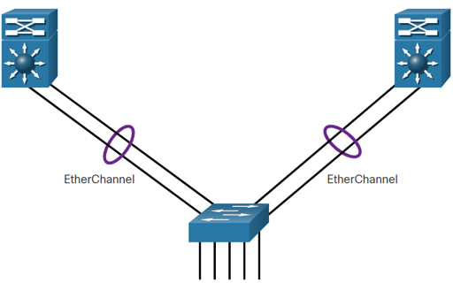
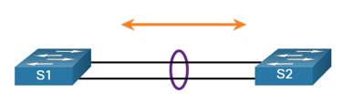

<!-- _class: invert -->

<!-- _paginate: false -->

# EtherChannel

<!-- _footer: CCNA2v7 Module 6 EtherChannel\nPedro Durán -->

---

# Link Aggregation

**EtherChannel**: Link aggregation technology that groups multiple physical Ethernet links together into one single logical link. Provides:
- Fault-tolerance
- Load sharing
- Increase bandwith
- Redundancy between switches, routers and servers

**Port channel**: virtual interface that bundles together physical interfaces into one logical link.

---

# Advantages
- Configuration consistency throughout the links (same config).
- No need to upgrade the link to have more bandwith.
- Load balancing between links
- Provides redundancy (one physical link failing does not create a change in topology).
# Restrictions
- Interface types cannot be mixed (FastEthernet <> GigabitEthernet).
- Up to 8 Ethernet ports (800 Mbps or 8 Gbps). Cisco 2960 up to 6 EtherChannels
- Individual EtherChannel group member port config must be consistent om both sides (L2 ports, if it's a trunk -> same native VLAN)

---

# AutoNegation Protocols
- **Port Aggregation Protocol (PAgP)**:
  - Cisco propietary. PAgP packets sent every 30 seconds. 
  - All EtherChannel Ports: Same config (speed, duplex, VLAN info)
- **Link Aggregation Control Protocol (LACP)**
  - IEEE specification (802.3ad)
  - Multivendor Environments

---

# PAgP-LACP Mode Settings

| S1 | S2 | Channel Establishment |
|----|----|-----------------------|
| On | On | **Yes** |
| On | Desirable/Auto / Active/Passive | **No** |
| Desirable / Active | Desirable / Active | **Yes** |
| Desirable / Active | Auto / Passive | **Yes**  |
| Auto / Passive | Desirable / Active | **Yes**  |
| Auto / Passive | Auto / Passive | **No** |

---

