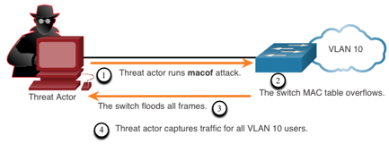
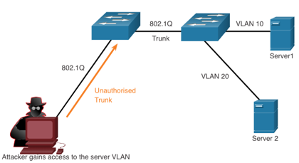

<!-- _class: invert -->

<!-- _paginate: false -->

# LAN Security Concepts

<!-- _footer: CCNA2v7 Module 10 LAN Security Concepts\nPedro Durán -->

---

# Networks Attacks
- **Distributed Denial of Service (DDoS)**
- **Data Breach**
- **Malware** (e.g. WannaCry)

# Network Security Devices
- **Virtual Private Network (VPN) enabled router**: Can be integrated into firewall.
- **Next-Generation Firewall (NGFW)**: stateful packet inspection, application visibility and control, Next-Generation IPS (NGIPS), advanced malware protection (AMP), and URL filtering.
- **Network Access Control (NAC)**: Includes AAA services. Cisco ISE (Indentity Services Engine)

---

# Endpoint Protection

- Best protected with combination of: NAC + AMP + ESA + WSA
  - **Cisco ESA** (Email Security Appliance): monitors SMTP
  - **Cisco WSA** (Web Security Appliance): advanced malware protection (AMP), application visibility and control, acceptable use policy controls, and reporting.

---

# Access Control - AAA Components
- **Authentication**: **who is permitted to access** a network
  - **Local Authentication:** SSH in Cisco Routers. Small networks.
  - **Server-Based Authentication:** router accesses (via **RADIUS** or **TACACS+** protocols) a central AAA server that contains usernames and passwords for all users
- **Authorization**: **what they can do** while they are there. Uses a set of attributes that describe the user's access to the network.
- **Accounting**: **audit what actions they performed** while accessing the network. Collects and reports usage.

---

# Access Control - 802.1X
 - Port-based access control and authentication protocol.
 - Restricts unauthorized workstations from connecting to a LAN throught publicly accessible switch ports.

 ## 802.1x Roles:
 - **Client (Supplicant)**: Requires access and responds to request from switch
 - **Switch (Authenticator)**: Controls physical access to the network based on client authentication status
 - **Authentication Server**: Performs client authentication.

---

# Layer 2 Vulnerabilities - Switch Attack Categories

- **MAC Table Attacks**: MAC address flooding attacks
- **VLAN Attacks**: VLAN hopping and VLAN double-tagging attacks
- **DHCP Attacks**: DHCP starvation and DHCP spoofing attacks
- **ARP Attacks**: ARP spoofing and ARP poisoning attacks
- **Address Spoofing Attacks**: MAC address and IP address spoofing attacks
- **STP Attacks**: Spanning Tree Protocol manipulation atacks

---

# Layer 2 Vulnerabilities - Switch Attack Mitigation

- **Port Security**: Prevents MAC address flooding and DHCP starvation attacks
- **DHCP Snooping**: Prevents DHCP starvation and DHCP spoofing attacks
- **Dynamic ARP Inspection (DAI)**: Prevents ARP spoofing and ARP poisoning attacks
- **IP Source Guard**: Prevents MAC and IP address spoofing attacks

> Also recommended:
> SSH, SCP, SFTP, SSL/TLS, dedicated management VLAN, ACLs

---

# MAC Address Table Flooding Attack

---

# VLAN Hopping Attacks

---

# VLAN Double-Tagging Attacks

---

# DHCP Attacks

---

# ARP Attacks

---

# Address Spoofing Attacks

---

# STP Attack

---

# CDP Reconnaissance Attack

---