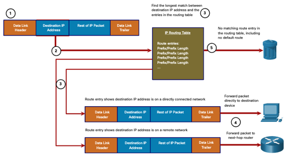

<style>
img[alt~="center"] {
  display: block;
  margin: 0 auto;
}
</style>

<style scoped>
h1 {
  font-size: 80px;
}
</style>

<!-- _class: invert -->

<!-- _paginate: false -->

# Routing Concepts

<!-- _footer: CCNA2v7 Module 14 Routing Concepts\nPedro Durán -->

---

# Functions of a Router and Longest Match
1. **Determine the best path** to forward packets based on the information in its **routing table**.
2. **Forward packets** towards their destination.

**Best Path** = **Longest Match** =  Routing table entry that has the **greatest number of far-left matching bits with the destination IP address** of the packet.

> Destination IPv4 Address: 172.16.0.10
> Route entries:
> 1. 172.16.0.0/12
> 2. 172.16.0.0/18
> 3. **172.16.0.0/26 ⬅ Longest Match**

---

# Routing Table

- **Directly Connected**: Local interface configured with an IP address and subnet mask and is active (up/up)
- **Remote networks** Networks not directly connected to the router.
  - **Static routes**: route manually configured
  - **Dynamic routing protocols**: routing protocols dynamically learn routes
- **Default route**: next-hop router when routing table does not contain a matching
  - /0 prefix length
  - Also known as **gateway of last resort**

---

# Packet Forwarding Decision Process



---

# Packet Forwarding Mechanisms
1. **Process switching**
  - Packet arrives on interface ➡ forwarded to control plane ➡ CPU matches destination address in routing table ➡ forwards to exit interface
2. **Fast switching**
  - Uses fast-switching cache to store next-hop information ➡ cache re-used without CPU intervention
3. **Cisco Express Forwarding (CEF)**
  - Default Cisco IOS forwarding mechanism
  - CEF builds a Forwarding Information Base (FIB) and adjacency table.
  - Table entries are change-triggered.

---

# Route Sources

- **`C`**: directly connected network
- **`L`**: address assigned to a router interface (IPv4 /32, IPv6 /128)
- **`S`**: static route
  - small networks not expected to grow significantly
  - path to any network that does not have a more specific match with another route in the routing table
  - routes to and from stub networks.
- **`O`**: dynamically learnt network using OSPF
- **`*`**:  candidate for default route. 0.0.0.0/0 or ::/0

---

# Route Table Entries

1. Route source
2. Destination network
3. Administrative distance
4. Metric
5. Next-hop
6. Route timestamp
7. Exit interface


---

# Structure of an IPv4 Routing Table

```
Parent route (Classful network address of this subnet)
   Child route (Indented, Route source and all the forwarding info)
```

Example:
```
Router# show ip route 
(Output omitted) 
   192.168.1.0/24 is variably..
C    192.168.1.0/24 is direct..
L    192.168.1.1/32 is direct..
O    192.168.2.0/24 [110/65]..
O    192.168.3.0/24 [110/65]..
   192.168.13.0/24 is variably..
C    192.168.13.0/30 is direct..
L    192.168.13.1/32 is direct..
   192.168.23.0/30 is subnette..
O    192.168.23.0/30 [110/128]..
```
---

# Administrative distance


