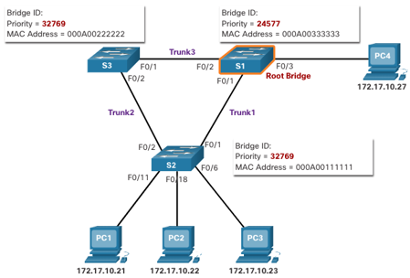
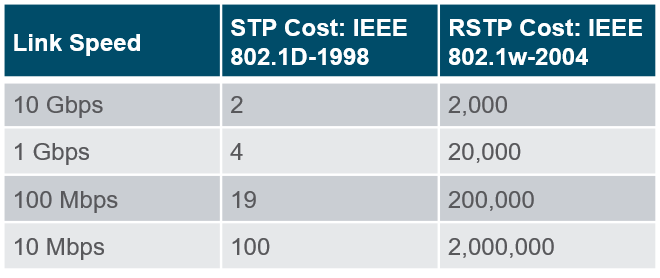
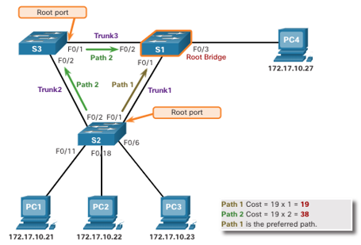
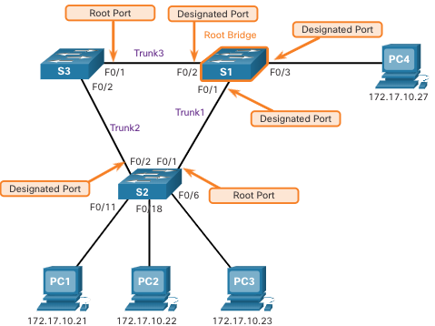
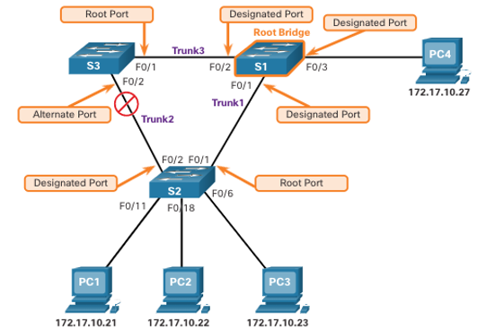
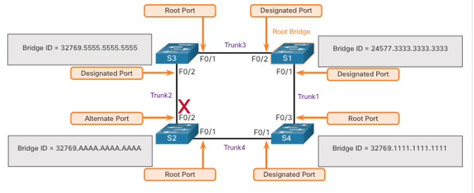
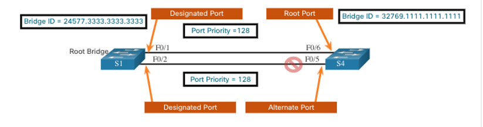
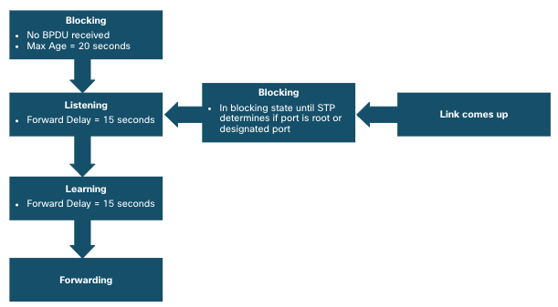
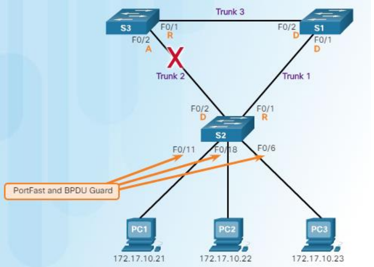
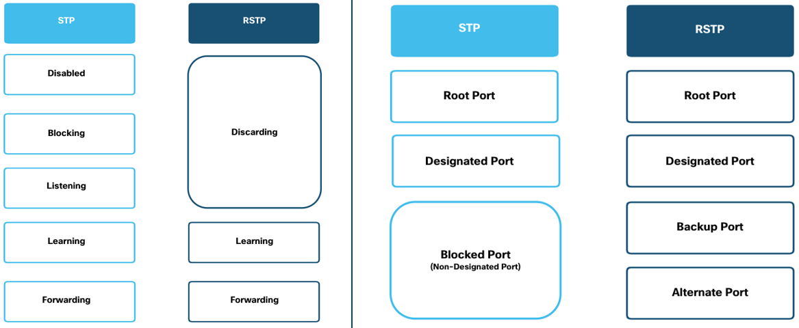

<style>
img[alt~="center"] {
  display: block;
  margin: 0 auto;
}
</style>

<style scoped>
h1 {
  font-size: 80px;
}
</style>

<!-- _class: invert -->

<!-- _paginate: false -->

# Spanning Tree Protocol (STP)

<!-- _footer: CCNA2v7 Module 5 STP Concepts + CCNA3v6 Chapter 3 STP\nPedro Durán -->

---

# Redundancy in Layer 2 Switched Networks
- **Redundancy** ➡️ eliminating **single points of failure**.
- **Path redundancy** ➡️ physical and logical **Layer 2 loops** (frame has not TTL) ➡️ 🔥
- **STP logically blocks physical loops**, preventing frames circling the network forever.
- STP compensates for a failure by recalculating and opening up previously blocked ports.
- **STA: Spanning Tree Algorithm**
  - Creates a loop-free topology by selecting a single root bridge where all the other switches determine a single least-cost path, blocking redudant paths and recalculating in case of Link Failure.

- **⚠️ STP enabled by default!!!**

---

# STP

- **Problems solved:**
  - **MAC database instability**: MAC address table constantly changing from the broadcast frames -> High CPU -> Switch unable to forward frames
  - **Broadcast Storm**: high number of broadcasts overwhelming the network 🔥
  - **Duplicated unicast frames:** devices receive twice the same frame from different paths.
- **Usages:**
  - **Solves L2 looping problems**
  - **Provides alternative paths in case of failure**
  - **Provides VLAN Load Balancing between trunks**

---

# STP Step #1 - Elect the Root Bridge (RB)
- STA designates a single switch as root bridge
- **Root Bridge = Switch with the lowest BID (Bridge ID)**
- **BID  = (Bridge Priority + VLAN ID) . Bridge MAC**
  - **Bridge Priority = 32768** (default). Range: 0...61440 (increments of 4096)
    - **⚠️ Can be changed to elect another root bridge**
  - **VLAN ID = Extended System ID**
  - **Bridge ID = Switch MAC Address**

> Example:
> S1 BID: `32768.00A0.1101.V001`
> S2 BID: `32768.00A0.FF01.6689`
> S3 BID: `32767.0010.FF32.991B` ➡️ Lowest BID ➡️ Root Bridge

---

# STP Step #1 - Elect the Root Bridge



---

# STP Step #1 - Changing and verify Root Bridge

**Option 1: Select root bridge manually**
```
S1(config)# spanning-tree VLAN 1 root primary
...
S2(config)# spanning-tree VLAN 1 root secondary
```

**Option 2: Change the priority value**
```
S1(config)# spanning-tree VLAN 1 priority 24576
```

**Verify Bridge ID and Root Bridge election**
```
S1# show spanning-tree
```

---

# STP Step #2 - Elect the Root Ports (RP)

- **EVERY NON-ROOT SWITCH will select one Root Port.**
  - **Root port** (#1, if equals then #2, ...):
    - #1 Port with overall lower cost to the Root Bridge
    - #2 Port with lower Sender Bridge ID
    - #3 Port with lower Sender Port Priority
    - #4 Port with lower Sender Port ID

---

# Root Path Cost

## Defaults



## Modify Cost

```
S1(config)# interface f0/1
S1(config-if)# spanning-tree cost 25
```

---

# STP Step #2 - Elect the Root Ports



---

# STP Step #3 - Elect Designated Ports (DP)

- **EVERY SEGMENT between 2 switches will have one Designated Port.**
  - All ports of Root Bridge ➡️ DP
  - One end of a segment is RP ➡️ Other end is DP
  - All ports attached to end devices ➡️ DP
  - Other segments without DP, one DP (#1, if equals then #2, ...):
    - #1 Port with overall lower cost to the Root Bridge
    - #2 Port with lower Sender Bridge ID
    - #3 Port with lower Sender Port Priority
    - #4 Port with lower Sender Port ID

---

# STP Step #3 - Elect Designated Ports



---

# <!--fit--> STP Step #4 - Elect Alternate/Blocked Ports (ALT/BLK)

- **Block ports that are not RP or DP**



---

# Multiple Equal-Cost Path: Lower Sender BID



> S2: Root Port is F0/1, because S4 has a lower sender BID than S3
> Same cost > Different Sender BID

---

# Multiple Equal-Cost Path: Lower Sender Port ID



> S4: Root Port is F0/6, because S1 F0/1 has a lower sender Port ID than S1 F0/2
> Same cost > Same sender BID > Same Port Priority > Different Sender Port ID

---

# STP Timers and Port States
STP convergence requires 3 timers, defined in Root Bridge (changeable):
- **Hello Timer**: Interval between PDUS. Default = **2 seconds** (range: 1...10 seconds)
- **Forward Delay Timer**: Time that is spent in the listening and learning state. Default = **15 seconds** (range: 4...30 seconds)
- **Max Age Timer**: Maximum length of time that a switch waits before attempting to change the STP Topology. Default = **20 seconds** (range: 6...40 seconds)



---

# Per-VLAN Spanning Tree (PVST)

**A Root Bridge is elected for EACH spanning stree instance/VLAN ➡️ Load Balancing**
- Cisco switches running IOS 15.0+ run PVST+ by default


---

# PVST Config: PortFast and BPDU Guard

- **PortFast**: Ports that have end devices (**Access Ports**). Port in FW state.
- **BPDU Guard**: Disables a PortFast port if a BPDU is received ➡️ Port in errdisabled

```
S2(config)# interface range f0/11,f0/18,f0/6
S2(config-if-range)# spanning-tree portfast
S2(config-if-range)# spanning-tree bpduguard enable
```




---

# Different Versions of STP

- **Common STP (CST/STP/802.1D)**: 1998. 1 instance regardless number of VLANs.
- **Per-VLAN STP (PVST+)**: Cisco enhanced STP. 1 instance per VLAN. PortFast, BPDU Guard.
- **Rapid STP (RSTP/802.1w)**: Evolution of STP that provides faster convergence
- **Rapid PVST+**: Cisco enhanced RSTP. 1 instance per VLAN.
- **Multiple STP (MSTP/802.1s)**: Maps multiple VLANs into the same spanning tree instance.
- **Multiple Spanning Tree (MST)**: Cisco enhanced MSTP. Provides up to 16 instances of RSTP.

---

# RSTP
- **Alternate Port** (alternate path to the Root Bridge) ➡️ change to forwarding state without waiting the network to converge.
- **Backup Port**: backup to a shared medium (Hub). Less common!!

