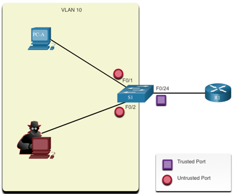

<style>
img[alt~="center"] {
  display: block;
  margin: 0 auto;
}
</style>

<style scoped>
h1 {
  font-size: 80px;
}
</style>

<!-- _class: invert -->

<!-- _paginate: false -->

# Switch Security Configuration

<!-- _footer: CCNA2v7 Module 11\nPedro Durán -->

---

# Implement Port Security

- ⚠ **Secure all unused ports on a switch**
```
S1(config)# interface range f0/10-f0/24
S1(config-if)# shutdown
```

- ⚠ **Enable port security**
  - Limits the number of valid MAC addresses allowed on a port):
    - Manually configured
    - Dynamically learnt
```
S1(config)# interface f0/1
S1(config-if)# switchport mode access
S1(config-if)# switchport port-security
S1(config-if)# do show port-security interface f0/1
```
---

# Limit and Learn MAC Addresses

Set the maximum number of MAC addresses allowed on a port (default: 1):
```
S1(config-if)# switchport port-security maximum 4
```

**1. Manually Configured**
```
S1(config-if)# switchport port-security mac-address aaaa.bbbb.1234
```

**2. Dynamically Learnt:**
- Current source MAC for the device connected to the port is secured
  - ⚠ NOT added to `running-config`!!!
```
S1(config-if)# switchport port-security
```
---

# Limit and Learn MAC Addresses

**3. Dynamically Learned - Sticky**
- Dynamically learns the MAC address and stick them to `running-config` ➡ `wr`

```
S1(config-if)# switchport port-security mac-address sticky
```

**Example:**
```
S1(config)# interface f0/1
S1(config-if)# switchport mode access
S1(config-if)# switchport port-security maximum 4
S1(config-if)# switchport port-security mac-address aaaa.bbbb.1234
S1(config-if)# switchport port-security mac-address sticky
S1(config-if)# exit
S1# show port-security interface f0/1
S1# show port-security address
```

---

# Port Aging Security

Can be used to set the aging time for static and dynamic secure addresses on a port:
- **Absolute**: deleted after the specified aging time.
```
S1(config)# interface f0/1
S1(config-if)# switchport port-security again time 10
S1(config-if)# switchport port-security again type absolute
```
- **Inactivity**: deleted if they are inactive for a specified time.
```
S1(config)# interface f0/1
S1(config-if)# switchport port-security again time 10
S1(config-if)# switchport port-security again type inactivity
```

---

# Port Security Violation Modes

If a **MAC address** of a device attached to a port **differs from the list of secure addresses** ➡ **port violation** occurs ➡ port enters **error-disabled state**. 3 modes:

- **shutdown** (default): 💥 **error-disabled** inmediately + 🔴 **turns off port LED** + 📩sends **syslog** message + 💦 **increments violation counter**.
**Reenable:** `shutdown` + `no shutdown`

- **restrict**: port drops packets with unknown source addresses until you remove a sufficient number of secure MAC addresses to drop below the max value or increase the max value. 💥 **error-disabled** + 📩 send **syslog** message + 💦 **increments violation counter**

- **protect**: port drops packets with unknown source addresses until you remove a sufficient number of secure MAC addresses to drop below the max value or increase the max value. 💥 **error-disabled** + ⚠ **no syslog message**

---

# Port Security Violation: shutdown mode
```
S1# show interface f0/18
FastEthernet0/18 is down, line protocol is down (err-disabled)

S1# show port-security interface f0/18
Port Security: Enabled
Port Status: Secure-shutdown
Violation Mode: Shutdown
Security Violation Count: 1
...

S1# configure terminal
S1(config)# interface f0/18
S1(config-if)# shutdown
S1(config-if)# no shutdown
```

---

# Port Security Violation: restrict mode

```
S1(config)# interface f0/1
S1(config-if)# switchport port-security violation restrict
S1(config-if)# end

S1# show port-security interface f0/1
Port Security : Enabled
Port Status : Secure-shutdown
Violation Mode : Restrict
Security Violation Count: 1

S1# show port-security
```

---

# VLAN Attacks Mitigation

1. Disable DTP on non-trunking ports: `switchport mode access`
2. Disable unused ports and put them in an unused VLAN
3. Manually enable trunk link: `switchport mode trunk`
4. Disable DTP on trunking ports: `switchport nonegotiate`
5. Set native VLAN to a VLAN other than VLAN 1: `switchport trunk native vlan 999`

```
S1(config)# interface range f0/1-16
S1(config-if-range)# switchport mode access
S1(config-if-range)# interface range f0/17-20
S1(config-if-range)# switchport mode access
S1(config-if-range)# switchport access vlan 1000
S1(config-if-range)# interface range f0/21-24
S1(config-if-range)# switchport mode trunk
S1(config-if-range)# switchport nonegotiate
S1(config-if-range)# switchport trunk native vlan 999
```
---

# DHCP Attacks Mitigation

1. Enable DHCP snooping in global config: `ip dhcp snooping`
2. On trusted ports (port connected to DHCP server): `ip dhcp snooping trust`
3. On untrusted interfaces (access ports), limit DHCP discovery messages received per second: `ip dhcp snooping limit rate 6`
4. Enable DHCP snooping by VLAN in global config: `ip dhcp snooping 5`
```
S1(config)# ip dhcp snooping
S1(config)# interface f0/1
S1(config-if)# ip dhcp snooping trust
S1(config-if)# interface range f0/5-24
S1(config-if-range)# ip dhcp snooping limit rate 6
S1(config-if)# exit
S1(config)# ip dhcp snooping vlan 5,10,50-52
S1(config)# do show ip dhcp snooping
S1(config)# do show ip dhcp snooping binding
```

---

# ARP Attacks Mitigation - Dynamic ARP Inspection

1. Enable DHCP snooping globally
2. Enable DHCP snooping on selected VLANs.
3. Enable DAI on selected VLANs.
4. Configure trusted interfaces for DHCP snooping and ARP inspection.

🟢 **Trusted interfaces:** All uplink ports connected to other switches / routers
🔴 **Untrusted interfaces:** All access switch ports

---

# DAI Configuration Example

```
S1(config)# ip dhcp snooping
S1(config)# ip dhcp snooping vlan 10
S1(config)# ip arp inspection vlan 10
S1(config)# interface f0/24
S1(config-if)# ip dhcp snooping trust
S1(config-if)# ip arp inspection trust
S1(config-if)# exit
S1(config)# ip arp inspection validate src-mac dst-mac ip
```



---

# STP Attacks Mitigation - PortFast and BPDU Guard

- **PortFast**
  - Immediately brings a port to the forwarding state from a blocking state.
  - ⚠ **Apply to all end-user access ports**
  - Enabled on an Interface: `S1(config-if)# spanning-tree portfast`
  - Enabled Globally: `S1(config)# spanning-tree portfast default`
- **BPDU Guard**
  - Immediately error disables a port that receives a BPDU.
  - ⚠ **Apply to all interfaces attached to end devices**
  - Enabled on an Interface: `S1(config-if)# spanning-tree bpduguard enable`
  - Globally: `S1(config)# spanning-tree portfast bpduguard default`

---

# PortFast and BPDU Guard Configuration Example

```
S1(config)# interface f0/1
S1(config-if)# spanning-tree bpduguard enable
S1(config-if)# exit
S1(config)# spanning-tree portfast bpduguard default
S1(config)# end
S1# show spanning-tree summary
...

%PORT_SECURITY-2-PSECURE-VIOLATION: Security violation ocurred, caused by
MAC address 001d.60b3.0aff on port FastEthernet0/1.

S1# show errdisable recovery
S1# configure terminal
S1(config)# errdisable reovery cause psecure-violation
S1(config)# do show errdisable recovery
```