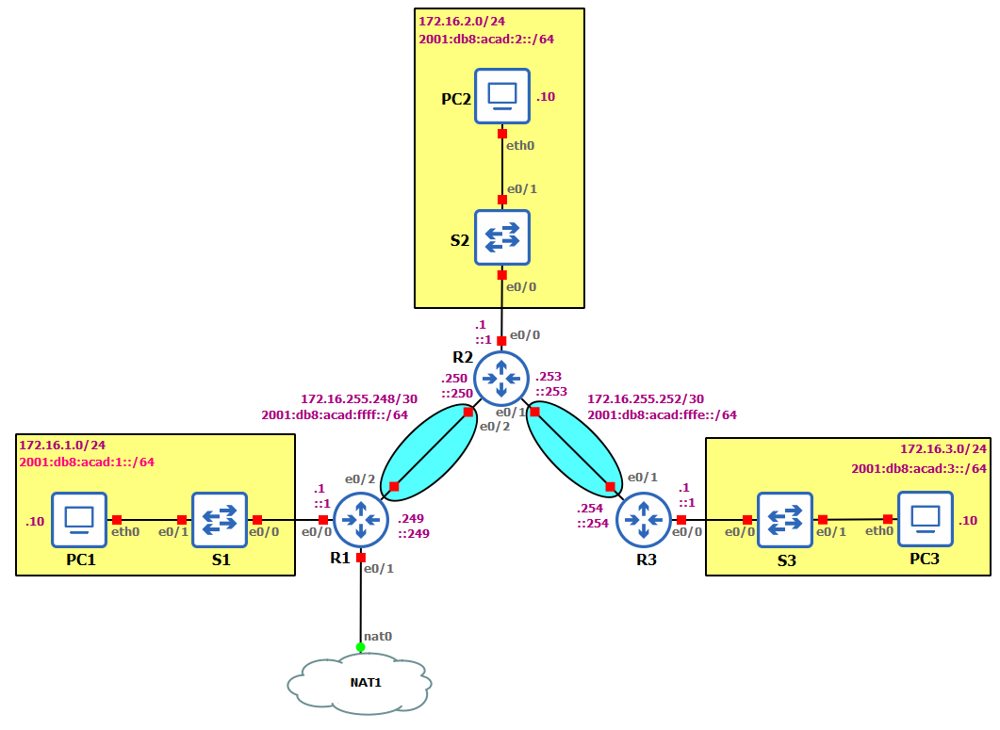

# R1 - Configure IP addresses on connected interfaces
```
R1(config)#int e0/0
R1(config-if)#ip add 172.16.1.1 255.255.255.0
R1(config-if)#ipv6 add 2001:db8:acad:1::1/64
R1(config-if)#no sh

R1(config-if)#int s2/0
R1(config-if)#ip add 172.16.255.249 255.255.255.252
R1(config-if)#ipv6 add 2001:db8:acad:ffff::249/64
R1(config-if)#no sh

R1(config-if)#int e0/1
R1(config-if)#ip add dhcp
R1(config-if)#no sh
```

# R2 - Configure IP addresses on connected interfaces
```
R2(config)#int s2/1
R2(config-if)#ip add 172.16.255.250 255.255.255.252
R2(config-if)#ipv6 add 2001:db8:acad:ffff::250/64
R2(config-if)#no sh


R2(config-if)#int e0/0
R2(config-if)#ip add 172.16.2.1 255.255.255.0
R2(config-if)#ipv6 add 2001:db8:acad:2::1/64
R2(config-if)#no sh

R2(config-if)#int s2/0
R2(config-if)#ip add 172.16.255.253 255.255.255.252
R2(config-if)#ipv6 add 2001:db8:acad:fffe::253/64
R2(config-if)#no sh
```

# R3 - Configure IP addresses on connected interfaces
```
R3(config)#int s2/1
R3(config-if)#ip add 172.16.255.254 255.255.255.252
R3(config-if)#ipv6 add 2001:db8:acad:fffe::254/64
R3(config-if)#no sh

R3(config-if)#int e0/0
R3(config-if)#ip add 172.16.3.1 255.255.255.0
R3(config-if)#ipv6 add 2001:db8:acad:3::1/64
R3(config-if)#no sh
```

# R1 - Configure next-hop static routes
```
R1(config)#ip route 172.16.2.0 255.255.255.0 172.16.255.250 
R1(config)#ip route 172.16.255.252 255.255.255.252 172.16.255.250
R1(config)#ip route 172.16.3.0 255.255.255.0 172.16.255.250

R1(config)#ipv6 unicast-routing
R1(config)#ipv6 route 2001:db8:acad:2::/64 2001:db8:acad:ffff::250 
R1(config)#ipv6 route 2001:db8:acad:fffe::/64 2001:db8:acad:ffff::250
R1(config)#ipv6 route 2001:db8:acad:3::/64 2001:db8:acad:ffff::250  
```

# R1 - Show static routes
```
R1# sh ip route
R1# sh ipv6 route
```

# R2 - Configure directly connected static routes
```
R2#conf t
R2(config)#ip route 172.16.1.0 255.255.255.0 e0/2
R2(config)#ip route 172.16.3.0 255.255.255.0 e0/1

R2(config)#ipv6 unicast-routing 
R2(config)#ipv6 route 2001:db8:acad:1::/64 e0/2 2001:db8:acad:ffff::249
R2(config)#ipv6 route 2001:db8:acad:3::/64 e0/1 2001:db8:acad:fffe::254
```

# R2 - Show static routes
```
R2# sh ip route
R2# sh ipv6 route
```

# R3 - Configure fully specified static routes
```
R3(config)#ip route 172.16.1.0 255.255.255.0 e0/1 172.16.255.253
R3(config)#ip route 172.16.255.248 255.255.255.252 e0/1 172.16.255.253
R3(config)#ip route 172.16.2.0 255.255.255.0 e0/1 172.16.255.253

R3(config)#ipv6 unicast-routing
R3(config)#ipv6 route 2001:db8:acad:1::/64 e0/1 2001:db8:acad:fffe::253
R3(config)#ipv6 route 2001:db8:acad:ffff::/64 e0/1 2001:db8:acad:fffe::253
R3(config)#ipv6 route 2001:db8:acad:2::/64 e0/1 2001:db8:acad:fffe::253
```

# R3 - Show static routes
```
R3# sh ip route
R3# sh ipv6 route
```

# R1 - Enable IPv4 NAT overload
```
R1(config)#int e0/1
R1(config-if)#ip nat outside
R1(config-if)#int range e0/0,e0/2
R1(config-if-range)#ip nat inside
R1(config-if-range)#exit
R1(config)#ip nat inside source list 1 interface e0/1 overload
R1(config)#access-list 1 permit 172.16.1.0 0.0.0.255
R1(config)#access-list 1 permit 172.16.2.0 0.0.0.255
R1(config)#access-list 1 permit 172.16.3.0 0.0.0.255
```


# R2 - Enable default static route (directly connected)
```
R2#conf t
R2(config)#ip route 0.0.0.0 0.0.0.0 e0/2
```


# R3 - Enable default static route (next-hop)
```
R3#conf t
R3(config)#ip route 0.0.0.0 0.0.0.0 172.16.255.253
```

# Ping between PC1, PC2, PC3 (IPv4 and IPv6)
Ping OK between them, and ping OK to 8.8.8.8
```
ping -4 www.google.es
```