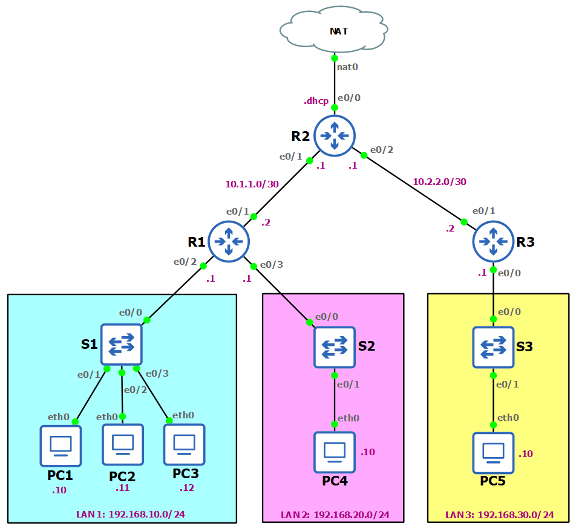

# R1 - Configure interface IP addresses and NAT overload
```
int e0/0
ip address dhcp
ip nat outside
no sh
int e0/1
ip address 10.1.1.1 255.255.255.252
ip nat inside
no sh
int e0/2
ip address 10.2.2.1 255.255.255.252
ip nat inside
no sh
exit
ip nat inside source list 1 interface e0/0 overload
access-list 1 permit 192.168.10.0 0.0.0.255
access-list 1 permit 192.168.20.0 0.0.0.255
access-list 1 permit 192.168.30.0 0.0.0.255
```

# R2 - Configure interface IP addresses
```
int e0/1
ip address 10.1.1.2 255.255.255.252
no sh
int e0/2
ip address 192.168.10.1 255.255.255.0
no sh
int e0/3
ip address 192.168.20.1 255.255.255.0
no sh
```

# R3 - Configure interface IP addresses
```
int e0/0
ip address 192.168.30.1 255.255.255.0
no sh
int e0/1
ip address 10.2.2.2 255.255.255.252
```

# R1 - Configure static routes
```
ip route 0.0.0.0 0.0.0.0 e0/1 10.1.1.1
```

# R2 - Configure static routes
```
ip route 192.168.10.0 255.255.255.0 e0/1 10.1.1.2
ip route 192.168.20.0 255.255.255.0 e0/1 10.1.1.2
ip route 192.168.30.0 255.255.255.0 e0/2 10.2.2.2
```

# R3 - Configure static routes
```
ip route 0.0.0.0 0.0.0.0 e0/1 10.2.2.1
```

# PC1-5: Enable docker persistence and install telnet and ssh
Add this directory list to PC3 > Configure > Advanced > Additional directories to make persistent...

```
/bin
/boot
/dev
/etc
/gns3
/gns3volumes
/home
/lib
/lib64
/root
/sbin
/var
/usr
```

Install telnet and ssh in all PCs:

```
apk update
apk add busybox-extras openssh

```


# Standard Numbered ACL - Denies host PC1 192.168.10.10 but permits all other hosts in LAN 1
```
R1(config)#access-list 20 deny host 192.168.10.10
R1(config)#access-list 20 permit 192.168.10.0 0.0.0.255
R1(config)#int e0/2
R1(config-if)#ip access-group 20 in
```

## Tests:
All pings 🟢 except:
* PC1->PC4,5: 🔴
* PC1->Internet: 🔴

# Standard Named ACL - Permits host PC2 192.168.10.11 but denies all other hosts access to LAN 2

```
R1(config)#ip access-list standard LAN2-FILTER
R1(config-std-nacl)#permit host 192.168.10.11 
R1(config-std-nacl)#deny any
R1(config-std-nacl)#int e0/3
R1(config-if)#ip access-group LAN2-FILTER out
```

## Tests:
All pings to PC4 🔴 except:
* PC2->PC4: 🟢

# Standard Named ACL - Secure R1 VTY Ports to PC3 LAN1 only
```
R1(config)#ip ssh version 2
R1(config)#ip domain name cisco.com
R1(config)#crypto key generate rsa modulus 1024
R1(config)#username admin secret cisco
R1(config)#ip access-list standard ADMIN-HOST
R1(config-std-nacl)#remark This ACL secures incoming vty lines
R1(config-std-nacl)#permit 192.168.10.12
R1(config-std-nacl)#deny any
R1(config-std-nacl)#exit
R1(config)#line vty 0 4
R1(config-line)#transport input ssh
R1(config-line)#login local
R1(config-line)#access-class ADMIN-HOST in
```

## Tests:
* PC3->SSH R1: 🟢
* PC1,2,4,5->SSH R1: 🔴

```
ssh -oKeXAlgorithms=+diffie-hellman-group14-sha1 -oHostKeyAlgorithms=+ssh-rsa -l admin 192.168.10.1
```

# R3 Named Extended ACL - Restrict only http, https and dns to LAN3 (ping not allowed)

```
R3(config)#ip access-list extended PERMIT-LAN3
R3(config-ext-nacl)#permit tcp 192.168.30.0 0.0.0.255 any eq domain
R3(config-ext-nacl)#permit udp 192.168.30.0 0.0.0.255 any eq domain
R3(config-ext-nacl)#permit tcp 192.168.30.0 0.0.0.255 any eq www
R3(config-ext-nacl)#permit tcp 192.168.30.0 0.0.0.255 any eq 443
R3(config-ext-nacl)#deny ip 192.168.30.0 0.0.0.255 any
R3(config-ext-nacl)#int e0/0
R3(config-if)#ip access-group PERMIT-LAN3 in
```
## Tests:
* PC5 ping to 8.8.8.8: 🔴
* PC5 browse www.google.com: 🟢
```
elinks https://www.google.com
```


# R1 Named Extended ACL - Restrict only http, https, dns and ping to PC3 in LAN1

```
R1(config)#ip access-list extended BROWSING-PC3-LAN1
R1(config-ext-nacl)#permit tcp host 192.168.10.12 any eq domain
R1(config-ext-nacl)#permit udp host 192.168.10.12 any eq domain
R1(config-ext-nacl)#permit tcp host 192.168.10.12 any eq www
R1(config-ext-nacl)#permit tcp host 192.168.10.12 any eq 443
R1(config-ext-nacl)#permit tcp host 192.168.10.12 any eq echo
R1(config-ext-nacl)#deny ip 192.168.10.0 0.0.0.255 any
R1(config-ext-nacl)#int e0/2
R1(config-if)#ip access-group BROWSING-PC3-LAN1 in
```

## Tests:
* PC2 browse www.google.com: 🔴
* PC3 browse www.google.com: 🟢
```
elinks https://www.google.com
```