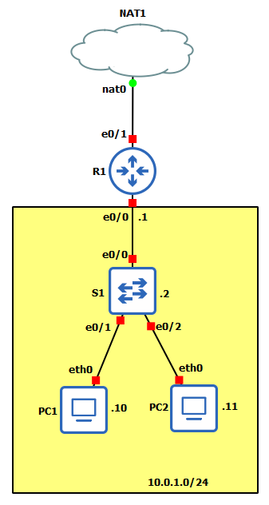

# S1 - Disable unused ports
```
S1(config)#int range e0/3, e1/0-3, e2/0-3, e3/0-3
S1(config-if-range)#sh

S1(config)#vlan 999
S1(config-vlan)#name Parking
S1(config-vlan)#int range e0/3, e1/0-3, e2/0-3, e3/0-3
S1(config-if-range)#switchport mode access
S1(config-if-range)#switchport access vlan 999
```

# S1 - Create VLAN99 and assign access ports
```
S1(config)#vlan 99
S1(config-vlan)#name Management
S1(config-vlan)#int vlan 99
S1(config-if)#ip add 10.0.1.2 255.255.255.0
S1(config-if)#no sh
S1(config-if)#int range e0/0-2
S1(config-if-range)#switchport access vlan 99
```

# R1 - Configure interfaces and enable NAT overload
```
R1(config)#int e0/0
R1(config-if)#ip nat inside
R1(config-if)#ip add 10.0.1.1 255.255.255.0
R1(config-if)#no sh
R1(config-if)#int e0/1
R1(config-if)#ip nat outside
R1(config-if)#ip add dhcp
R1(config-if)#no sh
R1(config-if)#exit
R1(config)#ip nat inside source list 1 int e0/1 overload
R1(config)#access-list 1 permit 10.0.1.0 0.0.0.255
```

# S1 - Enable Telnet access
```
S1(config)#line vty 0
S1(config-line)#password cisco
S1(config-line)#login
S1(config-line)#loggin synchronous
S1(config-line)#exec-timeout 40
S1(config-line)#exit
S1(config)#enable password class
```

# R1 - Enable SSH access
```
R1#show ip ssh
R1#conf t
R1(config)#ip ssh version 2
R1(config)#ip domain name cisco.com
R1(config)#crypto key generate rsa modulus 1024
R1(config)#username admin secret ccna
R1(config)#line vty 0 4 
R1(config-line)#transport input ssh
R1(config-line)#login local
R1(config-line)#exit
R1(config)#enable password class
```

# PC1 - Update packages, install ssh and telnet and connect to S1 and R1
```
apk update
apk add busybox-extras openssh
telnet 10.0.1.2
ssh -oKexAlgorithms=+diffie-hellman-group14-sha1 -oHostKeyAlgorithms=+ssh-rsa -c aes128-ctr -l admin 10.0.1.1
```

# S1 - Show and clear MAC address table. Show port security
```
S1#show mac address-table
S1#clear mac address-table dynamic
S1#show port-security
```

# PC1 - Edit config and change MAC address
```
auto eth0
iface eth0 inet static
	address 10.0.1.10
	netmask 255.255.255.0
	gateway 10.0.1.1
	up echo nameserver 8.8.8.8 > /etc/resolv.conf
	hwaddress ether 00:11:11:11:11:11
```

# PC2 - Edit config and change MAC address
```
auto eth0
iface eth0 inet static
	address 10.0.1.11
	netmask 255.255.255.0
	gateway 10.0.1.1
	up echo nameserver 8.8.8.8 > /etc/resolv.conf
	hwaddress ether 00:22:22:22:22:22
```

# S1 - Enable Port-Security
```
S1(config-if)#switchport port-security 
Command rejected: Ethernet0/1 is a dynamic port.
S1(config-if)#switchport mode access   
S1(config-if)#switchport port-security 

S1#show port-security 
Secure Port  MaxSecureAddr  CurrentAddr  SecurityViolation  Security Action
                (Count)       (Count)          (Count)
---------------------------------------------------------------------------
      Et0/1              1            1                  0         Shutdown
---------------------------------------------------------------------------
Total Addresses in System (excluding one mac per port)     : 0
Max Addresses limit in System (excluding one mac per port) : 4096


S1#show port-security address
               Secure Mac Address Table
-----------------------------------------------------------------------------
Vlan    Mac Address       Type                          Ports   Remaining Age
                                                                   (mins)    
----    -----------       ----                          -----   -------------
  99    0011.1111.1111    SecureDynamic                 Et0/1        -
-----------------------------------------------------------------------------
Total Addresses in System (excluding one mac per port)     : 0
Max Addresses limit in System (excluding one mac per port) : 4096
```

# PC1 - Change MAC address from command line
```
ifconfig eth0 hw ether 00:01:02:03:04:05
ping 8.8.8.8
```

# S1 - e0/1 in err-disable
```
S1#
*Feb  3 12:41:02.153: %PM-4-ERR_DISABLE: psecure-violation error detected on Et0/1, putting Et0/1 in err-disable state
*Feb  3 12:41:02.153: %PORT_SECURITY-2-PSECURE_VIOLATION: Security violation occurred, caused by MAC address 0001.0203.0405 on port Ethernet0/1.
*Feb  3 12:41:03.159: %LINEPROTO-5-UPDOWN: Line protocol on Interface Ethernet0/1, changed state to down
*Feb  3 12:41:04.163: %LINK-3-UPDOWN: Interface Ethernet0/1, changed state to down
```

```
S1#show port-security 
Secure Port  MaxSecureAddr  CurrentAddr  SecurityViolation  Security Action
                (Count)       (Count)          (Count)
---------------------------------------------------------------------------
      Et0/1              1            0                  1         Shutdown
---------------------------------------------------------------------------
Total Addresses in System (excluding one mac per port)     : 0
Max Addresses limit in System (excluding one mac per port) : 4096


S1#show port-security address
               Secure Mac Address Table
-----------------------------------------------------------------------------
Vlan    Mac Address       Type                          Ports   Remaining Age
                                                                   (mins)    
----    -----------       ----                          -----   -------------
-----------------------------------------------------------------------------
Total Addresses in System (excluding one mac per port)     : 0
Max Addresses limit in System (excluding one mac per port) : 4096


S1#show interface e0/1
Ethernet0/1 is down, line protocol is down (err-disabled) 
...
```

# Reboot PC1

# S1 - Reenable port e0/1
```
S1(config)#int e0/1
S1(config-if)#sh
S1(config-if)#no sh
```

# Add Ubuntu Docker Guest connected to S1 e0/3

# S1 enable e0/3 and assign to VLAN 99
```
S1#conf t
S1(config)#int e0/3
S1(config-if)#no sh
S1(config-if)#switchport mode access
S1(config-if)#switchport access vlan 99
```


# S1 - Enable DHCP Snooping
```
S1(config)#ip dhcp snooping
S1(config)#int e0/3
S1(config-if)#ip dhcp snooping trust
S1(config-if)#int range e0/1-2
S1(config-if-range)#ip dhcp snooping limit rate 5
S1(config-if-range)#exit
S1(config)#ip dhcp snooping vlan 99
```

# DHCPServer - Ubuntu Docker Guest

Enable docker data persistence. Add these folders to Configure > Advanced > Additional directories...

```
/bin
/boot
/dev
/etc
/gns3
/gns3volumes
/home
/lib
/lib64
/root
/sbin
/var
/usr
```

# DHCPServer - Install and configure dnsmasq
```
apt install -y dnsmasq
nano /etc/dnsmasq.conf
```
```
server=8.8.8.8
server=8.8.4.4
dhcp-range=10.0.1.10,10.0.1.20,12h
```
```
service dnsmasq status
```

# S1 - Show DHCP Snooping stats
```
S1#show ip dhcp snooping
Switch DHCP snooping is enabled
Switch DHCP gleaning is disabled
DHCP snooping is configured on following VLANs:
99
DHCP snooping is operational on following VLANs:
99
DHCP snooping is configured on the following L3 Interfaces:

Insertion of option 82 is enabled
   circuit-id default format: vlan-mod-port
   remote-id: aabb.cc00.0200 (MAC)
Option 82 on untrusted port is not allowed
Verification of hwaddr field is enabled
Verification of giaddr field is enabled
DHCP snooping trust/rate is configured on the following Interfaces:

Interface                  Trusted    Allow option    Rate limit (pps)
-----------------------    -------    ------------    ----------------   
Ethernet0/1                no         no              5         
  Custom circuit-ids:
Ethernet0/2                no         no              5         
  Custom circuit-ids:
Ethernet0/3                yes        yes             unlimited
  Custom circuit-ids:
S1#show ip dhcp snooping binding
MacAddress          IpAddress        Lease(sec)  Type           VLAN  Interface
------------------  ---------------  ----------  -------------  ----  --------------------
00:11:11:11:11:11   10.0.1.19        43149       dhcp-snooping   99    Ethernet0/1
Total number of bindings: 1
```

# Shutdown PC1, edit IP config and start
auto eth0
iface eth0 inet dhcp
    hwaddress ether 00:11:11:11:11:11


# S1 - Enable ARP Inspection
```
S1#conf t
S1(config)#ip arp inspection vlan 99
S1(config)#int e0/3
S1(config-if)#ip arp inspection trust
```


# PC2 - Change MAC address and dhcp auto
```
auto eth0
iface eth0 inet dhcp
hwaddress ether 00:22:22:22:22:22
```

# S1 - Show Dynamic ARP Inspection stats
```
S1#show ip arp inspection

Source Mac Validation      : Disabled
Destination Mac Validation : Disabled
IP Address Validation      : Disabled

 Vlan     Configuration    Operation   ACL Match          Static ACL
 ----     -------------    ---------   ---------          ----------
   99     Enabled          Active                         

 Vlan     ACL Logging      DHCP Logging      Probe Logging
 ----     -----------      ------------      -------------
   99     Deny             Deny              Off          

 Vlan      Forwarded        Dropped     DHCP Drops      ACL Drops
 ----      ---------        -------     ----------      ---------
   99             10              0              0              0

 Vlan   DHCP Permits    ACL Permits  Probe Permits   Source MAC Failures
 ----   ------------    -----------  -------------   -------------------
   99              5              0              0                     0

 Vlan   Dest MAC Failures   IP Validation Failures   Invalid Protocol Data
 ----   -----------------   ----------------------   ---------------------
          
 Vlan   Dest MAC Failures   IP Validation Failures   Invalid Protocol Data
 ----   -----------------   ----------------------   ---------------------
   99                   0                        0                       0
```
