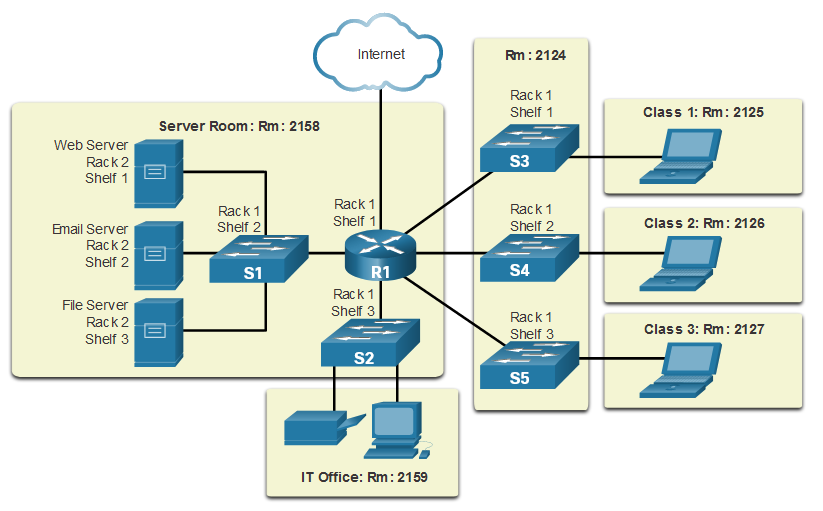
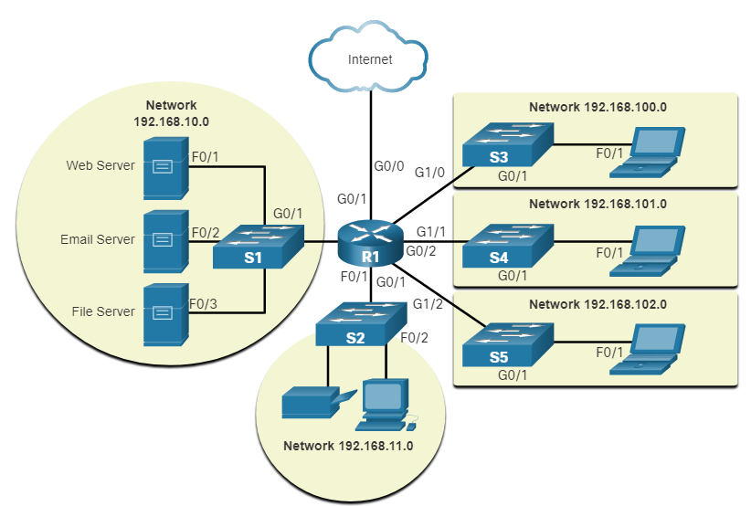

<!-- _class: invert -->

<!-- _paginate: false -->

# Networking Today

<!-- _footer: "📕 CCNA1v7 Module 1 Networking Today\n🧑🏻‍🏫 Pedro Durán" -->

---

# Network components

- **Host**: every computer in a network
  - **Server**: computers that provide information to end devices (email server, web server, ftp server)
  
  - **Clients**: computers that send requests to the servers to retrieve information (email from an email server, web page from a web server)

- **Peer-to-peer**: Network design only recommended for very small network where the same device acts as a client and as a server.

---

# Network components

- **End Devices**: where a message originates from or where it is received.
- **Intermediary Network Devices**: interconnects end devices. E.g.: switches, wireless access points, routers, firewalls.
- **Media**: communication across a network is carried through a medium which allows a message to travel from source to destination.
  - **Metal wires within cables**: Uses electrical pulses ⚡
  - **Glass or plastic fiber within cables (fiber-optic cable)**: Uses pulses of light 💡
  - **Wireless transmission**: Uses modulation of specific frequencies of electromagnetic waves. 🛰️

<!-- _footer: 📝 1.2.6 -->

---

# Topology Diagrams

| Physical topology  |  Logical Topology  |
|---|---|
|Illustrate the physical location of intermediary devices and cable installation.|Illustrate devices, ports, and the addressing scheme of the network|
|   |   |

<!-- _footer: 📝 1.3.3 -->

---

# Networks of many sizes

- **Small network computers**: few computers to each other and internet
- **Small Office/Home Office (SOHO)**: home or remote office to corporate network
- **Medium to Large Networks**: many locations with hundreds or thousands of PCs
- **World Wide Networks**: hundreds of millions of PCs world-wide (internet)

# LANs and WANs
- **LAN (Local Area Network)**: network that spans a **small geographic area**
- **WAN (Wide Area Network)**: network that spans a **wide geographic area**

---

# Intranet and Extranets
- **Intranet**:
  - Private collection of LANs and WANs internal to an organization
  - Accessible only to the organization members
- **Extranet**:
  - Provide secure access to their network to individuals
    - Suppliers
    - Customers
    - Collaborators
- **Internet**: Worlwide collection of interconnected LANs and WANs.

<!-- _footer: 📝 1.4.5 -->

---

# Home and Small Office Internet Connections
- **Cable**: internet offered by cable TV service providers
- **DSL** (Digital Subscriber Line): ADSL (Asymmetric), SDSL (Symmetric)
- **Cellular**: cell phone network to connect to internet
- **Satellite**: rural areas without ISP (Internet Service Provider)
- **Dial-up telephone**: modem

# Business Internet Connections
- **Dedicated Leased Line**: reserved circuits within service provider
- **Ethernet WAN**: extends LAN access technology into the WAN
- **DSL**
- **Satellite**

---

# Converging Network
Carry multiple services on one link: data + voice + video

# Network Architecture
Technologies that support the infrastructure that moves data across the network.

4 basic characteristics that the underlying architecture need to address to meet users expectations:
- 1️⃣ **Fault Tolerance**: Redundancy (alternative paths if a device or link fails)
- 2️⃣ **Scalability**: expand quickly and easily to support new users/apps
- 3️⃣ **Quality of Service (QoS)**: mechanism to ensure reliable delivery for all users
- 4️⃣ **Security**: network infrastructure security and information security

---

# Goals of network security
- **Confidentiality**: only intented recipients can read the data
- **Integrity**: assurance that the data has not been altered with during transmission
- **Availability**: assurance of timely and reliable access to data for authorized users

# Network trends
- Bring Your Own Device (BYOD)
- Online Collaboration. Video communications
- Cloud computing
- Powerline Networking (PLC)
- Wireless Broadband: WISP (Wireless ISP)

<!-- _footer: 📝 1.6.6 + 1.7.10 -->

---

# Network Security Threats
- **External threats**: viruses, worms, trojans horses. Spyware and adware. 0-day attacks. Threat actor attacks. Denial of Service (DoS) attacks. Data interception and theft. Identity theft.
- **Internal threats**: lost or stolen devices. Accidental misuse by employees. Malicious employees.

# Security Solutions
- **Home or Small Office Networks**: Antivirus, antispyware, firewall
- **Large networks**: dedicated firewall system, Access Control Lists (ACL), Intrusion Prevention System (IPS), Virtual Private Network (VPN)

<!-- _footer: 📝 1.8.3 -->