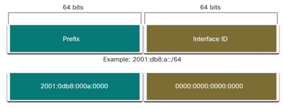
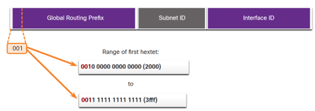
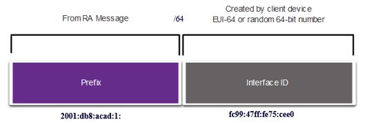
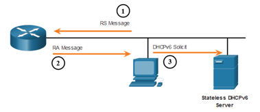
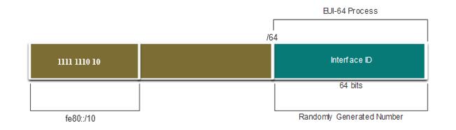
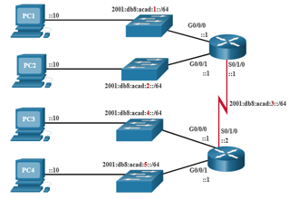
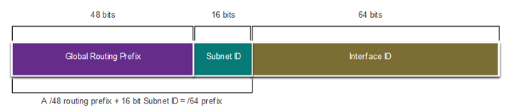

<!-- _class: invert -->

<!-- _paginate: false -->

# IPv6 Addressing

<!-- _footer: CCNA1v7 Module 12 IPv6 Addressing\nPedro Durán -->

---

# Need for IPv6

- **IPv4 depletion**
All RIRs (Regional Internet Registries) have exhausted their address pools, except those reserved for IPv6 transition.

- **Enhancements over IPv4**
The development of IPv6 also included fixes for IPv4 limitations and other enhancements, with subnetting in mind.

<!-- We can make comments during our presentation which will be shown in the presenter tool -->

---

# IPv4 and IPv6 Coexistence

## Protocols and tools to help network admins migrate to IPv6

- **Dual Stack**
  The devices run both IPv4 and IPv6 protocol stacks simultaneously.

- **Tunneling**
  The IPv6 packet is encapsulated inside an IPv4 packet.

- **Translation**
  Network Address Translation 64 (NAT64) allows IPv6-enabled devices to communicate with IPv4-enabled devices using a translation technique similar to NAT for IPv4

---

# IPv6 Addressing Format

- **Length:** 128 bits
- **Representation:** Hexadecimal
- **Format: `xxxx:xxxx:xxxx:xxxx:xxxx:xxxx:xxxx:xxxx`**
- **IPv6 -> 8 hextets**
  1 hextet = 16 bit segment = 4 hexadecimal values

> **Example:**
> 2001:0db8:acad:1111:abde:cafe:010f:1234

---

# IPv6 Compression

## Rule 1 – Omit Hextets Leading Zero

> **Example:**
> Preferred: `2001:0db8:0000:1111:0000:0000:0000:0200`
> No leading zeros: `2001:db8:0:1111:0:0:0:200`

## Rule 2. Replace contiguous zero hextets with ::

:warning: **We can only use `::` once!**

> **Example:**
> No leading zeros: `2001:db8:0:1111:0:0:0:200`
> Compressed: `2001:db8:0:1111::200`

---

# IPv6 Prefix Length

- Used to indicate the **network portion** of an IPv6 address
- **Recommended Prefix length:** /64

---

# IPv6 Unicast Addresses

- **Global Unicast Address (GUA)**
  - Similar to public IPv4 addresses.
  - Globally unique, **internet-routable addresses**.
- **Link-Local Address (LLA)**
  - Used to communicate to other devices on the same local link.
  - **Not routable, confined to a single link**.
- **Loopback `::1/128`**
- **Unspecified Address `::/128`**
- **Unique local `fc00::/7 - fdff::/7`**
  Similar to IPv4 private addresses.
---

<!-- _header: "IPv6 Unicast Adresses" -->

# IPv6 GUA

- **Currently Range:** `2000::/3` <--> `3fff::/3`
- **Global Routing Prefix** (48bits):  **Network portion.** Assigned by provider.
- **Subnet ID** (16bits): **Subnet.** To identy subnets within its site.
- **Interface ID** (64bits): **Host portion.**
- **Static GUA on a Router:** `ipv6 address 2001:db8:acada:1::1/64`

---

<!-- _header: "IPv6 Unicast Adresses" -->

# IPv6 LLA

- **Range:** `fe80::/10`
- An IPv6 LLA enables a device to communicate with other IPv6-enabled devices on the same link and only on that link (subnet).
- **Cannot be routed.**
- Every IPv6-enabled network interface must have an LLA.
- **If an LLA is not configured manually on an interface, the device will automatically create one.**
- **Static LLA on a Router:** `ipv6 address fe80::1/64 link-local`
---

<!-- _header: "IPv6 Unicast Adresses" -->

# Dynamic Addressing for IPv6 GUAs

- Devices obtain addresses dynamically through **ICMPv6 messages**:
  - **Router Solicitation (RS) messages**
    - Sent by host devices to discover IPv6 routers
  - **Router Advertisement (RA) messages**
    - Sent by routers to inform hosts on how to obtain an IPv6 GUA/LLA.
  - 3 methods for configuring IPv6 GUA:
    - SLAAC
    - SLAAC with Stateless DHCPv6 server
    - Stateful DHCPv6 (no SLAAC)

---

<!-- _header: "IPv6 Unicast Adresses > Dynamic Addressing for IPv6 GUAs" -->

## Method 1: SLAAC
- Devices configure a GUA without the services of DHCPv6, obtaining the necessary information from the ICMPv6 RA messages of the local router.
- **Prefix:** provided by the RA message
- **Interface ID:** created by the device using one of these 2 methods:
  - EUI-64
  - Random generation

---

<!-- _header: "IPv6 Unicast Adresses > Dynamic Addressing for IPv6 GUAs" -->

## Method 2: SLAAC with Stateless DHCPv6 server
- **IPv6 GUA:** SLAAC
- **Default gateway:** Router LLA (RA source IPv6 address)
- **DNS Server and domain name:** obtained from an stateless DHCPv6 server

---

<!-- _header: "IPv6 Unicast Adresses > Dynamic Addressing for IPv6 GUAs" -->

## Method 3: Stateful DHCPv6
- Similar to DHCPv4
- **IPv6 GUA, prefix length, DNS server and domain:** From Stateful DHCPv6 server
- **Default gateway:** Router LLA (RA source IPv6 address)

---

<!-- _header: "IPv6 Unicast Adresses > Dynamic Addressing for IPv6 GUAs" -->

## Auto Generated Interface ID: EUI-64 Process
- Used by Linux and CISCO devices
- Split Ethernet MAC address of the client (48bits): OUI <--> Serial Number
- Insert `ff:fe` into the middle (64bits)
- Reverse from binary 0 to 1 the 7th bit

> **Example:**
> MAC: `fc:99:47:75:ce:e0`
> EUI-64 Interface ID: `fe:99:47:ff:fe:75:ce:e0`

---

<!-- _header: "IPv6 Unicast Adresses > Dynamic Addressing for IPv6 GUAs" -->

## Randomly Generated Interface ID
- Used by Windows
- **Interface ID:** Random number

:warning: Client may use DAD (Duplicate Address Detection) to ensure the uniqueness of the generated IPv6. No reply => unique.

---

<!-- _header: "IPv6 Unicast Adresses > Dynamic LLA" -->

# Dynamic LLA

- **Interface ID:**
  - Created by the device using one of these 2 methods:
    - EUI-64
    - Random generation

---

<!-- _header: "IPv6 Multicast and Anycast Adresses" -->

# IPv6 Multicast

- **Prefix: `ff00::/8`**. 2 types:
  - **Well-known multicast addresses**
    - **`ff02::1` All-nodes multicast group**: All IPv6-enabled devices join
    - **`ff02::2` All-routers multicast group**: All IPv6 routers join
  - **Solicited node multicast addresses**
    - Similar to the all-nodes multicast address.

# IPv6 Anycast

- Any IPv6 unicast address that can be assigned to multiple devices.
- Routed to the nearest device having that address.

---

# IPv6 Subnetting

- A separate **Subnet ID** field in the IPv6 GUA is used to create subnets. 
- Subnet ID: **4th hextext**

