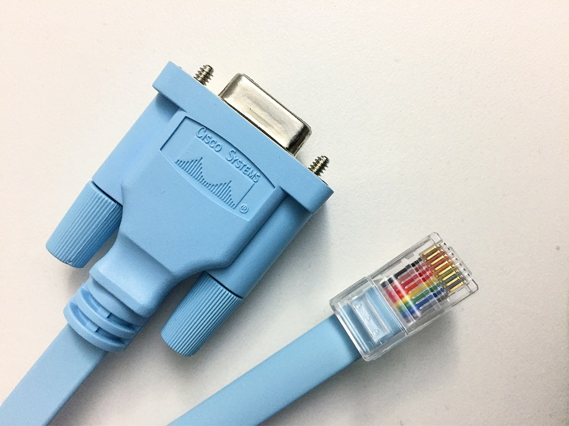
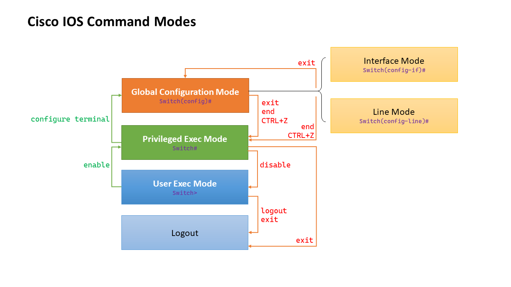
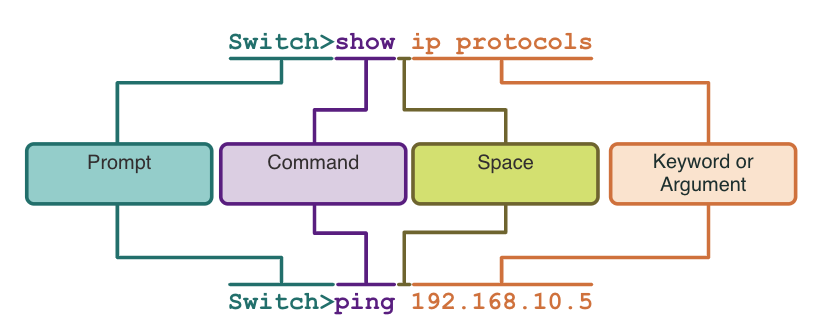

<style>
img[alt~="center"] {
  display: block;
  margin: 0 auto;
}
</style>

<style scoped>
h1 {
  font-size: 80px;
}
</style>

<!-- _class: invert -->

<!-- _paginate: false -->

# Basic Switch and End Device Configuration

<!-- _footer: "📕 CCNA1v7 Module 2 Basic Switch and End Device Configuration\n🧑🏻‍🏫 Pedro Durán" -->

---

# Cisco IOS Access
- **Operating System:** Hardware > Kernel > Shell
- **Shell:** CLI (Command Line Interface) / GUI (Graphical User Interface)
- **Access Methods:**
  - Software: PuTTY, TeraTerm
  - 1️⃣ **Console:** Initial configurations. Console cable (RJ45 - RS232/USB).
  
  - 2️⃣ **SSH (Secure Shell):** Secure remote CLI connection. Recommended.
  - 3️⃣ **Telnet:** Insecure remote CLI connection.


<!-- _footer: 📝 2.1.6 -->

---



<!-- _footer: 📝 2.2.8 -->

---

# Basic IOS Command Structure



- **Tab**: completes a partial command
- **Enter key**: displays next line
- **Space bar**: displays next screen
- **Ctrl+Shift+6**: break sequence to abort commands

---

# Configure Device Name
```csharp
Switch# configure terminal
Switch(config)# hostname Sw-Floor-1
```

# Securing User Exec Mode
```csharp
Switch(config)# line console 0
Switch(config)# password cisco
Switch(config)# login
```

# Securing Priviledged Exec Mode
```csharp
Switch(config)# enable secret class
```

---

# Securing VTY line access (SSH/Telnet)
```csharp
Switch(config)# line vty 0 15
Switch(config)# password cisco
Switch(config)# login
```

# Encrypt passwords
```csharp
Switch(config)# do show running-config
Switch(config)# service password-encryption
Switch(config)# do show running-config
```

---

# Banner messages

```csharp
Switch(config)# banner motd #Authorized Access Only!#
```


```csharp
⚠️ Switch(config)# banner motd vBienvenidos. Acceso no autorizadov
```

# Configuration Files (Save config)
- **startup-config**: Flash NVRAM. Non-volatile
- **running-config**: RAM. Volatile
```csharp
Switch# show startup-config
Switch# show running-config
Switch# copy running-config startup-config
Switch# wr
```

<!-- _footer: 📝 2.4.8 -->

---

# Remove one command from running-config
```csharp
S1(config)# no hostname
```

# Delete initial boot configuration
```csharp
Switch# erase startup-config
```

# Reboot device
```csharp
Switch# reload
```

---

# Configure IP Addressing
- Windows / Linux:
  - Static configuration:
    - IP Address
    - Subnet mask
    - Default gateway
    - Primary/secondary DNS servers
   - Dynamic configuration: DHCP
- Cisco Switch (configure SVI, Switch Virtual Interface):
```csharp
Switch(config)# interface vlan 1
Switch(config-if)# ip address 192.168.1.20 255.255.255.0
Switch(config-if)# no shutdown
```

<!-- _footer: 📝 2.6.3 + 2.9.4 -->