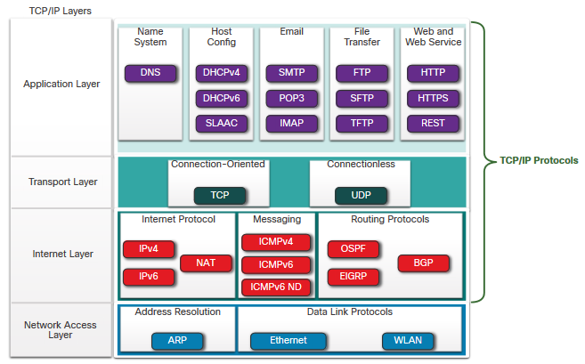
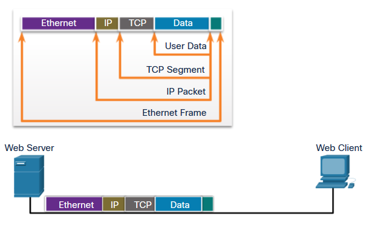
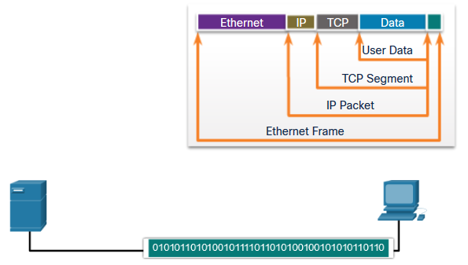
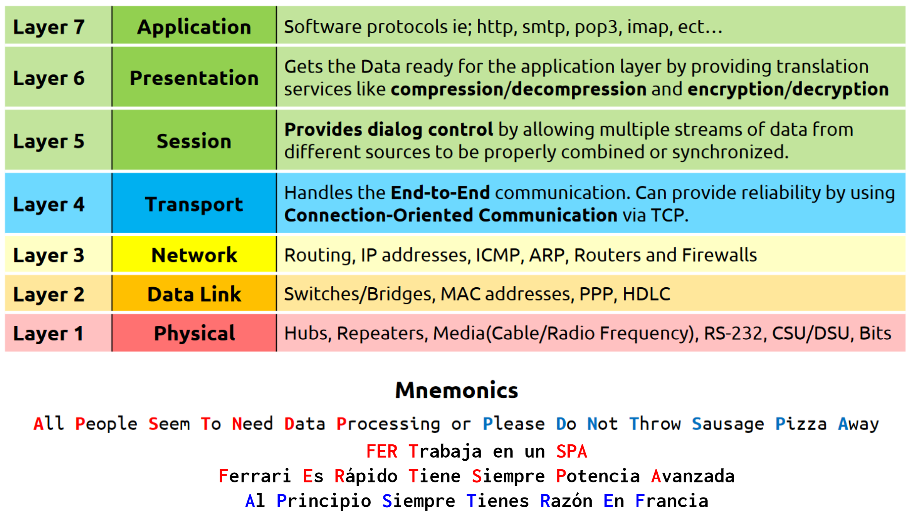
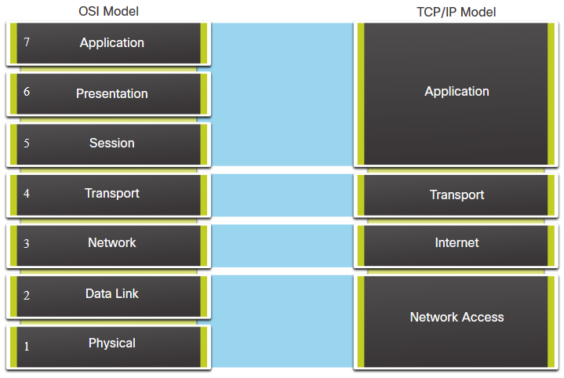
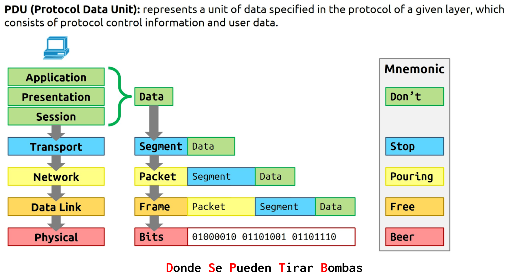
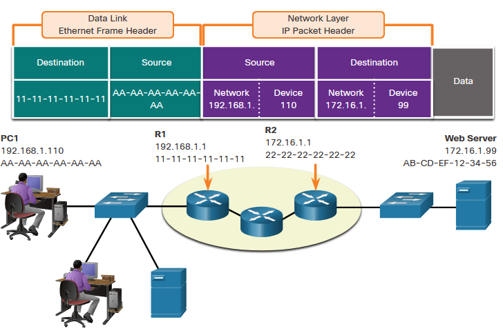
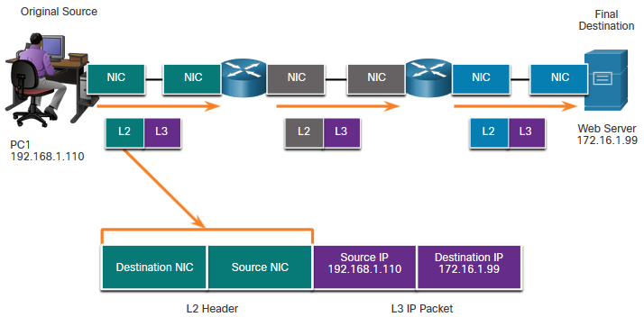

<!-- _class: invert -->

<!-- _paginate: false -->

# Protocols and models

<!-- _footer: "📕 CCNA1v7 Module 3 Protocols and models\n🧑🏻‍🏫 Pedro Durán" -->

---

# Communication
- **Source** (sender) ➡️ **Channel** (media) ➡️ **Destination** (receiver)
- **Protocol:** rules that communication will follow
    - **Message encoding:** encoding (info->form for transmission)/decoding
    - **Message formatting and encapsulation**: specific format or structure
    - **Message size:** encoding in appropiate format for the medium
    - **Message timing:** Flow control (rate), Response Timeout, Access method
    - **Message delivery options:** Unicast (1-1), Multicast (1-many), Broadcast (1-all)

<!-- _footer: 📝 3.1.12 -->

---

# Network Protocols

Network Protocols define a common set of rules.

**Functions:**
- **Addressing:** Identifies sender and receiver
- **Reliability:** Provides guaranteed delivery
- **Flow Control:** Ensure data flows at an efficient rate
- **Sequencing:** Uniquely labels each transmitted segment of data
- **Error Detection:** Determines if data became corrupted during transmission
- **Application Interface:** Process-to-process communications between network apps

---

# Protocol Suites

Group of inter-related protocols necessary to perfom a communication.
Protocols are viewed in terms of layers.

Examples:
- **Internet Protocol Suite or TCP/IP:** maintained by IETF
- **OSI (Open Systems Interconnections):** developed by ISO and ITU
- **AppleTalk**
- **Novell Netware**

---

# TCP/IP Protocol Suite

<!-- _footer: 📝 3.2.4 -->

---

# TCP/IP Communication Process

|A web server encapsulating and sending a web page to a client|A client de-encapsulating the web page for the web browser|
|--|--|
|||

<!-- _footer: 📝 3.3.6 -->

---

# Standards organizations
- Vendor-neutral
- Non-profit organizations
- Establish to develop and promote the concept of open standards.

# Internet Standards
- ISOC, IAB, IETF, IRTF, ICANN, IANA

# Electronic and Communications Standards
- IEEE, EIA, TIA, ITU-T

<!-- _footer: 📝 3.4.5 -->

---

# Reference Layered Models

Two layered models describe network operations:
- **Open System Interconnection (OSI) Reference Model**
- **TCP/IP Reference Model**

Benefits of using a layered model:
- Assist in protocol design
- Faster competition because products from different vendors can work together
- Prevent technology or capability changes in one layer from affecting other layers
- Provide a common language to describe networking functions and capabilities

---

# The OSI Reference Model

---

# OSI and TCP/IP Model Comparison

---

# Data Encapsulation - Segmenting and sequencing

- **Segmenting:** process of breaking up messages into smaller units
- **Multiplexing:** process of taking multiple streams of segmented data and interleaving them together.
- **Sequencing:** process of numbering the segments so that the message may be reassembled at the destination. (TCP)

Segmenting messages has 2 primary benefits:
- 1️⃣ **Increases speed** - Large amounts of data can be sent over the network without tying up a communications link.
- 2️⃣ **Increases efficiency** - Only segments which fail to reach the destination need to be retransmitted, not the entire data stream.

---

# Protocol Data Unit (PDU)

<!-- _footer: 📝 3.6.6 -->

---

# Layer 3 Logical Address

IP Packet contains 2 addresses:
- Source IP Address
- Destination IP Address

IP Address contains 2 parts
- Network Portion (IPv4) or Prefix (IPv6)
- Host Portion (IPv4) or Interface ID (IPv6)

---

# Devices on the Same Network

---

# Devices on a Remote Network

---

# Data Link Addresses

<!-- _footer: 📝 3.7.11 + 3.8.2 -->