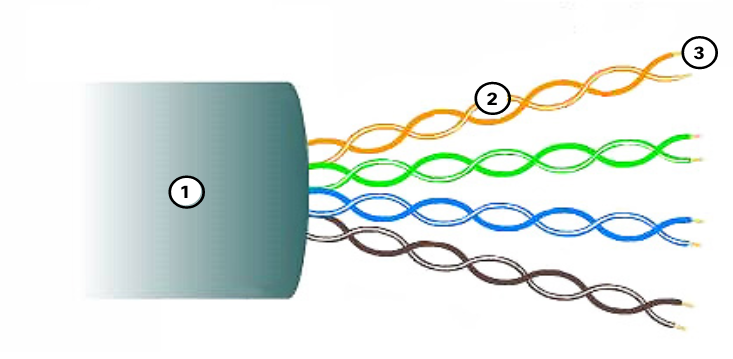
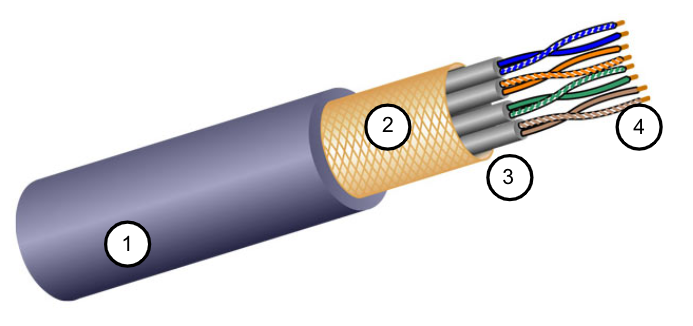
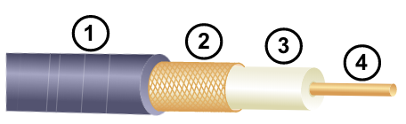
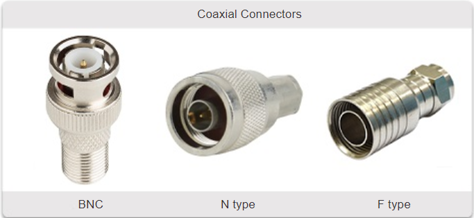
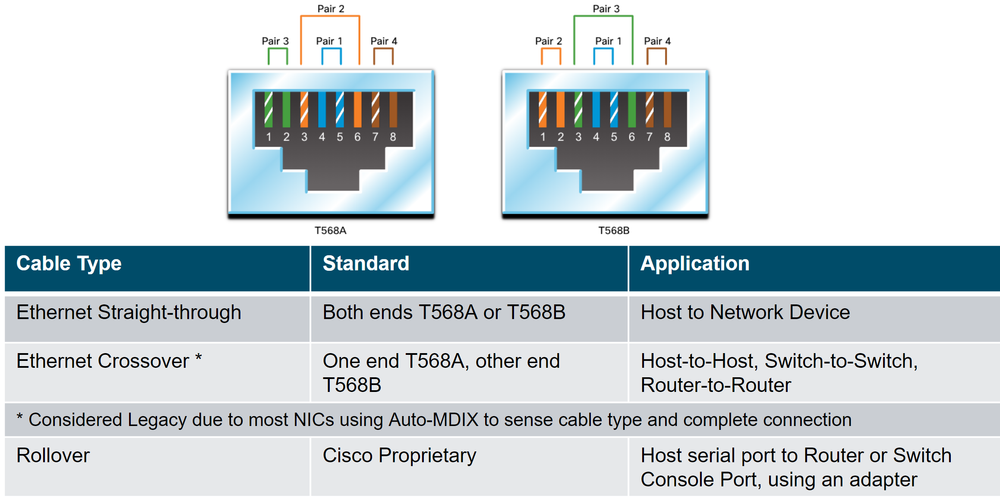
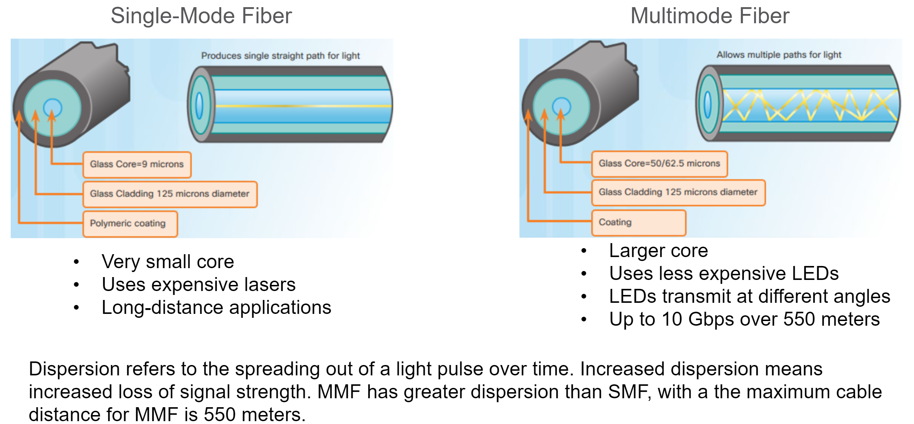
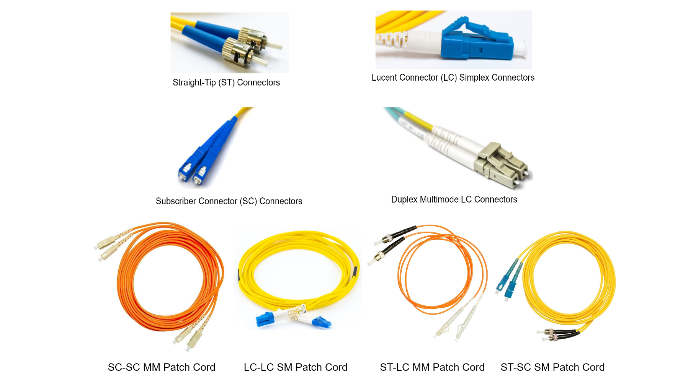
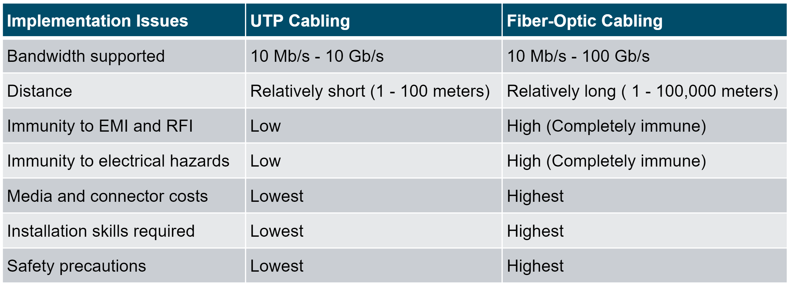

<!-- _class: invert -->

<!-- _paginate: false -->

# Physical Layer

<!-- _footer: "📕 CCNA1v7 Module 4 Physical Layer\n🧑🏻‍🏫 Pedro Durán" -->

---
# The Physical Layer

Physical Layer Standards address 3 functional areas:
- 💪🏻 **Physical Components:** NICs (Network Interface Card), interfaces and connectors, cable materials, and cable designs 
- 🤖 **Encoding:** converts the stream of bits into a format recognizable by the next device in the network path.
- 🚦 **Signaling:** how the bit values, “1” and “0” are represented on the physical medium. The method of signaling will vary based on the type of medium being used.

<!-- _footer: 📝 4.1.3 -->

---

# Bandwidth

- **Bandwidth:** capacity at which a medium can carry data. Bits per second (bps), Mbps (Megabits per second), Gbps (Gigabits per second). 1Gbps = 10^6 bps
- **Terminology**
  - ⌛ **Latency:** Amount of time, including delays, for data to travel from one given point to another
  - 🌪️ **Throughput:** The measure of the transfer of bits across the media over a given period of time
  - 🌊 **Goodput:** The measure of usable data transferred over a given period of time

**🧮 Goodput = Throughput - traffic overhead**
  
<!-- _footer: 📝 4.2.7 -->

---

# Copper cabling

🟢 Most common type of cabling used today, inexpensive, easy to install, and has low resistance to electrical current flow.

🟡 **Limitations:**
  - **Attenuation:** the longer the electrical signals have to travel, the weaker they get.
    - 🟦 Mitigation: Strict adherence to cable length limits
  - **Interferences:**
    - Electromagnetic Interference (EMI) and Radio Frequency Interference (RFI)
      - 🟦 Mitigation: metallic shielding and grounding
    - Crosstalk
      - 🟦 Mitigation: twisting opposing circuit pair wires together

---

# Copper cabling

| Unshielded Twisted Pair (UTP) | Shielded Twisted Pair (STP) |
| -- | -- |
|  |   |
| Most common networking media. RJ-45 connectors. Twisted pairs protect the signal from interference. | Better noise protection, more expensive, harder to install. EMI/RFI protection
 |

---

# Coaxial cable

Commonly used in the following situations:
- **Wireless installations:** attach antennas to wireless devices
- **Cable internet installations:** customer premises wiring

| Coaxial cable | Coaxial connectors |
| -- | -- |
|  |   |

<!-- _footer: 📝 4.3.6 -->

---

# UTP Cabling
UTP relies on the following properties to limit crosstalk:
- **Cancellation:** Each wire in a pair of wires uses opposite polarity. One wire is negative, the other wire is positive. They are twisted together and the magnetic fields effectively cancel each other and outside EMI/RFI.
- **Variation in twists per foot in each wire:** Each wire is twisted a different amount, which helps prevent crosstalk amongst the wires in the cable.

**Standard TIA/EIA-568:**
- Cable Types, cable lengths, connectors (RJ-45), cable termination, testing methods

**Standard IEEE: Performance**
- Cat 3, Cat 5 (100Mbps), Cat 5e (1Gbps), Cat 6/7 (10Gbps), Cat 8 (40Gbps)

---

# Straight-through and Crossover UTP Cables 

<!-- _footer: 👾 4.4.4 -->

---

# Fiber-Optic Cabling

- Not as common as UTP because of the expense involved
- Transmits data over longer distances at higher bandwidth than any other networking media
- Less susceptible to attenuation, and completely immune to EMI/RFI
- Made of flexible, extremely thin strands of very pure glass
- Uses a laser or LED to encode bits as pulses of light
- The fiber-optic cable acts as a wave guide to transmit light between the two ends with minimal signal loss
- **Uses:** Enterprise Networks, Fiber-to-the-Home (FTTH), Long-Haul Networks and Submarine Cable Networks

---

# Types of Fiber Media

---

# Fiber-Optic Connectors and Patch Cords

---

# Fiber versus Copper

<!-- _footer: 📝 4.5.7 -->

---

# Wireless Media

**Limitations of wireless:**
- **Coverage area:** Impacted by the physical characteristics of the location.
- **Interference:** Susceptible to interference and can be disrupted by many devices.
- **Security:** Anyone can gain access to the transmission.
- **Shared medium:** WLANs operate in half-duplex, which means only one device can send or receive at a time. Many users ➡️ reduced bandwidth for each user.

**Standards:** Wi-Fi (IEEE 802.11), Bluetooth (IEEE 802.15), WiMAX (IEEE 802.16), Zigbee (IEEE 802.15.4)

**Devices:** Wireless Access Point (AP), Wireless NIC Adapters

<!-- _footer: 📝 4.6.4 + 4.7.4 -->