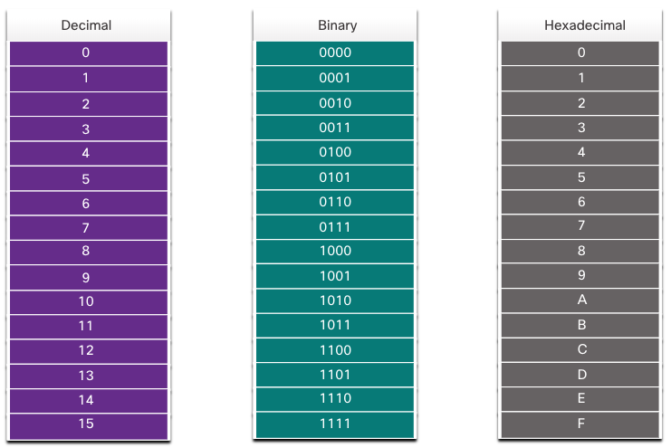
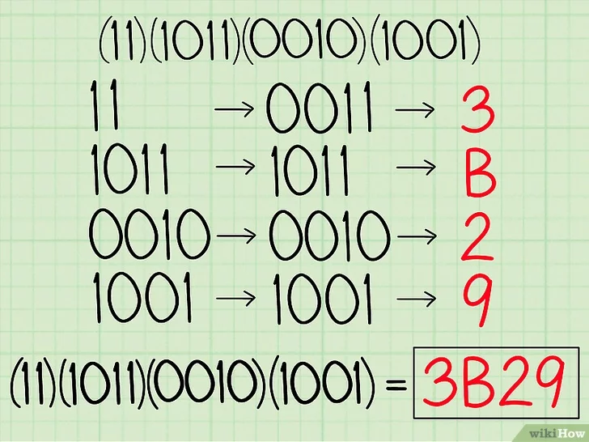

<!-- _class: invert -->

<!-- _paginate: false -->

# Number Systems

<!-- _footer: "📕 CCNA1v7 Module 5 Number Systems\n🧑🏻‍🏫 Pedro Durán" -->

---

# Decimal - Binary - Hexadecimal

---

# Binary to decimal conversion

---

# Decimal to binary conversion

---

# Binary to hexadecimal conversion and viceversa

<!-- _footer: 📝 5.2.5 + 5.3.2 -->