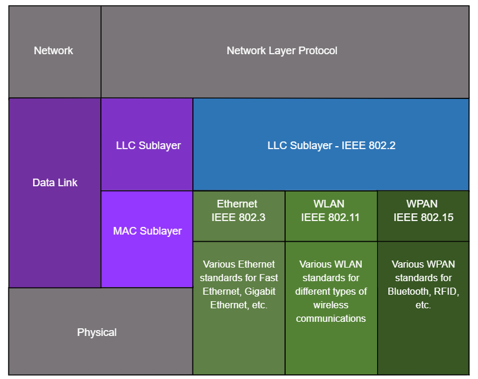
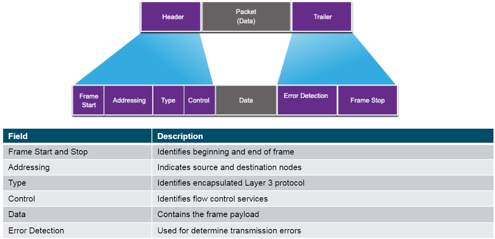

<!-- _class: invert -->

<!-- _paginate: false -->

# Data Link Layer

<!-- _footer: "📕 CCNA1v7 Module 6 Data Link Layer\n🧑🏻‍🏫 Pedro Durán" -->

---

# The Data Link Layer

- Encapsulate Layer 3 packets into Layer 2 Frames
- Performs **error detection** and **rejects corrupt frames**

---

# Providing Access to Media and Standards

At each hop along the path, a router performs four basic Layer 2 functions:
- 1️⃣ Accepts a frame from the network medium.
- 2️⃣ De-encapsulates the frame to expose the encapsulated packet.
- 3️⃣ Re-encapsulates the packet into a new frame.
- 4️⃣ Forwards the new frame on the medium of the next network segment.

**Standards:** IEEE, ITU, ISO, ANSI

<!-- _footer: 📝 6.1.5 -->

---

# Topologies

- **WAN:** Point-to-point, Hub and spoke, Mesh
- **LAN:** Star, Extended Star, Bus and Ring

---

# Half and Full Duplex Communication

➡️ **Half-duplex communication:**
- Only allows one device to send or receive at a time on a shared medium.
- Used on WLANs and legacy bus topologies with Ethernet hubs.

↔️ **Full-duplex communication:**
- Allows both devices to simultaneously transmit and receive on a shared medium.
- Ethernet switches operate in full-duplex mode.

---

# Access Control Methods

**Contention-based access:** All nodes operating in **half-duplex**, competing for medium.
  - **Carrier Sense Multiple Access with Collision Detection (CSMA/CD)**
    - **Use:** Legacy bus-topology Ethernet LANs. Devices detect the collission and wait a period of time and retransmit data.
  - **Carrier Sense Multiple Access with Collision Avoidance (CSMA/CA)**
    - **Use:** WLAN. Devices when transmitting include the time duration needed for the transmission. Other devices know how long the medium is unavailable.

**Controlled access:** Deterministic access where each node has its own time on the medium. Used on legacy networks such as Token Ring and ARCNET.

<!-- _footer: 📝 6.2.9 -->

---

# Frame Fields

<!-- _footer: 📝 6.3.5 + 6.4.2 -->