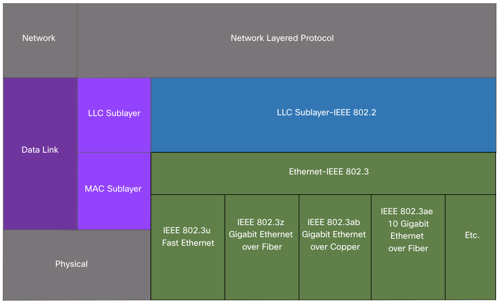
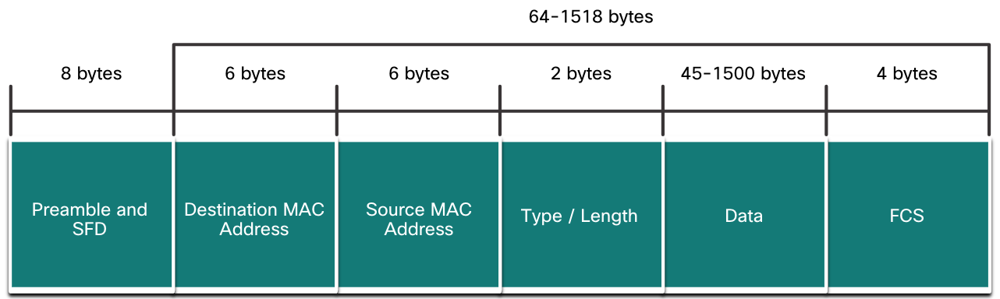
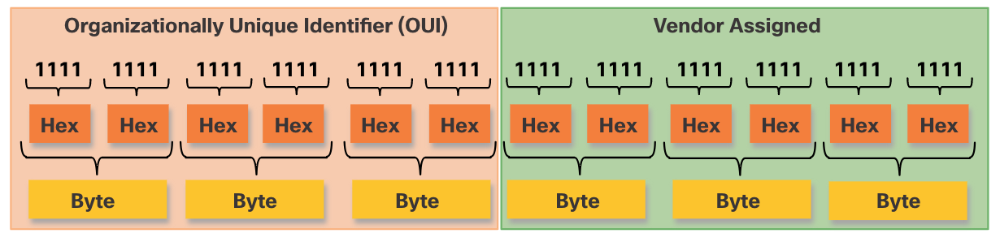

<!-- _class: invert -->

<!-- _paginate: false -->

# Ethernet Switching

<!-- _footer: "📕 CCNA1v7 Module 7 Ethernet Switching\n🧑🏻‍🏫 Pedro Durán" -->

---

# Data Link Sublayers

- **LLC Sublayer:** Places information in the frame to identify which network layer protocol is used for the frame.
- **MAC Sublayer:** Responsible for:
  - **Data encapsulation:** Ethernet frame, Addressing (MAC), Error detection
  - **Media access control:** CSMA/CD, CSMA/CA

---

# Ethernet Frame

- Ethernet frame size (preamble not included):
   - **Minimum = 64 bytes. Maximum = 1518 bytes**
- Frame **< 64 bytes** ➡️ “collision fragment” or **“runt frame”** (discarded)
- Frame **> 1500 bytes of data** ➡️ **“jumbo”** or “baby giant frames”.
- Minimum > Size of transmitted frame > Maximum ➡️ device drops the frame

<!-- _footer: 📝 7.1.5 -->

---

# Ethernet MAC Address

Ethernet MAC Address = 48 bits expressed in 12 hexadecimal digits
All MAC addresses must be unique to the Ethernet device or Ethernet interface. 

---

# Frame Processing

- Ethernet header include a Source MAC address and a Destination MAC address.
- Device receives frame ➡️ examine Destination MAC address
  - Frame received Destination MAC address ≠ Device NIC MAC ➡️ Discard frame
  - Frame received Destination MAC address = Device NIC MAC ➡️ Accept

# Types of MAC Adresses
- **Unicast:** Determine MAC Address with an IP: IPv4 (ARP), IPv6 (ND)
- **Broadcast: FF-FF-FF-FF-FF-FF**
- **Multicast:**
  - **Multicast IPv4: 01-00-5E**
  - **Multicast IPv6: 33-33**

---

# Switch Fundamentals

Switch makes its forwarding decisions based on the Layer 2 Ethernet MAC addresses.

1️⃣ **LEARN.** Frame enters switch. Switch examines frame **Source MAC address**
  - Source MAC address unkwown ➡️ Adds Source MAC to table with incoming port
  - Source MAC address known ➡️ Refresh timer for that entry (default: 5 min)

2️⃣ **FORWARD.** Find the Destination MAC Address
  - Destination is Unicast?
    - Destination MAC known ➡️ Forwards out the specified port
    - Destination MAC unknown ➡️ Forwards out all ports except incoming port
  - Destination is Multicast or Broadcast? ➡️ Forwards out all ports except incoming port

---

# Frame Forwarding Methods on Cisco Switches

- **Store-and-forward switching:**
  - Receives the entire frame and computes the CRC.
    - CRC valid? ➡️ Forwards frame
    - CRC invalid? ➡️ Discards frame
- **Cut-through switching:**
  - **Fast-forward switching:** forwards after reading the destination address.
  - **Fragment-free switching:** switch stores and performs an error check on the first 64 bytes of the frame before forwarding.

---

# Duplex and Speed Settings

- **Full-duplex:** Both ends of the connection can send and receive simultaneously.
- **Half-duplex:** Only one end of the connection can send at a time.

⚠️ Gigabit Ethernet ports only operate in full-duplex. 

**Best practice:** configure both Ethernet switch ports as full-duplex.

# Auto-MDIX
Most switch devices now support the automatic medium-dependent interface crossover (auto-MDIX) feature. When enabled, the switch automatically detects the type of cable attached to the port and configures the interfaces accordingly. (`mdix auto`)

<!-- _footer: 📝 7.4.5 + 7.5.2 -->