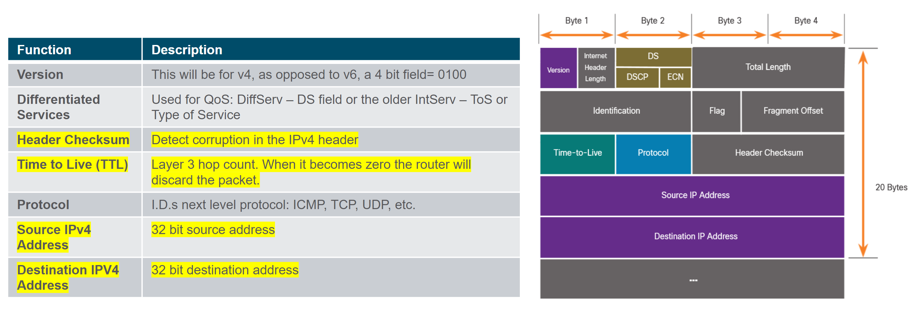
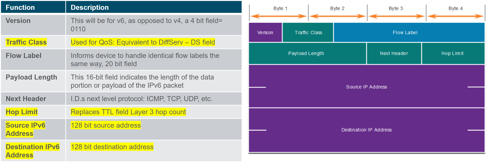
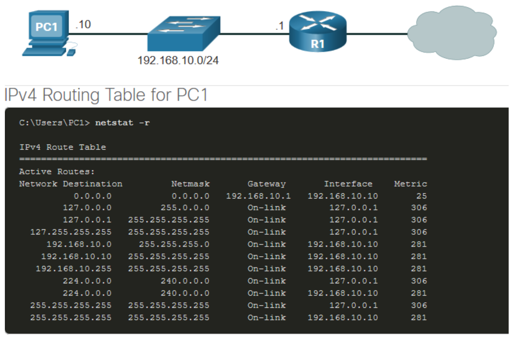
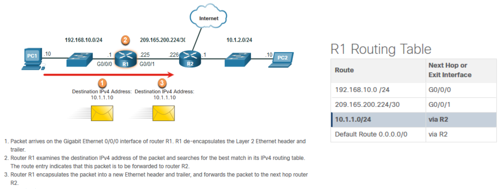
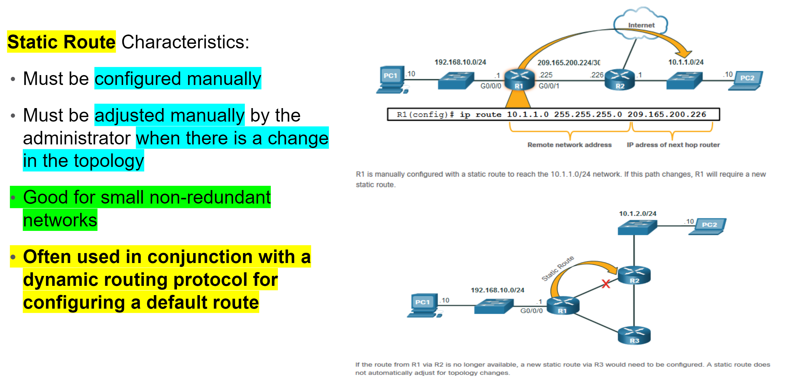
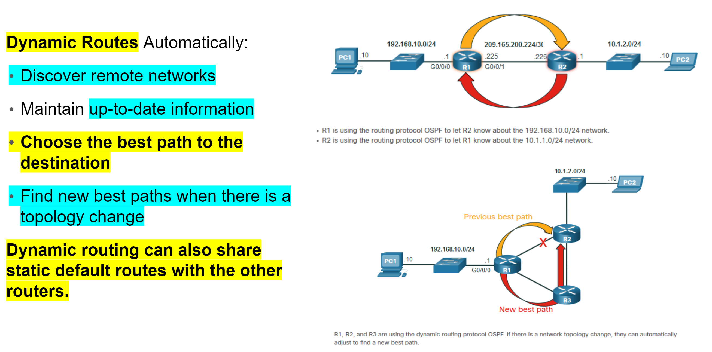
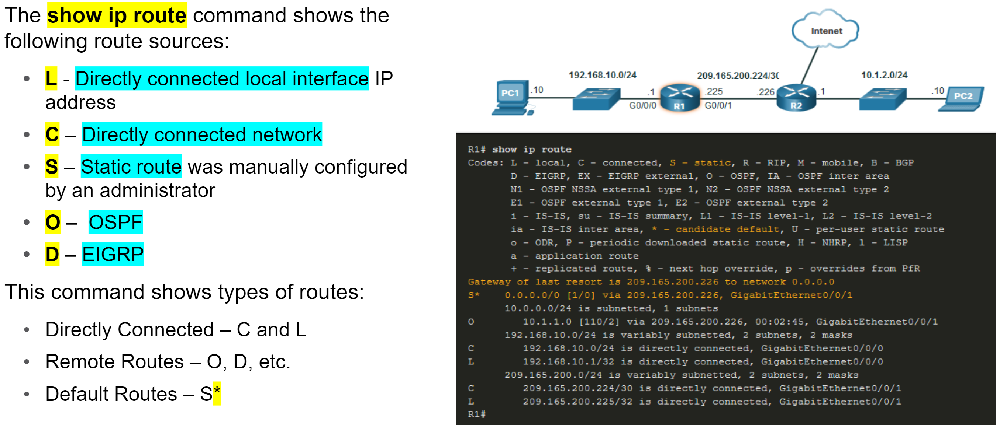

<style>
img[alt~="center"] {
  display: block;
  margin: 0 auto;
}
</style>

<style scoped>
h1 {
  font-size: 80px;
}
</style>

<!-- _class: invert -->

<!-- _paginate: false -->

# Network Layer

<!-- _footer: "📕 CCNA1v7 Module 8 Network Layer\n🧑🏻‍🏫 Pedro Durán" -->

---

# Network Layer
- Provides services to allow end devices to exchange data.
- Network Layer Protocols: **IPv4 and IPv6**.
- The network layer performs four **basic operations**:
  - 📫 **Addressing end devices**
  - 📥 **Encapsulation**
  - 🚗 **Routing**
  - 📤 **De-encapsulation**
- :warning: **The IP addressing does not change from source to destination.**

---

# Network Layer Characteristics

IP have low overhead and may be described as:
  - **Connectionless**: does not establish a connection before sending a packet. There is no control information needed.
  - **Best effort**: will not guarantee delivery of the packet. Reduced overhead and no acknowledments.
  - **Media Independent**:
    - IP is unreliable: cannot manage or fix undelivered or corrupt packets
    - IP is media independent: can be sent over any media type.

Layer 3 splits the IPv4 into smaller units (Fragmentation, **MTU**: Maximum Transport Unit)

---

# IPv4 Packet Header Fields



<!-- _footer: 📝 8.2.4 -->

---

# IPv6 Overview

**IPv4 has 3 major limitations:**
- 1️⃣ **IPv4 address depletion:** run out of IPv4 addressing
- 2️⃣ **Lack of end-to-end connectivity:** private addressing and NAT were created
- 3️⃣ **Increased network complexity:** NAT was a temporary solution, create issues and causes latency.

**IPv6 overcomes the limitation of IPv4:**
- 1️⃣ **Increased address space:** based on 128 bit address instead of 32 bit
- 2️⃣ **Improved packet handling:** simplified header with fewer fields
- 3️⃣ **Eliminates the need for NAT:** no need to use private addressing internally

---

# IPv6 Packet Header Fields



<!-- _footer: 📝 8.3.6 -->

---

# Host Forwarding Decision

- Each host devices creates their own routing table.
- A host can send packets to:
  - 🏠 **Itself**: 127.0.0.1 (IPv4), ::1 (IPv6)
  - 🏘️ **Local hosts**: destination on the same LAN. Traffic handled by intermediary device.
  - 🏙 **Remote hosts**: devices are not on the same LAN. Traffic forwarded directly to LAN default gateway.
- The source device determines whether the destination is local or remote:
  - **IPv4:** Source IP address and network mask <> Destination IP address
  - **IPv6:** Source uses the network address and prefix advertised by local router

---

# Default Gateway

**A Router or Layer 3 Switch can be a default gateway.**
- :warning: It must have an IP address in the same range as the rest of the LAN.
- It can route to other networks.

**A default gateway is static route which will be a last resort route in the routing table.**
**All device on the LAN will need the default gateway of the router if they intend to send traffic remotely. If a device has no default gateway or a bad default gateway, its traffic will not be able to leave the LAN.**

🤔 Host will know the default gateway:
- IPv4 ➡️ statically or through DHCP
- IPv6 ➡️ through RS (Router Solicitation) or manually

---

# Host Routing Tables

Display the PC routing table:
- 🪟 Windows ➡️ ```route print``` or ```netstat -r```
- 🐧 Linux ➡️ ```ip route```



<!-- _footer: 📝 8.4.5 -->

---

# Router Packet Forwarding Decision

🤔 What happens when the router receives the frame from the host device?



---

# IP Routing Table

3 types of routes in a router's routing table:
- 1️⃣ **Directly Connected:** These routes are automatically added by the router, provided the interface is active and has addressing.
- 2️⃣ **Remote:** These are the routes the router does not have a direct connection and may be learned:
  - Manually – with a static route
  - Dynamically – by using a routing protocol to have the routers share their information with each other
- 3️⃣ **Default Route:** this forwards all traffic to a specific direction when there is not a match in the routing table

---

# Static Routing



---

# Dynamic Routing



---

# Introduction to an IPv4 Routing Table



<!-- _footer: 📝 8.5.7 + 📝 8.6.2  -->