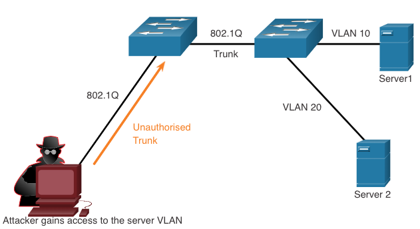

<!-- _class: invert -->

<!-- _paginate: false -->

# LAN Security Concepts

<!-- _footer: 📕 CCNA2v7 Module 10 LAN Security Concepts\n🧑🏻‍🏫 Pedro Durán -->

---

# Networks Attacks
- 🥵 **Distributed Denial of Service (DDoS)**
- 🐒 **Data Breach**
- 🧟 **Malware** (e.g. WannaCry)

# Network Security Devices
- 🚇 **Virtual Private Network (VPN) enabled router**: Can be integrated into firewall.
- 🔥 **Next-Generation Firewall (NGFW)**: stateful packet inspection, application visibility and control, Next-Generation IPS (NGIPS), advanced malware protection (AMP), and URL filtering.
- 👮🏻‍♂️ **Network Access Control (NAC)**: Includes AAA services. Cisco ISE (Identity Services Engine)

---

# Endpoint Protection

😎 Best protected with combination of: NAC + AMP + ESA + WSA
  - **Cisco ESA** (Email Security Appliance): monitors SMTP
  - **Cisco WSA** (Web Security Appliance): advanced malware protection (AMP), application visibility and control, acceptable use policy controls, and reporting.

---

# Access Control - AAA Components
- 👮🏻‍♂️ **Authentication**: **who is permitted to access** a network
  - **Local Authentication:** SSH in Cisco Routers. Small networks.
  - **Server-Based Authentication:** router accesses (via **RADIUS** or **TACACS+** protocols) a central AAA server that contains usernames and passwords for all users
- 👮🏻‍♂️ **Authorization**: **what they can do** while they are there. Uses a set of attributes that describe the user's access to the network.
- 👮🏻‍♂️ **Accounting**: **audit what actions they performed** while accessing the network. Collects and reports usage.

---

# Access Control - 802.1X
 - Port-based access control and authentication protocol.
 - Restricts unauthorized workstations from connecting to a LAN throught publicly accessible switch ports.

 ## 802.1x Roles:
 - **Client (Supplicant)**: Requires access and responds to request from switch
 - **Switch (Authenticator)**: Controls physical access to the network based on client authentication status
 - **Authentication Server**: Performs client authentication.

---

# Layer 2 Vulnerabilities - Switch Attack Categories

😈 **MAC Table Attacks**: MAC address flooding attacks

😈 **VLAN Attacks**: VLAN hopping and VLAN double-tagging attacks

😈 **DHCP Attacks**: DHCP starvation and DHCP spoofing attacks

😈 **ARP Attacks**: ARP spoofing and ARP poisoning attacks

😈 **Address Spoofing Attacks**: MAC address and IP address spoofing attacks

😈 **STP Attacks**: Spanning Tree Protocol manipulation atacks

---

# Layer 2 Vulnerabilities - Switch Attack Mitigation

😎 **Port Security**: Prevents MAC address flooding and DHCP starvation attacks

😎 **DHCP Snooping**: Prevents DHCP starvation and DHCP spoofing attacks

😎 **Dynamic ARP Inspection (DAI)**: Prevents ARP spoofing and ARP poisoning attacks

😎 **IP Source Guard**: Prevents MAC and IP address spoofing attacks

> Also recommended: SSH, SCP, SFTP, SSL/TLS, dedicated management VLAN, ACLs

---

# MAC Address Table Flooding Attack

😈 **Attacker bombards the switch with fake source MAC addresses** ➡ switch MAC address table full ➡ **switch floods all incoming traffic out all ports on the same VLAN** ➡ **attacker captures all of the frames sent from one host to another** on the local LAN or local VLAN.

## Mitigation
😎 **Implement port security.**

---

# VLAN Hopping Attacks
- 🦘 **Enables traffic from one VLAN to be seen by another VLAN without the aid of a router.**
- 🥸 The threat actor **configures a host to act like a switch** to take advantage of the automatic trunking port feature enabled by default on most switch ports ➡ **establishes a trunk** ➡ **can access all the VLANs on the switch.**

---

# VLAN Double-Tagging Attacks

- 😈 **Attacker embeds a hidden 802.1Q tag inside the frame that already has an 802.1Q tag:**
  - **1st 802.1 tag ➡ Native VLAN:** Switch forwards the packet out all native VLAN ports after stripping the VLAN tag ➡ Attacker must be in a native VLAN port.
  - **2nd inner 802.1 tag** ➡ The second switch looks only at the inner 802.1Q tag ➡ frame is destined to the target VLAN.
- 😈 **The attacker gets the ability to communicate with devices on the normally blocked VLAN.**

## Mitigation
😎 **Disable trunking on all access ports**, **disable auto trunking on trunk links** (if needed enabled manually) and be **sure that native VLAN is only used for trunks**.

---

# DHCP Attacks
😋 **DHCP Starvation Attack:** create a DoS for connecting clients. Attacking tools look at the entire scope of leasable IP addresses and try to lease them all.

🥸 **DHCP Spoofing Attack:** a rogue DHCP server is connected to the network and provides false IP configuration parameters to legimitate clients:
  - **Wrong default gateway:** MiTM attack
  - **Wrong DNS server:** points the user to a nefarious website.
  - **Wrong IP address:** DoS attack on the DHCP client.
---

# ARP Attacks

- An attacker can send a gratuitous ARP message containing a spoofed MAC address to a switch, and the switch would update its MAC table accordingly.
- **A threat actor sends unsolicited ARP Replies to other hosts on the subnet with the MAC Address of the threat actor and the IP address of the default gateway**, effectively setting up a **man-in-the-middle attack**.

## Mitigation
😎 **Implement Dynamic ARP Inspection (DAI).**

---

# Address Spoofing Attacks

- 🥸 **IP address spoofing:** when a threat actor hijacks a valid IP address of another device on the subnet or uses a random IP address.
- 🥸 **MAC address spoofing:** when a threat actor alters the MAC address of their host to match another known MAC address of a target host.

## Mitigation
😎 **Implement IP Source Guard (IPSG).**

---

# STP Attack

Network attackers can manipulate the Spanning Tree Protocol to conduct an attack:
- 🥸 **Spoofing the Root Bridge:**
  - **Attacker broadcasts BPDUs with lower bridge priority** to be elected as the **Root Bridge**
  - Changing the topology of the network
- Capturing all traffic for the immediate switched domain

## Mitigation
😎 **Implement BPDU Guard on all access ports.**

---

# CDP Reconnaissance Attack
- **CDP enabled by default** on all Cisco devices.
- CDP information includes the IP address of the device, IOS software version, platform, capabilities and the native VLAN.

## Mitigation
😎 **Limit the use of CDP on devices or ports:**
  - Disable CDP globally on a **device**: `no cdp run`
  - Disable CDP on a **port**: `no cdp enable`