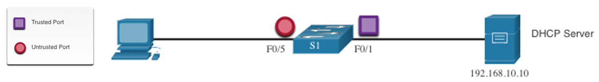
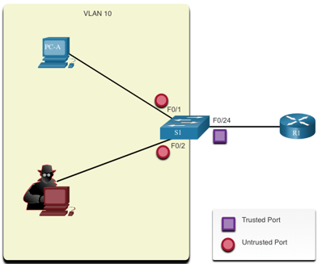

<style>
img[alt~="center"] {
  display: block;
  margin: 0 auto;
}
</style>

<style scoped>
h1 {
  font-size: 80px;
}
</style>

<!-- _class: invert -->

<!-- _paginate: false -->

# Switch Security Configuration

<!-- _footer: CCNA2v7 Module 11 Switch Security Configuration\nPedro Durán -->

---

# Implement Port Security

- Secure switch ports ➡️ **Disable all unused ports!!!** `interface range` and `no shutdown`
- Prevent MAC address table overflow ➡️ **Enable port security** (limits the number of valid MAC addresses allowed on a port).
  - Can only be configured on manually access or trunk ports.
```
S1(config)# interface f0/1
S1(config-if)# switchport mode access
S1(config-if)# switchport port-security
S1# show port-security interface f0/1
```
- Set the maximum number of MAC addresses allowed on a port:
```
S1(config-if)# switchport port-security maximum 2
```

---

# Learn MAC Addresses modes

1️⃣ **Manually Configured**
```
S1(config-if)# switchport port-security mac-address cafe.caca.baba
```

2️⃣ **Dynamically Learned**
`switchport port-security` command ➡️ current source MAC secured but NOT added to `running-config` (config lost!)

3️⃣ **Dynamically Learned - Sticky**
```
S1(config-if)# switchport port-security mac-address sticky
```
Learn MAC address and stick them to `running-config` (`wr` to commit changes).

---

# Switch Port Security Configuration Example
- Maximum of 4 MAC addresses
- Manually configure one secure MAC address
- Configure the port to dynamically learn additional secure MAC addresses up to the 4 secure MAC address maximum.

```
S1(config)# interface f0/1
S1(config-if)# switchport mode access
S1(config-if)# switchport port-security
S1(config-if)# switchport port-security maximum 4
S1(config-if)# switchport port-security mac-address aaaa.bbbb.1234
S1(config-if)# switchport port-security mac-address sticky
S1(config-if)# end
S1# show port-security interface f0/1
S1# show port-security
```

---

# Port security aging
Set the aging time for static and dynamic secure addresses on a port:
- **Absolute**: Secured addresses deleted after specified aging time (minutes).

```
S1(config-if)# switchport port-security aging time 10
S1(config-if)# switchport port-security aging type absolute
```

- **Inactivity**: Secured addresses deleted if they are inactive for a specified time.

```
S1(config-if)# switchport port-security aging time 10
S1(config-if)# switchport port-security aging type inactivity
```


Enable / disable static aging for the secured port:
```
S1(config-if)# switchport port-security aging static
```

---

# Port Security Violation Modes

MAC address differs from list of secured addresses ➡️ Port violation (`err-disabled`)

- **shutdown** (default): ❌`err-disabled` immediately + LED off + 📨sends syslog + 💦increments violation counter. Re-enable: `shutdown`and `no shutdown`
```
S1(config-if)# switchport port-security violation shutdown
```

- **restrict**: port drops packets with unknown source address until removed below the maximum allowed. 💦 increments violation counter + 📨sends syslog
```
S1(config-if)# switchport port-security violation restrict
```


- **protect**: port drops packets with unknown source address until removed below the maximum allowed.
```
S1(config-if)# switchport port-security violation protect
```

---

# Mitigate VLAN attacks

1️⃣ **Disable DTP on non-trunking ports**
```
S1(config)# interface f0/1 - 16
S1(config-if-range)# switchport mode access
```
2️⃣ **Disable unused ports and put them in an unused VLAN**
```
S1(config)# interface f0/17 - 20
S1(config-if-range)# switchport mode access
S1(config-if-range)# switchport access vlan 1000
```
**3️⃣ Manually enable trunks + 4️⃣ Disable DTP on trunking ports + 5️⃣ Set the native VLAN to a VLAN other than VLAN 1**
```
S1(config)# interface f0/21 - 24
S1(config-if-range)# switchport mode trunk
S1(config-if-range)# switchport nonegotiate
S1(config-if-range)# switchport trunk native vlan 999
```

---

# Mitigate DHCP attacks ➡️ DHCP Snooping

- **Enable DHCP snooping on trusted ports** 🟢 ➡️ rate-limit DHCP traffic on untrusted ports 🔴
  - 🟢 Switches, routers and servers
  - 🟠 Trunk links, server ports ➡️ explicity configured as trusted
  - 🔴 Devices outside the network and all access ports

- **DHCP Snooping Binding Table** built that includes:
  - **Source MAC address** of a device on an untrusted port
  - **IP assigned** by the DHCP server to that device

---

# Implement DHCP Snooping



1️⃣ **Enable DHCP snooping**
```
S1(config)# ip dhcp snooping
```
2️⃣ **On trusted ports**
```
S1(config)# interface f0/1
S1(config-if)# ip dhcp snooping trust
```


---

# Implement DHCP Snooping


3️⃣ On untrusted interfaces, **limit the number of DHCP discovery messages received (packets/second)**
```
S1(config)# interface range f0/5 - 24
S1(config-if)# ip dhcp snooping limit rate 6
```
4️⃣ **Enable DHCP snooping by VLAN**
```
S1(config)# ip dhcp snooping vlan 5,10,50-52
S1# show ip dhcp snooping
S1# show ip dhcp snooping binding
```

---

# Mitigate ARP Attacks ➡️ Dynamic ARP Inspection

- To prevent ARP spoofing and poisoning, switch must ensure that only valid ARP Requests and Replies are relayed ➡️ Enable Dynamic ARP Inspection (DAI)

- DAI requires DHCP snooping:
  - **Don't relay invalid ARP Replies** out to other ports in same VLAN.
  - **Intercept all ARP Requests and Replies on untrusted ports.**
  - Verify each intercepted packet for **valid IP-to-MAC binding**.
  - **Drop and log ARP Replies coming from invalid** to prevent ARP poisoning.
  - **`err-disabled` the interface** if the configured DAI number of ARP packets is exceeded.

All access switch ports: 🔴 untrusted
All uplink ports that are connected to other switches: 🟢 trusted

---

# DAI Implementation



1️⃣ **Enable DHCP snooping globally**
```
S1(config)# ip dhcp snooping
```

2️⃣ **Enable DHCP snooping on selected VLANs**
```
S1(config)# ip dhcp snooping vlan 10
```

3️⃣ **Enable DAI on selected VLANs**
```
S1(config)# ip arp inspection vlan 10
```

4️⃣ **Configure trusted interfaces**
```
S1(config)# interface f0/24
S1(config-if)# ip dhcp snooping trust
S1(config-if)# ip arp inspection trust
```

---

# Mitigate STP Attacks ➡️ PortFast and BPDU Guard

- **PortFast**: brings a port to the <span style="color:green">FWD</span> state from a <span style="color:red">BLK</span> state (bypassing listening and learning states). 
  - ⚠️ Apply to all end-user access ports
  - On a **interface**
  ```
  S1(config)# interface f0/1
  S1(config-if)# switchport mode access
  S1(config-if)# spanning-tree portfast
  ```
  - **Globally**
  ```
  S1(config)# spanning-tree portfast default
  ```

---

# Mitigate STP Attacks ➡️ PortFast and BPDU Guard

- **BPDU Guard**: `err-disabled` a port that receives a BPDU
  - ⚠️ Apply to all end-user access ports
  - Automatically re-enable port:
  ```
  S1(config)# errdisable recovery cause psecure_violation
  ```
  - On a **interface**
  ```
  S1(config)# interface f0/1
  S1(config-if)# spanning-tree bpduguard enable
  ```
  - **Globally**
  ```
  S1(config)# spanning-tree portfast bpduguard default
  S1(config)# end
  S1# show spanning-tree summary
  ```
