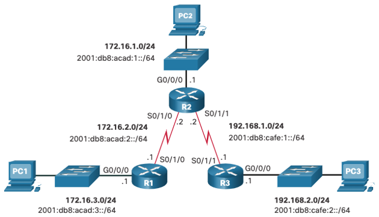

<style>
img[alt~="center"] {
  display: block;
  margin: 0 auto;
}
</style>

<style scoped>
h1 {
  font-size: 80px;
}
</style>

<!-- _class: invert -->

<!-- _paginate: false -->

# IP Static Routing

<!-- _footer: CCNA2v7 Module 15 IP Static Routing\nPedro Durán -->

---

# Types of Static Routes

- **Standard static route**: AD=1
- **Default static route**: Edge router to internet, stub router. AD=1
- **Floating static route**: backup path to a primary or dynamic route. Higher AD.
- **Host route**: Automatically (Local route: L) or Static
- **Summary static route**

# Next-Hop Options
- **Next-hop route**: next-hop IP address
- **Directly connected static route**: router exit interface
- **Fully specified static route**: next-hop IP address + router exit interface

---

# Dual-Stack Topology


---

## R1 - IPv4 and IPv6 Next-Hop Static Routes
```
R1(config)# ip route 172.16.1.0 255.255.255.0 172.16.2.2 
R1(config)# ip route 192.168.1.0 255.255.255.0 172.16.2.2 
R1(config)# ip route 192.168.2.0 255.255.255.0 172.16.2.2
R1(config)# ipv6 unicast-routing 
R1(config)# ipv6 route 2001:db8:acad:1::/64 2001:db8:acad:2::2 
R1(config)# ipv6 route 2001:db8:cafe:1::/64 2001:db8:acad:2::2 
R1(config)# ipv6 route 2001:db8:cafe:2::/64 2001:db8:acad:2::2
```

## R1 - IPv4 and IPv6 Directly Connected Static Route
```
R1(config)# ip route 172.16.1.0 255.255.255.0 s0/1/0 
R1(config)# ip route 192.168.1.0 255.255.255.0 s0/1/0 
R1(config)# ip route 192.168.2.0 255.255.255.0 s0/1/0
R1(config)# ipv6 unicast-routing 
R1(config)# ipv6 route 2001:db8:acad:1::/64 s0/1/0 
R1(config)# ipv6 route 2001:db8:cafe:1::/64 s0/1/0 
R1(config)# ipv6 route 2001:db8:cafe:2::/64 s0/1/0
```

---

## R1 - IPv4 and IPv6 Fully Specified Static Route
```
R1(config)# ip route 172.16.1.0 255.255.255.0 s0/1/0 172.16.2.2
R1(config)# ip route 192.168.1.0 255.255.255.0 s0/1/0 172.16.2.2
R1(config)# ip route 192.168.2.0 255.255.255.0 s0/1/0 172.16.2.2
R1(config)# ipv6 route 2001:db8:acad:1::/64 fe80::2
%Link-local address as next-hop => fully specified route
R1(config)# ipv6 route 2001:db8:acad:1::/64 s0/1/0 fe80::2
R1# show ip route
R1# show ipv6 route
```

## R1 - IPv4 and IPv6 Default Static Routes
```
R1(config)# ip route 0.0.0.0 0.0.0.0 172.16.2.2
R1(config)# ipv6 route ::/0 2001:db8:acad:2::2
R1# show ip route static
R1# show ipv6 route static
```
---

## R1 - IPv4 and IPv6 Floating Static Routes
```
R1(config)# ip route 0.0.0.0 0.0.0.0 172.16.2.2 
R1(config)# ip route 0.0.0.0 0.0.0.0 10.10.10.2 5 
R1(config)# ipv6 route ::/0 2001:db8:acad:2::2 
R1(config)# ipv6 route ::/0 2001:db8:feed:10::2 5
```

## R1 - IPv4 and IPv6 Static Host Routes
```
Branch(config)# ip route 209.165.200.238 255.255.255.255 198.51.100.2
Branch(config)# ipv6 route 2001:db8:acad:2::238/128 2001:db8:acad:1::2
Branch(config)# ipv6 route 2001:db8:acad:2::238/128 s0/1/0 fe80::2
```