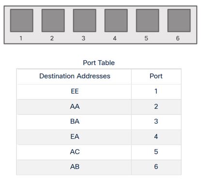
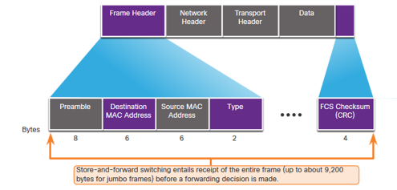
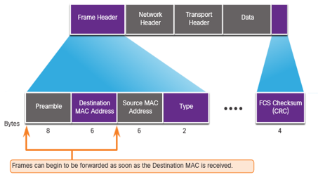
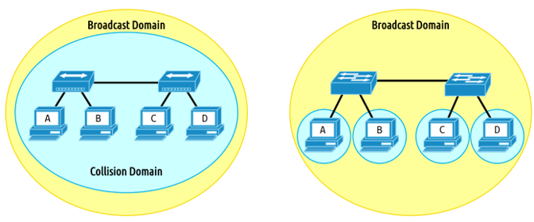

<!-- _class: invert -->

<!-- _paginate: false -->

# Switching Concepts

<!-- _footer: 📕 CCNA2v7 Module 2 Switching Concepts\n🧑🏻‍🏫 Pedro Durán -->

---
<!-- _header: "Frame Forwarding" -->

# Switching in Networking

## Ports Types:
- ⤵️ **Ingress**: entering the interface
- ⤴️ **Egress**: exiting the interface

## Forwarding frames:
  - ⤵️ **Ingress Interface**
  - **Destination MAC address** ➡️ Egress
  - **Using its MAC Address Table** ➡️ Ingress Source MAC Adress

---

<!-- _header: "Frame Forwarding" -->

# The Switch Learn and Forward Method

1️⃣ **Learn – Examines Source Address**
   - ✍🏻 Adds the source MAC if not in table
   - 🕐 Resets the time out setting back to 5 minutes if source is in the table

2️⃣ **Forward – Examines Destination Address**
   - 🤔 Destination MAC in MAC address table? ➡️ forward out the specified port
   - 🤔 Destination MAC is not in the table? ➡️ flooded out all interfaces except the one it was received.

---

<!-- _header: "Switch Forwarding Methods" -->
# Switch Forwarding Methods: Store-and-Forward
- **Error checking**: Check FCS for CRC errors. Bad frames discarded
- **Buffering**: Buffer frame while it checks FCS.

---

<!-- _header: "Switch Forwarding Methods" -->
# Switch Forwarding Methods: Cut-Through
- ✂️ **Cut-through**: Forwards frame after Destination MAC.
- **Fragment Free**: At least 64 bytes. Eliminates runts.
- **⚠️ Does not check FCS ➡️ It can propagate errors**

---

# Broadcast domain
- Router: 🔴
- Switch: 🟢 
- Hub: 🟢

# Collision domain
- Router: 🔴
- Switch: 🔴
- Hub: 🟢

---

# Alleviated Network Congestion

- MAC Address Table
- Full-duplex
- Fast Port Speeds
- Fast Internal Switching
- Large Frame Buffers
- High Port Density