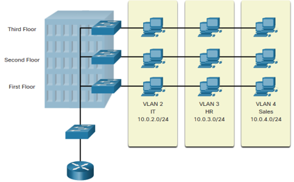
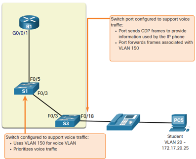
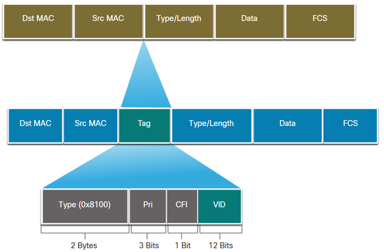
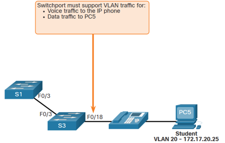
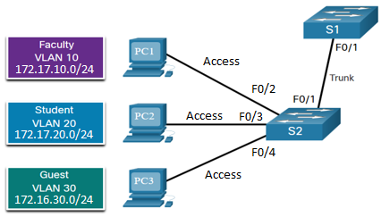
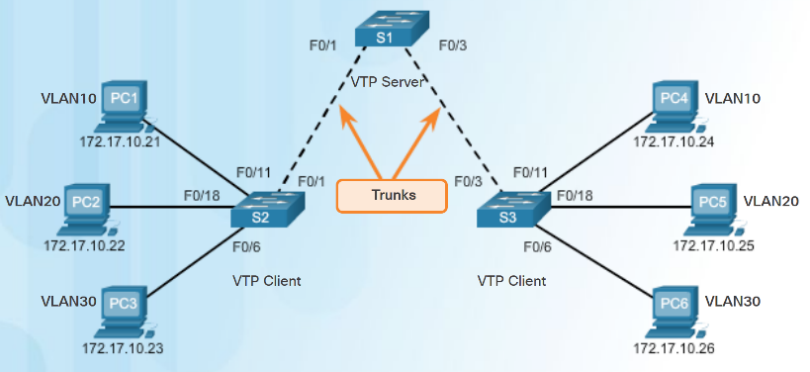

<style>
img[alt~="center"] {
  display: block;
  margin: 0 auto;
}
</style>

<style scoped>
h1 {
  font-size: 80px;
}
</style>

<!-- _class: invert -->

<!-- _paginate: false -->

# VLANs

<!-- _footer: 📕 CCNA2v7 Module 3 VLANs + CCNA3v6 Chapter 2 Scaling VLANs\n🧑🏻‍🏫 Pedro Durán -->

---

# VLAN
- **Logical connections** with other similar devices
- **Benefits:**
  - Smaller Broadcast Domains
  - Improved Security
  - Improved IT Efficiency
  - Reduced Cost
  - Better Performance
  - Simpler Management

> ⚠️ Each VLAN will have its own unique range of IP addressing



---

# Types of VLANs

- **Default VLAN**: **VLAN 1**
  - Default VLAN, native VLAN and management VLAN
  - Assigned to all interfaces by default
  - Cannot be deleted or renamed
- **Data VLAN**: User-generated traffic. Default VLAN 1.
- **Native VLAN**: Used for trunks links only. Default VLAN 1. Designed for legacy use.
- **Management VLAN**: Used for SSH/Telnet VTY traffic. Default VLAN 1.

---

# Types of VLANs

- 📞 **Voice VLAN**:
Separated VLAN required
  - Assured bandwith
  - High QoS priority
  - Ability to avoid congestion
  - Delay < 150 ms



---

# Defining VLAN Trunks
- 🪵 **Trunk**:  point-to-point link between 2 network devices that:
  - Allows more than one VLAN (by default all VLANs)
  - Extend the VLAN across the entire network
  - Support 802.1q trunking
- **Devices connected to the switches receive unicast, multicast and broadcast**:
  - **Without VLAN**: all devices
  - **With VLAN**: ony those confined to the VLAN

---

# VLAN Identication with a Tag
- **IEEE 802.1q: 4 bytes** (in a Frame between Src MAC and Type/Length)
  - **Type**: 2 bytes 0x8100
  - **User priority**: 3 bits
  - **Canonical Format Identifier (CFI)**: 1 bit (token ring frames)
  - **VLAN ID (VID)**: **12 bits ➡️ 4096 VLANs**
- Tag removed when sent to end devices



---

# VLAN Ranges on Catalyst Switches

- **Normal Range VLAN 1-1005**:
  - Used in Small to Medium sized businesses
  - **1, 1002-1005** (Reserved for legacy): Autocreated, cannot be deleted
  - Stored in **flash:/vlan.dat**
- **Extended Range VLAN 1006-4095**:
  - Used by Service Providers
  - Stored in **running-config**
  - Fewer VLAN features

---

# Data and Voice VLAN Example

```csharp
S3# configure terminal
S3(config)# vlan 20
S3(config-vlan)# name STUDENTS
S3(config-vlan)# vlan 150
S3(config-vlan)# name VOICE
S3(config-vlan)# interface f0/18
S3(config-if)# switchport mode access
S3(config-if)# switchport access vlan 20
S3(config-if)# mls qos trust cos
S3(config-if)# switchport voice vlan 150
S3(config-if)# end
S3# show vlan brief
```



---

# Trunk Configuration Example

```csharp
S2# configure terminal
S2(config)# vlan 10
S2(config-vlan)# name Faculty
S2(config-vlan)# vlan 20
S2(config-vlan)# name Student
S2(config-vlan)# vlan 30
S2(config-vlan)# name Guest
S2(config-vlan)# vlan 99
S2(config-vlan)# name Native
S2(config-vlan)# interface f0/2
S2(config-if)# switchport mode access
S2(config-if)# switchport access vlan 10
S2(config-if)# interface f0/3
S2(config-if)# switchport mode access
S2(config-if)# switchport access vlan 20
S2(config-if)# interface f0/4
S2(config-if)# switchport mode access
S2(config-if)# switchport access vlan 30
S2(config-if)# interface f0/1
S2(config-if)# switchport mode trunk
S2(config-if)# switchport trunk native vlan 99
S2(config-if)# switchport trunk allowed vlan 10,20,30,99
S2(config-if)# do show interfaces f0/1 switchport
```



---

# Dynamic Trunking Protocol (DTP)

- 🟢: by default (Dynamic auto mode) on Catalyst switches
- 🔴: turned off with **`switchport nonegotiate`** command

## Negotiated Interface Modes (`switchport mode ...`):
  - **`access`**: Permanent access mode. Negotiates to convert neighbor into access.
  - **`dynamic auto`**: Becomes a trunk only if neighbor is trunk or desirable.
  - **`dynamic desirable`**: Actively seeks becoming trunk.
  - **`trunk`**: Permanent trunk mode. Negotiates to convert neighbor into trunk.

> Verify DTP Mode with `show dtp interface f0/1`
> ⚠️ **Best practice: DISABLE DTP!**

---

## Results of a DTP Configuration

| Link Device 1 Mode / Link Device 2 Mode | Dynamic Auto | Dynamic Desirable | **<span style="color:blue">Trunk</span>** | **<span style="color:green">Access</span>** |
|-------------------|--------------|-------------------|----------------------|----------------------|
| **Dynamic Auto** | **<span style="color:green">Access</span>** | **<span style="color:blue">Trunk</span>** | **<span style="color:blue">Trunk</span>** | **<span style="color:green">Access</span>** |
| **Dynamic Desirable** | **<span style="color:blue">Trunk</span>** | **<span style="color:blue">Trunk</span>**      | **<span style="color:blue">Trunk</span>**         | **<span style="color:green">Access</span>** |
| **<span style="color:blue">Trunk</span>**      | **<span style="color:blue">Trunk</span>** | **<span style="color:blue">Trunk</span>**      | **<span style="color:blue">Trunk</span>**         | **<span style="color:red">Limited Connectivity</span>** |
| **<span style="color:green">Access</span>** | **<span style="color:green">Access</span>**  | **<span style="color:green">Access</span>**  | **<span style="color:red">Limited Connectivity</span>** | **<span style="color:green">Access</span>** |

---

# VLAN Trunking Protocol (VTP)

- Manage VLANs on a **switch** configured as a VTP Server
- VTP server distributes and synchronize VLAN information over trunk links.
- Modes:
  - VTP version 1: Default mode. Supports normal range VLANs only
  - VTP version 2: Supports advanced features.

```csharp
S1# show vtp status
```

---

# VTP Modes

- **VTP Server:**
  - Advertise VTP domain
  - Store VLAN information for the entire domain in NVRAM
  - Operations allowed: create, delete or rename VLANs for the domain
  - Configuration revision number stored in NVRAM.
- **VTP Client:**
  - Cannot create, delete or rename VLANs
  - Only stores VLAN information for the entire domain while is ON (RAM)
- **VTP Transparent:**
  - Forwards VTP advertisements to VTP clients and servers
  - Can create, rename or delete **LOCAL** VLANs (stored in NVRAM)
  - Needed for creating extended VLANs on a VTP enabled switch

---

# VTP Configuration

```csharp
S1(config)# vtp mode server
S1(config)# vtp domain CCNA
S1(config)# vtp password cisco12345
S1(config)# vlan 10
S1(config-vlan)# name SALES
S1(config-vlan)# vlan 20
S1(config-vlan)# name MARKETING
S1(config-vlan)# vlan 30
S1(config-vlan)# name ACCOUNTING
```
```csharp
S2(config)# vtp mode client
S2(config)# vtp domain CCNA
S2(config)# vtp password cisco12345
S2(config)# exit
S2# show vtp status
```

