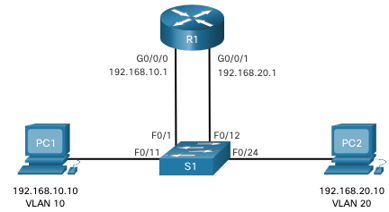
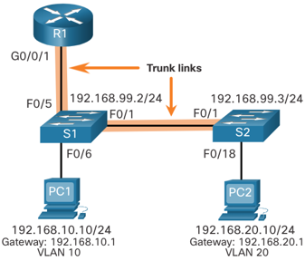
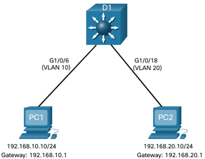

<style>
img[alt~="center"] {
  display: block;
  margin: 0 auto;
}
</style>

<style scoped>
h1 {
  font-size: 80px;
}
</style>

<!-- _class: invert -->

<!-- _paginate: false -->

# Inter-VLAN Routing

<!-- _footer: 📕 CCNA2v7 Module 4 Inter-VLAN Routing\n🧑🏻‍🏫 Pedro Durán -->

---

# Inter-VLAN Routing
- Process of forwarding network traffic from one VLAN to another VLAN.
- **3 options:**
  1️⃣ **Legacy Inter-VLAN Routing**: Legacy. Does not scale well.
  2️⃣ ⭐ **Router-on-a-Stick (RoaS)**: Acceptable for small to medium-sized network.
  3️⃣ ⭐ **Inter-VLAN Routing on a Layer 3 Switch**: Most scalable solution for medium to large organizations.

---

# 1️⃣ Legacy Inter-VLAN Routing

- Using a **Router** requiring **1 physical interface per VLAN**.
- **Limitation:** Routers have a limited number of interfaces.
> **⚠️ No longer implemented!!! Explanation purposes only!!!**



---

# 2️⃣ ⭐ Router-on-a-Stick Inter-VLAN Routing (RoaS)

- **Only requires 1 physical interface** to route traffic between multiple VLANs.
- Router (trunk port) > Link > Switch (trunk port)
- Using **software-based subinterfaces** to identify routable VLANs.
  - Each subinterface configured for each VLAN.
- **Limitation:** does not scale beyond 50 VLANs.

---

# 2️⃣ RoaS Configuration (S1/S2)

```
S2(config)# vlan 10
S2(config-vlan)# name LAN10
S2(config-vlan)# vlan 20
S2(config-vlan)# name LAN20
S2(config-vlan)# vlan 99
S2(config-vlan)# name Management
S2(config-vlan)# interface vlan 99
S2(config-if)# ip add 192.168.99.3 255.255.255.0
S2(config-if)# no shutdown
S2(config-if)# exit
S2(config)# ip default-gateway 192.168.99.1
S2(config)# interface f0/18
S2(config-if)# switchport mode access
S2(config-if)# switchport access vlan 20
S2(config-if)# no shutdown
```



---

# 2️⃣ RoaS Configuration (R1)

```
R1(config)# interface g0/0/1.10
R1(config-subif)# description Default gw for VLAN 10
R1(config-subif)# encapsulation dot1q 10
R1(config-subif)# ip add 192.168.10.1 255.255.255.0

R1(config-subif)# interface g0/0/1.20
R1(config-subif)# description Default gw for VLAN 20
R1(config-subif)# encapsulation dot1q 20
R1(config-subif)# ip add 192.168.20.1 255.255.255.0

R1(config-subif)# interface g0/0/1.99
R1(config-subif)# description Default gw for VLAN 99
R1(config-subif)# encapsulation dot1q 99
R1(config-subif)# ip add 192.168.99.1 255.255.255.0

R1(config-subif)# interface g0/0/1
R1(config-if)# description Trunk link to S1
R1(config-if)# no shutdown
```


---

# 3️⃣ ⭐ Inter-VLAN Routing on a Layer 3 Switch

- Modern method that uses **Layer 3 / Multilayer Switches** and SVIs.
- SVI created for each VLAN ➡️ `interface vlan 10`
- Convert a Layer 2 switchport to a Layer 3 interface (**routed port**).
- **Advantages:**
  - 🚅 Much faster than RoaS.
  - No need for external links from the switch to the router.
  - Not limited to 1 link ➡️ EtherChannels as trunk links between switches
  - Latency much lower.
  - **More commonly deployed in a Campus LAN than router.**
- **Disavantage:** 💵 Layer 3 Switches are more expensive.

---

# 3️⃣ L3 Switch Routing Config

```
D1(config)# vlan 10
D1(config-vlan)# name LAN10
D1(config-vlan)# vlan 20
D1(config-vlan)# name LAN20
D1(config-vlan)# interface vlan 10
D1(config-if)# description Default gw for 192.168.10.0/24
D1(config-if)# ip add 192.168.10.1 255.255.255.0
D1(config-if)# no shutdown
D1(config-if)# interface vlan 20
D1(config-if)# description Default gw for 192.168.20.0/24
D1(config-if)# ip add 192.168.20.1 255.255.255.0
D1(config-if)# no shutdown
D1(config-if)# interface GigabitEthernet1/0/6
D1(config-if)# description Access port to PC1
D1(config-if)# switchport mode access
D1(config-if)# switchport access vlan 10
D1(config-if)# interface GigabitEthernet1/0/18
D1(config-if)# description Access port to PC2
D1(config-if)# switchport mode access
D1(config-if)# switchport access vlan 20
D1(config-if)# exit
D1(config)# ip routing
```

