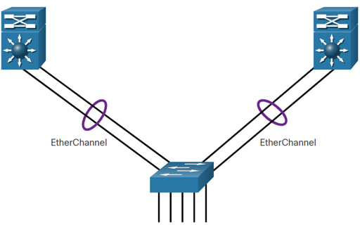
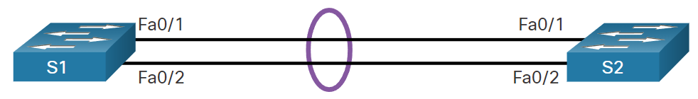

<style>
img[alt~="center"] {
  display: block;
  margin: 0 auto;
}
</style>

<style scoped>
h1 {
  font-size: 80px;
}
</style>

<!-- _class: invert -->

<!-- _paginate: false -->

# EtherChannel

<!-- _footer: CCNA2v7 Module 6 EtherChannel\nPedro Durán -->

---

# Link Aggregation

**EtherChannel**: Allows you to combine multiple physical interfaces into one logical interface, which increases performance while maintaining redundancy.
 - Provides fault-tolerance, load sharing, increase bandwith and redundancy.
 - Also known as Port Aggregation (PAgP), Link Aggregation (LACP), channel bonding, or multi-linking.

**Port channel**: Logical interface which operates at the speed of the combined physical interfaces.



---

# Advantages
- Configuration consistency throughout the links (same config).
- No need to upgrade the link to have more bandwith.
- Load balancing between links
- Provides redundancy (one physical link failing does not create a change in topology).
# Restrictions
- Interface types cannot be mixed (FastEthernet <> GigabitEthernet).
- Up to 8 Ethernet ports (800 Mbps or 8 Gbps). Cisco 2960 up to 6 EtherChannels
- Individual EtherChannel group member port config must be consistent on both sides (L2 ports, if it's a trunk ➡️ same native VLAN)

---

# AutoNegation Protocols
- **Port Aggregation Protocol (PAgP)**:
  - Cisco propietary. PAgP packets sent every 30 seconds. 
- **Link Aggregation Control Protocol (LACP)**
  - IEEE specification (802.3ad). Multivendor environments

# Configuration Guidelines both ends
  - **Same EtherChannel support. Same speed and duplex**.
  - **Same VLAN match** (all interfaces to same VLAN or as a trunk) and **Range of VLANs**.

---

# <span style="color:blue">PAgP</span> - <span style="color:violet">LACP</span> Mode Settings

| S1 | S2 | Channel Establishment |
|:--:|:--:|:---------------------:|
| <span style="color:blue">On</span> - <span style="color:violet">On</span> | <span style="color:blue">On</span> - <span style="color:violet">On</span> | **<span style="color:green">Yes</span>** |
| <span style="color:blue">On</span> - <span style="color:violet">On</span> | <span style="color:blue">Desirable/Auto</span> - <span style="color:violet">Active/Passive</span> | **<span style="color:red">No</span>** |
| <span style="color:blue">Desirable</span> - <span style="color:violet">Active</span> | <span style="color:blue">Desirable</span> - <span style="color:violet">Active</span> | **<span style="color:green">Yes</span>** |
| <span style="color:blue">Desirable</span> - <span style="color:violet">Active</span> | <span style="color:blue">Auto</span> - <span style="color:violet">Passive</span> | **<span style="color:green">Yes</span>**  |
| <span style="color:blue">Auto</span> - <span style="color:violet">Passive</span> | <span style="color:blue">Desirable</span> - <span style="color:violet">Active</span> | **<span style="color:green">Yes</span>**  |
| <span style="color:blue">Auto</span> - <span style="color:violet">Passive</span> | <span style="color:blue">Auto</span> - <span style="color:violet">Passive</span> | **<span style="color:red">No</span>** |

---

# LACP Configuration Example


```
S1(config)# interface range f0/1-2
S1(config-if-range)# channel-group 1 mode active
S1(config-if-range)# port-channel interface Port-channel 1
S1(config-if-range)# interface port-channel 1
S1(config-if)# switchport mode trunk
S1(config-if)# switchport trunk allowed vlan 1,2,20
S1(config-if)# end
S1# show interfaces port-channel
S1# show etherchannel summary
S1# show etherchannel port-channel
S1# show interfaces etherchannel
```