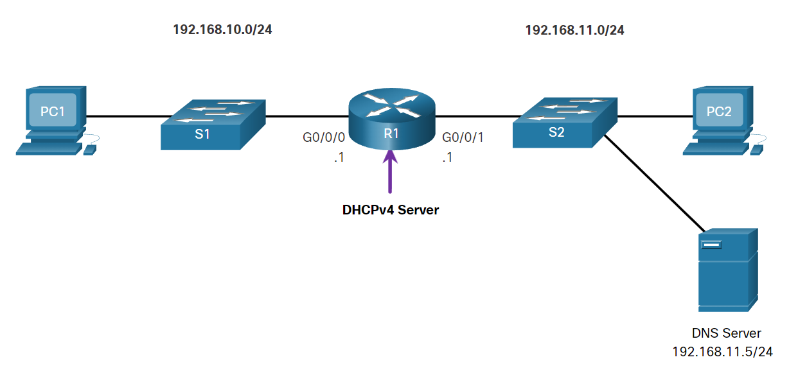
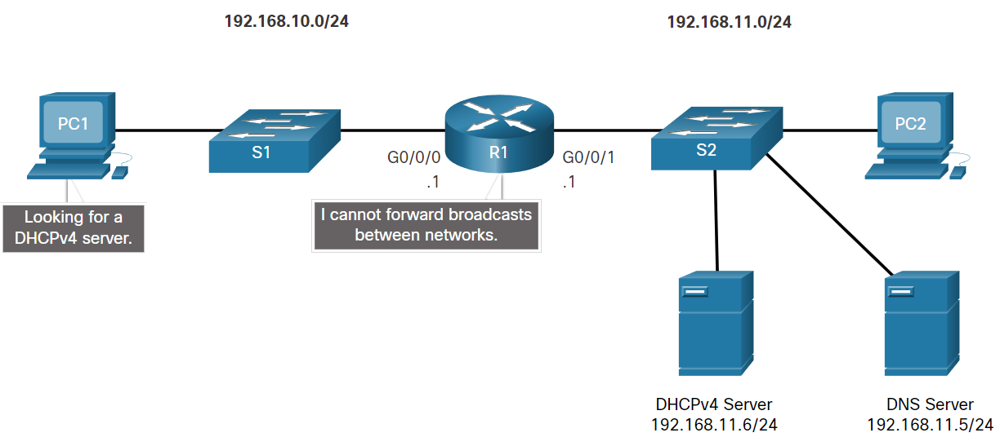
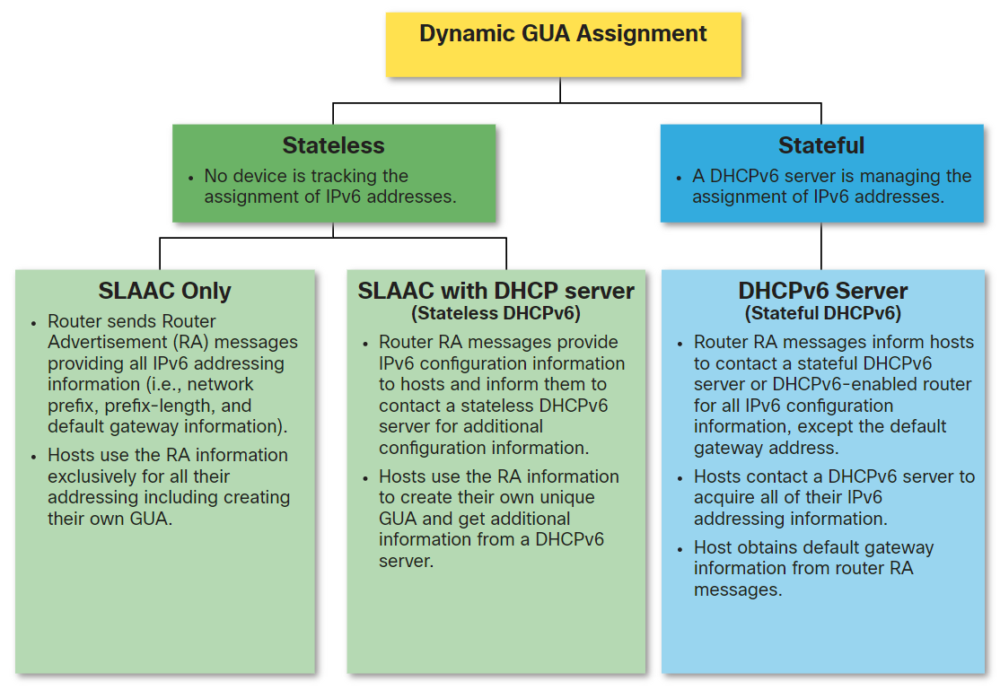
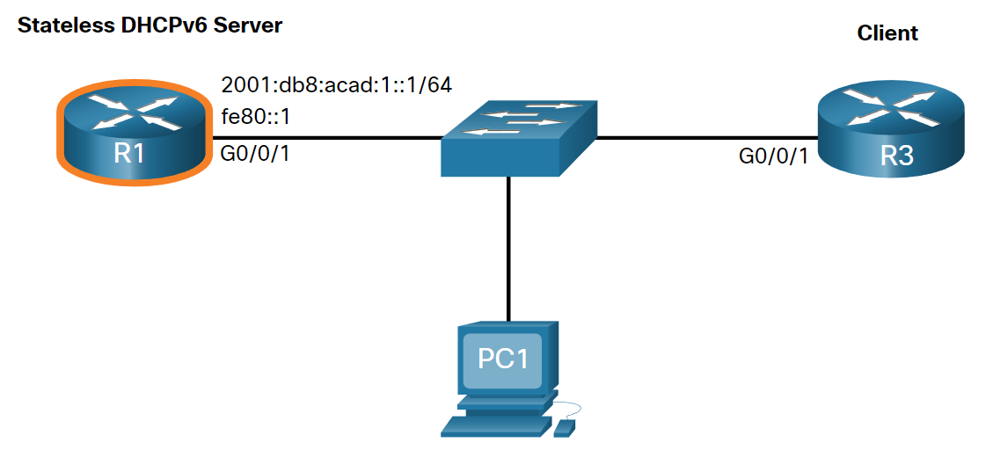
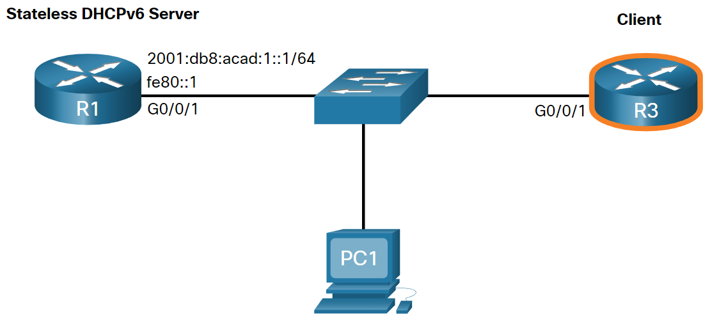
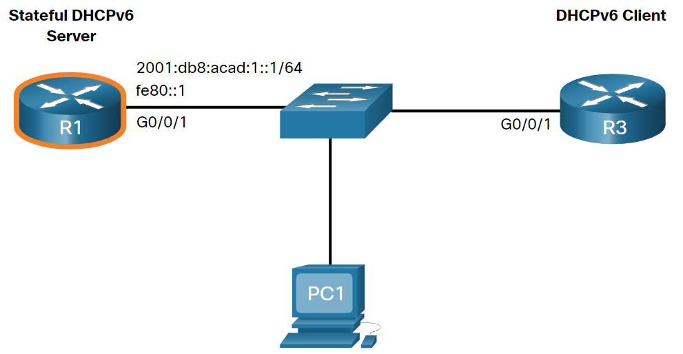
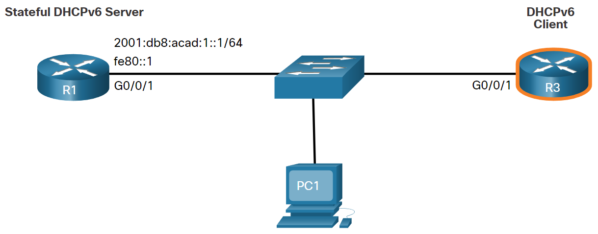
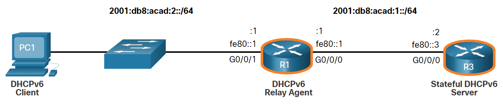

<style>
img[alt~="center"] {
  display: block;
  margin: 0 auto;
}
</style>

<style scoped>
h1 {
  font-size: 80px;
}
</style>

<!-- _class: invert -->

<!-- _paginate: false -->

# DHCPv4 + SLAAC and DHCPv6

<!-- _footer: CCNA2v7 Module 7 DHCPv4 +  CCNA2v7 Module 8 SLAAC and DHCPv6\nPedro Durán -->

---

# DHCPv4
- DHCPv4 server dynamically assigns, or leases, an IPv4 address from a pool of addresses (and other network configuration) for a limited period of time.
- Clients lease information from the server for a defined period.
 Lease expires ➡️ client asks for another address


## Disable the Cisco IOS DHCPv4 Server
```
R1(config)# no service dhcp
```

## Configure Cisco Router as a DHCPv4 Client
```
SOHO(config)# interface G0/0/1
SOHO(config-if)# ip address dhcp
```

---

# Steps to Obtain a Lease
1️⃣ DHCPDISCOVER: Broadcast
2️⃣ DHCPOFFER: Unicast
3️⃣ DHCPREQUEST: Broadcast
4️⃣ DHCPACK: Unicast

# Steps to Renew a Lease
1️⃣ DHCPREQUEST: Unicast
2️⃣ DHCPACK: Unicast

---

# Configure a Cisco IOS DHCPv4 Server


```
R1(config)# ip dhcp excluded-address 192.168.10.1 192.168.10.9
R1(config)# ip dhcp excluded-address 192.168.10.254
R1(config)# ip dhcp pool LAN-POOL-1
R1(dhcp-config)# network 192.168.10.0 255.255.255.0
R1(dhcp-config)# default-router 192.168.10.1
R1(dhcp-config)# dns-server 192.168.11.5
R1(dhcp-config)# domain-name example.com
R1# show running-config | section dhcp
R1# show ip dhcp binding
R1# show ip dhcp server statistics
```

---

# DHCPv4 Relay



```
R1(config)# interface g0/0/0
R1(config-if)# ip helper-address 192.168.11.6
```

## Other Service Broadcasts Relayed
37 Time, 49 TACACS, 53 DNS, 67 DHCP/BOOTP server, 68 DHCP/BOOTP client, 69 TFTP, 137 NetBIOS name service, 138 NetBIOS datagram service

---

# SLAAC and DHCPv6 - Dynamic GUA Assignment



---

# IPv6 GUA Assignment - 3 RA Message Flags
- **A flag (A: 1️⃣, O: 0️⃣, M: 0️⃣)**: Autoconfiguration. **SLAAC Only**
```
R1(config)# ipv6 unicast-routing
```
- **O flag (A: 1️⃣, O: 1️⃣, M: 0️⃣)**: Other configuration. **SLAAC with DHCPv6 Server (Stateless DHCPv6)**
```
R1(config)# ipv6 nd other-config-flag
```
- **M flag (A: 0️⃣, O: 0️⃣, M: 1️⃣)**: Managed address configuration. **DHCPv6 Server (Stateful DHCPv6)**

```
R1(config)# int g0/0/1
R1(config-if)# ipv6 nd managed-config-flag
R1(config-if)# ipv6 nd prefix default no-autoconfig
```
---

# <!--fit-->Configure a Stateless DHCPv6 Server (A: 1️⃣, O: 1️⃣, M: 0️⃣)



```
R1(config)# ipv6 unicast-routing
R1(config)# ipv6 dhcp pool IPV6-STATELESS
R1(config-dhcpv6)# dns-server 2001:db8:acad:1::254
R1(config-dhcpv6)# domain-name example.com
R1(config)# interface GigabitEthernet0/0/1
R1(config-if)# description Link to LAN
R1(config-if)# ipv6 address fe80::1 link-local
R1(config-if)# ipv6 address 2001:db8:acad:1::1/64
R1(config-if)# ipv6 nd other-config-flag
R1(config-if)# ipv6 dhcp server IPV6-STATELESS
R1(config-if)# no shut
```

---

# <!--fit-->Configure a Stateless DHCPv6 Client (A: 1️⃣, O: 1️⃣, M: 0️⃣)


```
R1(config)# ipv6 unicast-routing
R3(config)# interface g0/0/1
R3(config-if)# ipv6 enable
R3(config-if)# ipv6 address autoconfig
R3(config-if)# end
R3# show ipv6 interface brief
R3# show ipv6 dhcp interface g0/0/1
```

---

# <!--fit-->Configure a Stateful DHCPv6 Server (A: 0️⃣, O: 0️⃣, M: 1️⃣)


```
R1(config)# ipv6 unicast-routing
R1(config)# ipv6 dhcp pool IPV6-STATEFUL
R1(config-dhcpv6)# address prefix 2001:db8:acad:1::/64
R1(config-dhcpv6)# dns-server 2001:4860:4860::8888
R1(config-dhcpv6)# domain-name example.com
R1(config)# interface GigabitEthernet0/0/1
R1(config-if)# description Link to LAN
R1(config-if)# ipv6 address fe80::1 link-local
R1(config-if)# ipv6 address 2001:db8:acad:1::1/64
R1(config-if)# ipv6 nd managed-config-flag
R1(config-if)# ipv6 nd prefix default no-autoconfig
R1(config-if)# ipv6 dhcp server IPV6-STATEFUL
R1(config-if)# no shut
```

---

# <!--fit-->Configure a Stateful DHCPv6 Client (A: 0️⃣, O: 0️⃣, M: 1️⃣)



```
R3(config)# ipv6 unicast-routing
R3(config)# interface g0/0/1
R3(config-if)# ipv6 enable
R3(config-if)# ipv6 address dhcp
R3(config-if)# end
R3# show ipv6 interface brief
R3# show ipv6 dhcp interface g0/0/1

R1# show ipv6 dhcp pool
R1# show ipv6 dhcp binding
```

---

# Configure a DHCPv6 Relay Agent



```
R1(config)# interface gigabitethernet 0/0/1
R1(config-if)# ipv6 dhcp relay destination 2001:db8:acad:1::2 G0/0/0
R1(config-if)# exit
R1# show ipv6 dhcp interface
R3# show ipv6 dhcp binding
```