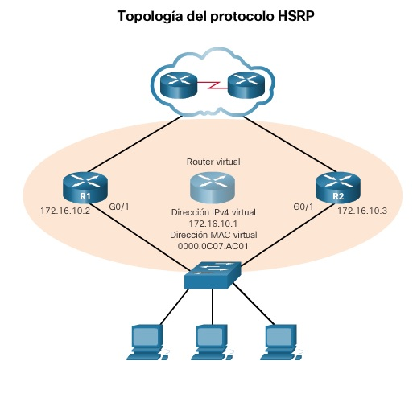

<style>
img[alt~="center"] {
  display: block;
  margin: 0 auto;
}
</style>

<style scoped>
h1 {
  font-size: 80px;
}
</style>

<!-- _class: invert -->

<!-- _paginate: false -->

# FHRP

<!-- _footer: CCNA2v7 Module 9 FHRP Concepts\nPedro Durán -->

---

# FHRP
First hop redundancy protocols (FHRPs) are mechanisms that **provide alternate default gateways** in switched networks where two or more routers are connected to the same VLANs.

- Implement a **virtual router**: 2 or more routers share an IP address and a MAC address acting as a single virtual router.
- A redundancy protocol provides the mechanism for determining which router should take the active role in forwarding traffic.

---

# FHRP Options
- **Hot Standby Router Protocol (HSRP)**: Cisco-propietary IPv4 or IPv6 devices.
  - Hello packets: 3 seconds
  - The standby router will become active if it does not receive a hello message from the active router after 10 seconds.
- **Virtual Router Redundancy Protocol version 2 (VRRPv2)**: non-propiertary IPv4
- **VRRPv3**: non-propiertary IPv4 and IPv6. More scalable than VRRPv2
- **Gateway Load Balancing Protocol (GLBP)**: Cisco-propietary. IPv4 and IPv6. Adds load balancing.

---

# HSRP Priority and Preemption
- HSRP Election Process (1️⃣, if equals then 2️⃣):
  - 1️⃣ Router with highest HSRP Priority ➡️ Active router
    - Default priority: 100 (Range: 0..255)
  - 2️⃣ Router with highest IPv4 ➡️ Active router
- Active router remains active even if another router comes online with higher HSRP priority.
  - Force ➡️ **Preemption enabled (triggers re-election)**
    - **Only higher HSRP priority. NOT PREEMPT equal priority but a higher IPv4**

---
# HSRP Configuration Example



```
R1(config)# interface g0/1
R1(config-if)# ip address 172.16.10.2 255.255.255.0 
R1(config-if)# standby 1 ip 172.16.10.1
R1(config-if)# standby 1 priority 150 
R1(config-if)# standby 1 preempt 
R1(config-if)# standby 1 authentication cisco
R1(config-if)# standby 1 timers 5 15

R2(config)# interface g0/1
R2(config-if)# ip address 172.16.10.3 255.255.255.0 
R2(config-if)# standby 1 ip 172.16.10.1 
R2(config-if)# standby 1 priority 100 
R2(config-if)# standby 1 authentication cisco 
R2(config-if)# standby 1 timers 5 15 
```