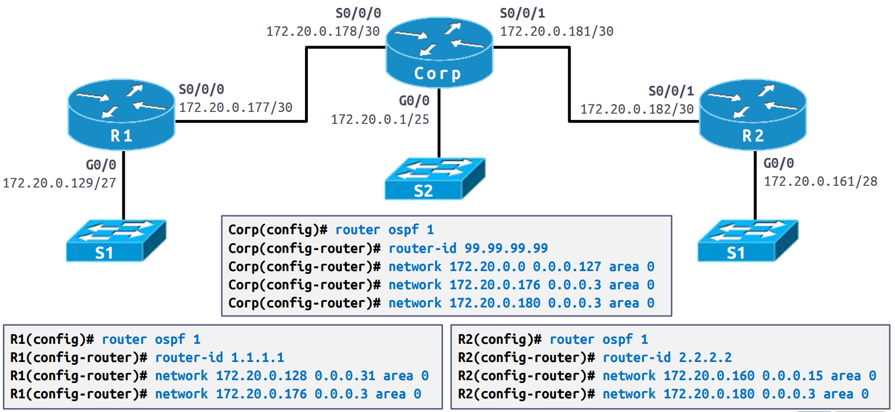
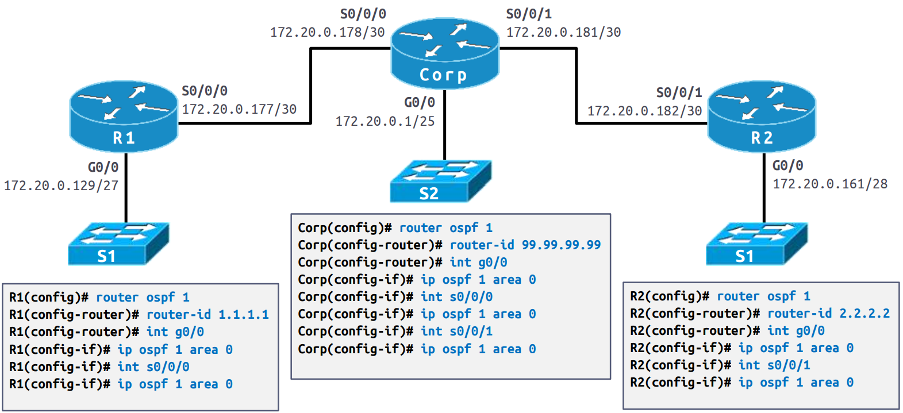
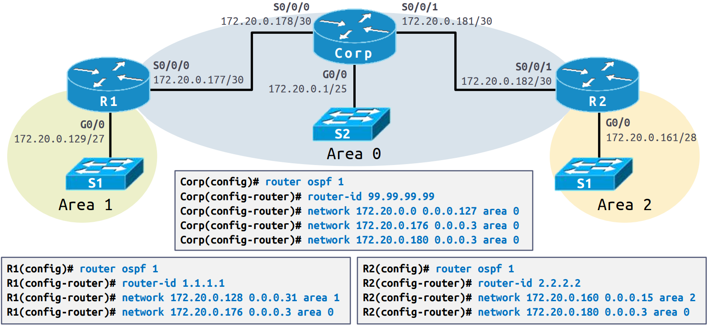
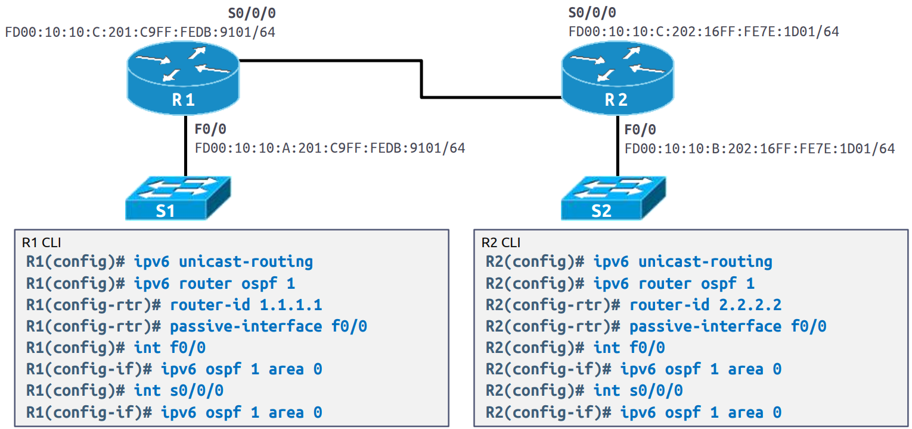

<style>
img[alt~="center"] {
  display: block;
  margin: 0 auto;
}
</style>

<style scoped>
h1 {
  font-size: 80px;
}
</style>

<!-- _class: invert -->

<!-- _paginate: false -->

# OSPF

<!-- _footer: CCNA2v7 Module 1 OSPF Concepts + Module 2 Single-Area OSPFv2 Configuration\nPedro Durán -->

---

# OSPF (IPv4: OSPFv2 / IPv6:OSPFv3)

- **Link-state** (network prefix, prefix length, cost) routing protocol. Alternative to RIP.
- Faster convergence. Scales to much large network implementations.
- Router builds topology table using **Dijkstra Shortest-Path First (SPF) algorithm** (cumulative cost to reach a destination) to calculate best routes.
- **Areas**: divide the routing domain into areas that help control routing update traffic.
  - **Single-Area OSPF**: all routers in one area. **Area 0**.
  - **Multiarea OSPF**:
    - All areas connected to backbone area (Area 0)
    - Area Border Routers (ABRs): routers interconnecting the areas.
    - Smaller routing tables. Reduced link-state update overhead. Reduced frequency of SPF calculations.

---

# Types of OSPF Packets

5 types of packets (LSP: Link State Packets) to discover neighbors and exchange routing info:

:one: **Hello packet**: Discovers neighbors and builds adjacencies between them
:two: **Database description (DBD)**: Checks for database synchronization between routers
:three: **Link-state request (LSR)**: Requests specific link-state records from router to router
:four: **Link-state update (LSU)**: Sends specifically requested link-state records
:five: **Link-state acknowledgment packet (LSack)**: Acknowledges the other packet types


---

# Components of OSPF - Databases

3 OSPF databases:

:one: **Adjacency Database** (Neighbor Table) `show ip ospf database`
List of all neighbor routers. Unique for each router.
  
:two: **Link-state Database (LSDB)** (Topology Table) `show ip ospf database`
Lists info about all other routers. All routers within an area have same LSDB.

:three: **Forwarding Database** (Routing Table)
List of routers generated when algorithm is run. Unique router's routing table.

---

# Components of OSPF - SPF algorithm
:one: Router builds topology table using Dijkstra shortest-path first (SPF) algorithm (cumulative cost to reach a destination) to calculate best routes.
:two: OSPF places the best routes into the Forwarding Database.

# Link-State Operation

Link-state routing steps that are completed by a router:

:one: Establish Neighbor Adjacencies
:two: Exchange Link-State Advertisements
:three: Build the Link State Database
:four: Execute the SPF Algorithm
:five: Choose the Best Route

---

# OSPF Terminology

- **Adjacency:** is the relationship that must be formed between two OSPF routers that allows them to exchange routing table updates. Adjacencies can only be formed by routers that are in the same area.

- **Router ID:** is a unique identifier used by OSPF routers to communicate with each other. It can be set by using the router-idcommand, but if it's not set the highest IP address on the loopback interface will become your router-id, if the loopback is not set then it's the highest IP on a physical interface.

---

# OSPF Terminology

- **Designated Router:** is determined by the priority set on the router (highest number wins). If the priority matches then the Router-id is the tie breaker (highest Router-id wins). The designated router (DR) forms adjacencies to all routers so it can send and receive all routing table updates.

- **Backup Designated Router:** is there as a backup for the DR. It’s the router with the next highest priority or the next highest Router-ID. It receives all routing table updates but does NOT send them out.

- **Hello Protocol:** used to discover other OSPF routers and maintains the adjacency between them.

- **Passive Interface:** to prevent the transmission of routing messages through a router interface, but still allow that network to be advertised to other routers.

---

# OSPF Terminology

- **Link State Advertisement:** is an OSPF data packet that sends out link-state and routing information. Only routers that form an adjacency can exchange link state advertisements (LSA)

- **Neighborship database:** list of all OSPF routers. This is a unique feature of OSPF.

- **Topological database:** list of all OSPF paths (routes).

- **Multi-access (Broadcast) / Non-broadcast multi-access (NBMA)**: are types of networks that require a DR and a BDR. This is determined by the type of WAN link you’re connected to.

- **Point-to-Point / Point-to-multipoint**: Do NOT require a DR or BDR. This is determined by the type of WAN link you’re connected to.

---

# OSPF Verification Commands
**`show ip ospf`** ➡️ Display OSPF Configuration

**`show ip ospf database`** ➡️ Display the Link ID of all routers and which neighbor is advertising that router to you

**`show ip ospf neighbor`** ➡️ Display your OSPF neighbors

**`show ip ospf interface`** ➡️ Display each interfaces IP, Area, Process ID, Router ID, Network type, Cost, Priority, DR/BDR election, and timers.**`show ip protocols`** ➡️ Display OSPF configurations you have set, Process ID, Router ID, Network advertisements.

# Propagate a Default Static Route in OSPFv2
```
R2(config)# router ospf 10
R2(config-router)# default-information originate
```

---

<style>
img[alt~="center"] {
  display: block;
  margin: 0 auto;
}
</style>

<style scoped>
h1 {
  font-size: 80px;
}
</style>

<!-- _class: invert -->

<!-- _paginate: false -->

# OSPFv2 IPv4 Single Area

---

# Option 1️⃣: OSPFv2 IPv4 (Single Area) by Advertising



---

# Option 2️⃣: OSPFv2 IPv4 (Single Area) by Interface



---

<style>
img[alt~="center"] {
  display: block;
  margin: 0 auto;
}
</style>

<style scoped>
h1 {
  font-size: 80px;
}
</style>

<!-- _class: invert -->

<!-- _paginate: false -->

# OSPFv2 IPv4 Multi-Area

---

# OSPFv2 IPv4 (Multi-Area)



---

<style>
img[alt~="center"] {
  display: block;
  margin: 0 auto;
}
</style>

<style scoped>
h1 {
  font-size: 80px;
}
</style>

<!-- _class: invert -->

<!-- _paginate: false -->

# OSPFv3 IPv6

---

# OSPFv3 IPv6

