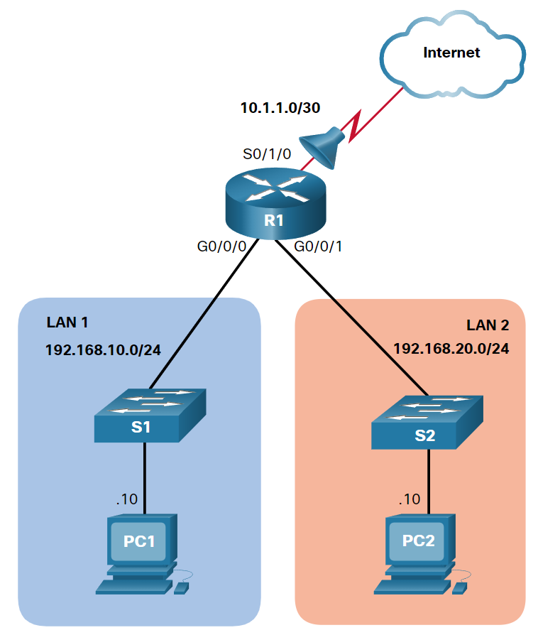
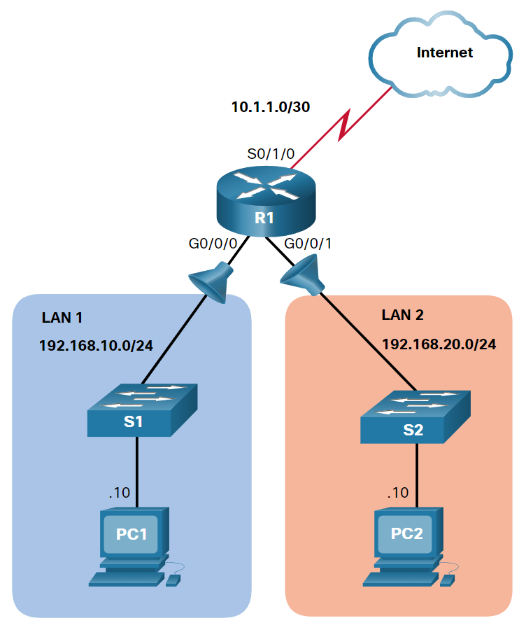
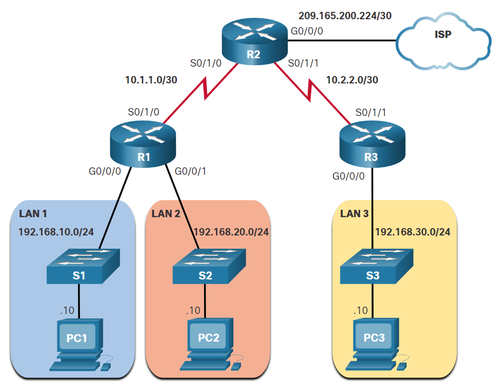
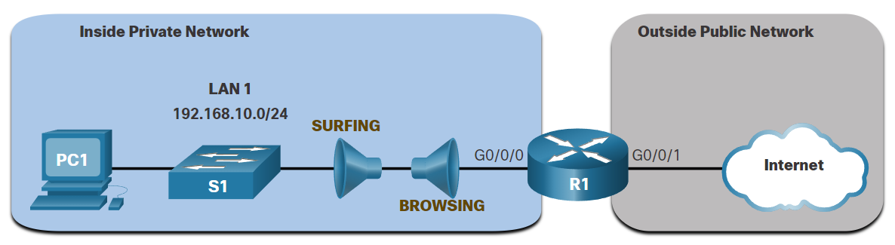

<style>
img[alt~="center"] {
  display: block;
  margin: 0 auto;
}
</style>

<style scoped>
h1 {
  font-size: 80px;
}
</style>

<!-- _class: invert -->

<!-- _paginate: false -->

# ACL Concepts and Configuration

<!-- _footer: 📕 CCNA3v7 Module 4 ACL Concepts + CCNA3v7 Module 5: ACLs for IPv4 Configuration\n🧑🏻‍🏫 Pedro Durán -->

---

# ACLs
- Used to filter packets based on information found in the packet header.
- Sequential list of **permit** or **deny** statements ➡️ **ACE (Access Control Entry)**
    - **Last ACE statement** ➡️ implicit **deny** that blocks all traffic.
- **Types of ACLs**: Standard / Extended
- **ACL Operation**:
  - **Inbound**: filters packets before they are routed to the outbound interface
  - **Outbound**: filters packets after being routed
> **⚠️ ACLs do not act on packets that originate from the router itself.**

- Limited Number of ACLs per Interface: 4 
  - Outbound IPv4 ACL + Outbound IPv6 ACL
  - Inbound IPv4 ACL + Inbound IPv6 ACL

---

# Wildcard Mask
- To determine which bits of the address to examine for a match:
  - Wildcard mask bit 0️⃣: **Match** the corresponding bit value in the address
  - Wildcard mask bit 1️⃣: **Ignore** the corresponding bit value in the address

> **💡 Subtract the subnet mask from 255.255.255.255**
- Keywords:
  - `host: 0.0.0.0`
  - `any: 255.255.255.255`

---

# Standard ACLs
- **Source IPv4 address only**
- Standard ACLs should be located **as close to the DESTINATION as possible.**
- Types:
  - Numbered
  - Named



---

# Numbered Standard ACLs: 1-99, 1300-1999
```
R1(config)# access-list 10 remark ACE permits ONLY host 192.168.10.10 to the internet
R1(config)# access-list 10 host 192.168.10.10
R1(config)# do show access-lists
Standard IP access list 10
    10 permit 192.168.10.10
R1(config)# access-list 10 remark ACE permits all host in LAN 2
R1(config)# access-list 10 192.168.20.0 0.0.0.255
R1(config)# do show access-lists
Standard IP access list 10
    10 permit 192.168.10.10
    20 permit 192.168.20.0, wildcard bits 0.0.0.255
R1(config)# interface s0/1/0
R1(config-if)# ip access-group 10 out
```
---

# Named Standard ACLs (preferred)
```
R1(config)# no access-list 10
R1(config)# ip access-list standard PERMIT-ACCESS
R1(config-std-nacl)# remark ACE permits host 192.168.10.10
R1(config-std-nacl)# permit host 192.168.10.10
R1(config-std-nacl)# remark ACE permits all hosts in LAN 2
R1(config-std-nacl)# permit 192.168.20.0 0.0.0.255
R1(config-std-nacl)# exit
R1(config)# interface s0/1/0
R1(config-if)# ip access-group PERMIT-ACCESS out
R1(config-if)# end
R1# show access-lists
R1# clear access-lists counters PERMIT-ACCESS
R1# show run | section access-list
R1# show ip int s0/1/0 | include access list
```

---

# Standard IPv4 ACLs Configuration Example



---

# <!--fit--> **Numbered ACL that denies host 192.168.10.10 but permits all other hosts in LAN 1**

1️⃣ Configure the ACL 20 ACE that denies the 192.168.10.10 host:
```
R1(config)#access-list 20 deny host 192.168.10.10
```

2️⃣ Create a numbered ACL 20 ACE that permits all other hosts in LAN 1 on network 192.168.10.0/24.
```
R1(config)#access-list 20 permit 192.168.10.0 0.0.0.255
```

3️⃣ Because the ACL 20 policies only apply to traffic from the LAN 1, the ACL would be best applied incoming to the G0/0/0 R1 interface.
```
R1(config)#interface g0/0/0
R1(config-if)#ip access-group 20 in
```
---

# <!--fit--> **Named ACL that permits host 192.168.10.10 but denies all other hosts access to LAN 2**

1️⃣ Configure a named standard ACL called LAN2-FILTER.
```
R1(config)#ip access-list standard LAN2-FILTER
```

2️⃣ Create an ACE that permits host 192.168.10.10
```
R1(config-std-nacl)#permit host 192.168.10.10
```

3️⃣ Deny all other hosts using the any keyword.
```
R1(config-std-nacl)#deny any
```

4️⃣ The LAN2-FILTER would be best applied outgoing to LAN 2.
```
R1(config)#interface g0/0/1
R1(config-if)#ip access-group LAN2-FILTER out
```

---

# Modify a Named Standard IPv4 ACL Example

```
R1# show access-lists
Standard IP access list NO-ACCESS
    10 deny   192.168.10.10
    20 permit 192.168.10.0, wildcard bits 0.0.0.255
R1# configure terminal
R1(config)# ip access-list standard NO-ACCESS
R1(config-std-nacl)# 15 deny 192.168.10.5
R1(config-std-nacl)# end
R1# show access-lists
Standard IP access list NO-ACCESS
    15 deny   192.168.10.5
    10 deny   192.168.10.10
    20 permit 192.168.10.0, wildcard bits 0.0.0.255 
```

---

# Modify a Numbered Standard IPv4 ACL Example

```
R1#show access-lists
Standard IP access list 1
    10 deny   19.168.10.10
    20 permit 192.168.10.0, wildcard bits 0.0.0.255
R1#configure terminal
R1(config)#ip access-list standard 1
R1(config-std-nacl)#no 10
R1(config-std-nacl)#10 deny host 192.168.10.10
R1(config-std-nacl)#end
R1#show access-lists
Standard IP access list 1
    10 deny   192.168.10.10
    20 permit 192.168.10.0, wildcard bits 0.0.0.255
```

---

# Secure VTY Ports with a Standard IPv4 ACL


---

```
R1(config)# username ADMIN secret class
R1(config)# ip access-list standard ADMIN-HOST
R1(config-std-nacl)# remark This ACL secures incoming vty lines
R1(config-std-nacl)# permit 192.168.10.10
R1(config-std-nacl)# deny any
R1(config-std-nacl)# exit
R1(config)# line vty 0 4
R1(config-line)# login local
R1(config-line)# transport input telnet
R1(config-line)# access-class ADMIN-HOST in
R1(config-line)# exit
R1(config)# line vty 0 4
R1(config-line)# login local
R1(config-line)# transport input ssh
R1(config-line)# access-class ADMIN-HOST in
R1(config-line)# end
```

---

# Extended ACLs
- Source and / or destination IPv4 address, protocol type, source and destination TCP or UDP ports and more.
- Extended ACLs should be located **as close to the SOURCE as possible.**
- Types:
  - Numbered
  - Named
```
R1(config)# access-list 100 permit tcp any any eq www
R1(config)# access-list 100 permit tcp any any eq 80 

R1(config)# access-list 100 permit tcp any any eq 22
R1(config)# access-list 100 permit tcp any any eq 443
```

---

# Numbered Extended IPv4 ACL Example



```
R1(config)# access-list 110 permit tcp 192.168.10.0 0.0.0.255 any eq www
R1(config)# access-list 110 permit tcp 192.168.10.0 0.0.0.255 any eq 443
R1(config)# interface g0/0/0
R1(config-if)# ip access-group 110 in
```
---
# <!--fit--> Named Extended IPv4 ACL Example (and established)

```
R1(config)# ip access-list extended SURFING
R1(config-ext-nacl)# Remark Permits inside HTTP and HTTPS traffic 
R1(config-ext-nacl)# permit tcp 192.168.10.0 0.0.0.255 any eq 80
R1(config-ext-nacl)# permit tcp 192.168.10.0 0.0.0.255 any eq 443
R1(config)# ip access-list extended BROWSING
R1(config-ext-nacl)# Remark Only permit returning HTTP and HTTPS traffic 
R1(config-ext-nacl)# permit tcp any 192.168.10.0 0.0.0.255 established
R1(config)# interface g0/0/0
R1(config-if)# ip access-group SURFING in
R1(config-if)# ip access-group BROWSING out
R1# show access-lists
Extended IP access list SURFING
    10 permit tcp 192.168.10.0 0.0.0.255 any eq www
    20 permit tcp 192.168.10.0 0.0.0.255 any eq 443 (124 matches) 
Extended IP access list BROWSING
    10 permit tcp any 192.168.10.0 0.0.0.255 established (369 matches) 
```
---

# Edit Extended ACLs

```
R1# show access-lists 
Extended IP access list BROWSING
    10 permit tcp any 192.168.10.0 0.0.0.255 established 
Extended IP access list SURFING
    10 permit tcp 19.168.10.0 0.0.0.255 any eq www
    20 permit tcp 192.168.10.0 0.0.0.255 any eq 443 
R1# configure terminal
R1(config)# ip access-list extended SURFING 
R1(config-ext-nacl)# no 10
R1(config-ext-nacl)# 10 permit tcp 192.168.10.0 0.0.0.255 any eq www
R1(config-ext-nacl)# end
R1# show access-lists 
Extended IP access list BROWSING
    10 permit tcp any 192.168.10.0 0.0.0.255 established 
Extended IP access list SURFING
    10 permit tcp 192.168.10.0 0.0.0.255 any eq www 
    20 permit tcp 192.168.10.0 0.0.0.255 any eq 443
```
---

# Another Named Extended IPv4 ACL Example


```
R1(config)# ip access-list extended PERMIT-PC1
R1(config-ext-nacl)# Remark Permit PC1 TCP access to internet 
R1(config-ext-nacl)# permit tcp host 192.168.10.10 any eq 20
R1(config-ext-nacl)# permit tcp host 192.168.10.10 any eq 21
R1(config-ext-nacl)# permit tcp host 192.168.10.10 any eq 22
R1(config-ext-nacl)# permit tcp host 192.168.10.10 any eq 23
R1(config-ext-nacl)# permit udp host 192.168.10.10 any eq 53
R1(config-ext-nacl)# permit tcp host 192.168.10.10 any eq 53
R1(config-ext-nacl)# permit tcp host 192.168.10.10 any eq 80
R1(config-ext-nacl)# permit tcp host 192.168.10.10 any eq 443
R1(config-ext-nacl)# deny ip 192.168.10.0 0.0.0.255 any 
R1(config)# ip access-list extended REPLY-PC1
R1(config-ext-nacl)# Remark Only permit returning traffic to PC1 
R1(config-ext-nacl)# permit tcp any host 192.168.10.10 established
R1(config)# interface g0/0/0
R1(config-if)# ip access-group PERMIT-PC1 in
R1(config-if)# ip access-group REPLY-PC1 out
```