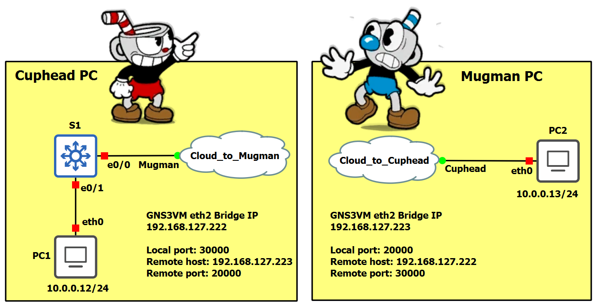
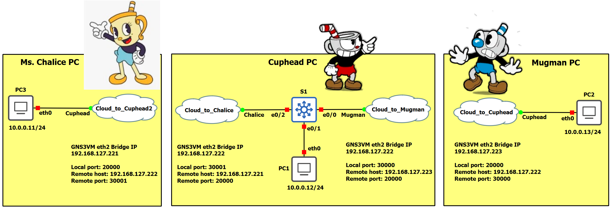

<style>
img[alt~="center"] {
  display: block;
  margin: 0 auto;
}
</style>

<style scoped>
h1 {
  font-size: 80px;
}
</style>

<!-- _class: invert -->

<!-- _paginate: false -->


<!-- _footer: 🧑🏻‍🏫 Pedro Durán -->

---

# GNS3 (Graphical Network Simulator-3)
Open-source network software emulator that allows the combination of virtual and real devices, used to simulate complex networks.


---

# Classroom GNS3 final configuration 


1️⃣ Edit `%APPDATA%\GNS3\2.2\gns3_server.ini` and change `Administrator` to your username (e.g. `alumne`):
```
images_path = C:\Users\alumne\GNS3\images
projects_path = C:\Users\alumne\GNS3\projects
appliances_path = C:\Users\alumne\GNS3\appliances
symbols_path = C:\Users\alumne\GNS3\symbols
configs_path = C:\Users\alumne\GNS3\configs
```

2️⃣ Download and import .ova from `GNS3.VM.VirtualBox.2.2.21.zip` https://github.com/GNS3/gns3-gui/releases/tag/v2.2.21


3️⃣ In GNS3 VM, add a **3rd Bridged network card**. Check **Promiscous mode: Allow all**.


---

# Install GNS3 at home

1️⃣ Download `GNS3-2.2.32-all-in-one.exe` from https://github.com/GNS3/gns3-gui/releases/tag/v2.2.21

2️⃣ Install selecting VirtualBox.

3️⃣ Download and import .ova from `GNS3.VM.VirtualBox.2.2.21.zip`


---

# Emulate PCs (Terminal) ➡️ Alpine Linux dockers

## Installation
1️⃣ File ➡️ New template

2️⃣ Install an appliance from the GNS3 server (recommended)

3️⃣ Guests ➡️ Alpine Linux

4️⃣ Install the appliance on the GNS3 VM 
(recommended)

## IP Configuration

- Before booting up: Right click ➡️ Edit config

---

# Emulate PCs (Graphical) ➡️ webterm dockers

## Installation
1️⃣ File ➡️ New template

2️⃣ Install an appliance from the GNS3 server (recommended)

3️⃣ Guests ➡️ webterm

4️⃣ Install the appliance on the GNS3 VM (recommended)

## IP Configuration

- Before booting up: Right click ➡️ Edit config

---

# Emulate Non-Managed Switches ➡️ Ethernet switch

:warning: Run Ethernet switch on **GNS3 VM**

# Emulate Cisco Managed Switches ➡️ Cisco IOU L2

1️⃣ Download and extract [Switch.rar](https://drive.google.com/file/d/1yAjvMrT-CBIH5UbBoauXd9xXE38Oy7Ya/view?usp=sharing)

2️⃣ File ➡️ Import appliance

3️⃣ Appliances ➡️ MultiLayer Switch - Cisco IOU L2


4️⃣ **Add License:** Edit ➡️ Preferences ➡️ IOS on UNIX. Paste the following:
```
[license]
gns3vm=73635fd3b0a13ad0;
```

---

# Emulate Cisco Managed Routers ➡️ Cisco IOU L3

1️⃣ Download and extract [Router.rar](https://drive.google.com/file/d/1WoUYqZYQR6FMQa-z-Jesx649Oq4OtYDk/view?usp=sharing)

2️⃣ Appliances ➡️ Router - Cisco IOU L3

3️⃣ When imported, right click ➡️ Configure template
  - Check `Use default IOU values for memories`. Set RAM size to 512 MB

4️⃣ **Add License:** Edit ➡️ Preferences ➡️ IOS on UNIX. Paste the following:
```
[license]
gns3vm=73635fd3b0a13ad0;
```

# Cisco Router SSH Connection with Linux 
```
ssh -oKexAlgorithms=+diffie-hellman-group14-sha1 -oHostKeyAlgorithms=+ssh-rsa -c aes128-cbc -l admin 10.0.1.1
```

---

# Switch Cisco IOU L2 15.2d Bugs

- 😡 Packets do not pass through switch (e.g. implementing InterVLAN Routing)
  - 😎 Disable CEF: `Switch(conf)# no ip cef`
  - 😎 Disable IGMP Snooping: `Switch(conf)# no ip igmp snooping`

- 😡 VTP does not synchronize VLANs
  - 😎 Disable VTP domain password: `Switch(conf)# no vtp password`

- 😡 SSH access not enabled
  - 😎 Use telnet connection on 15.2d or change the switch to version 15.6.0.9S


# Cisco Switch SSH Connection with Linux (15.6.0.9S)
```
ssh -oKexAlgorithms=+diffie-hellman-group1-sha1 -oHostKeyAlgorithms=+ssh-rsa -c aes128-cbc -l admin 192.168.99.2
```

---

# Emulate OS via VirtualBox

- :warning: In VirtualBox, **disconnect all network cards**
- Edit ➡️ Preferences ➡️ VirtualBox VMs ➡️ New
- Run this VirtualBox VM on my local computer
- Choose a VirtualBox VM from the list

# Emulate OS via Docker

- Edit ➡️ Preferences ➡️ Docker container ➡️ New
- Run this Docker container on the GNS3 VM
- New Image: image name from [Docker Hub](https://hub.docker.com/) (e.g. nginx)

---

# Docker - Enable data persistence

Add these folders to Configure ➡️ Advanced ➡️ Additional directories...
```
/bin
/boot
/dev
/etc
/gns3
/gns3volumes
/home
/lib
/lib64
/root
/sbin
/var
/usr
```

---

# Connect to Internet ➡️ NAT

- Fastest
- :warning: Run NAT on **GNS3 VM**
- :warning: Cannot access GNS3 topology from external network
- :warning: **Only in A22**: A22 uses 192.168.122.0/24 that conflicts with NAT default assigned range.
  - When loaded GNS3VM, press Enter (OK) ➡️ Shell
  - `virsh net-edit default`
  - Change `122` to another number (e.g. `112`)

---

# Connect to Internet ➡️ Cloud with bridged interface

- :warning: Drag **Cloud**, run on **GNS3VM** and connect to **eth2**
- :warning: **When using an Edge router:**
  - 1. Change MAC address of the interface connected to Cloud (one MAC assigned to each student): `R1(config-if)# mac-address aabb.cc00.0001`
  - 2. NAT overload is needed:
```
R1(config-if)# int e0/0
R1(config-if)# ip nat outside
R1(config-if)# int range e0/1-2
R1(config-if)# ip nat inside
R1(config-if)# exit
R1(config)# ip nat inside source list 1 interface e0/0 overload
R1(config)# access-list 1 permit 172.16.100.0 0.0.0.255
R1(config)# access-list 1 permit 172.16.200.0 0.0.0.255
```

---

# <!--fit--> Link GNS3 topologies on 2 different hosts with Cloud UDP tunnels



---

# <!--fit--> Link GNS3 topologies on 3 different hosts with Cloud UDP tunnels

