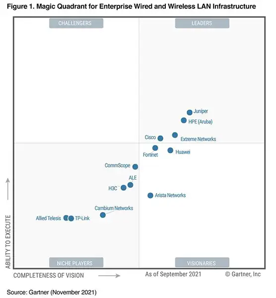
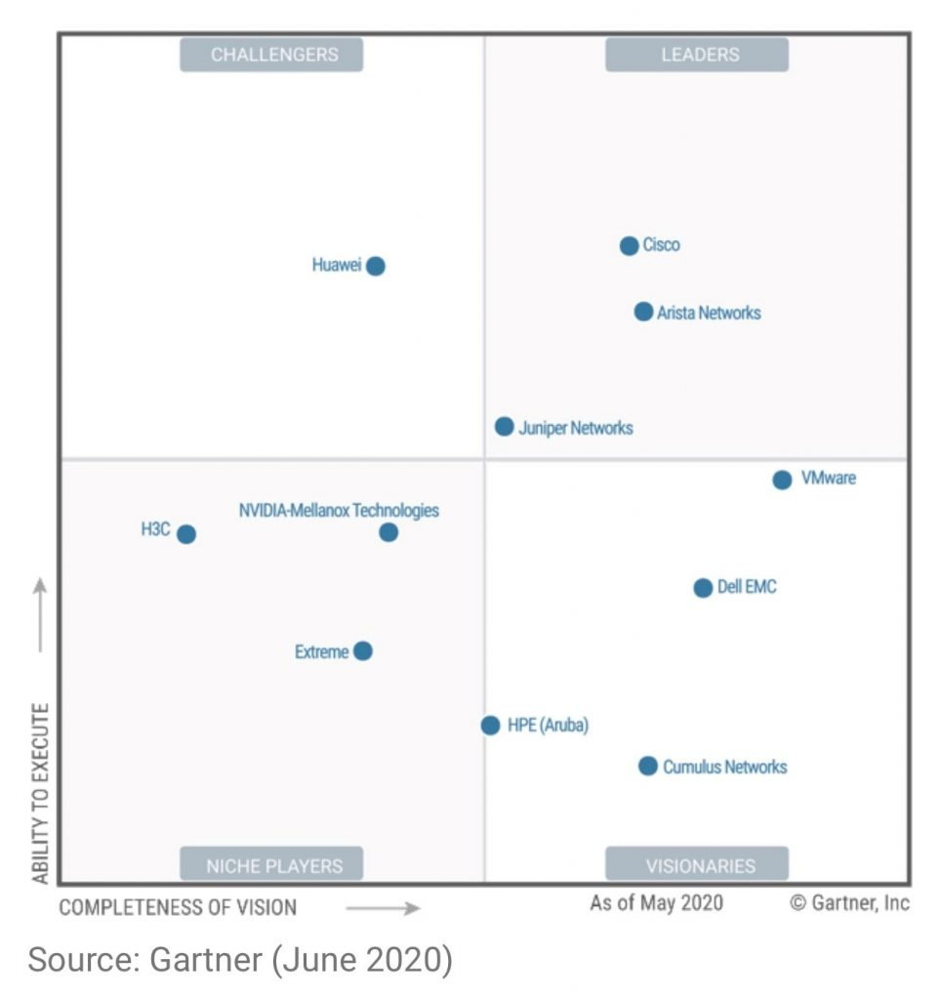
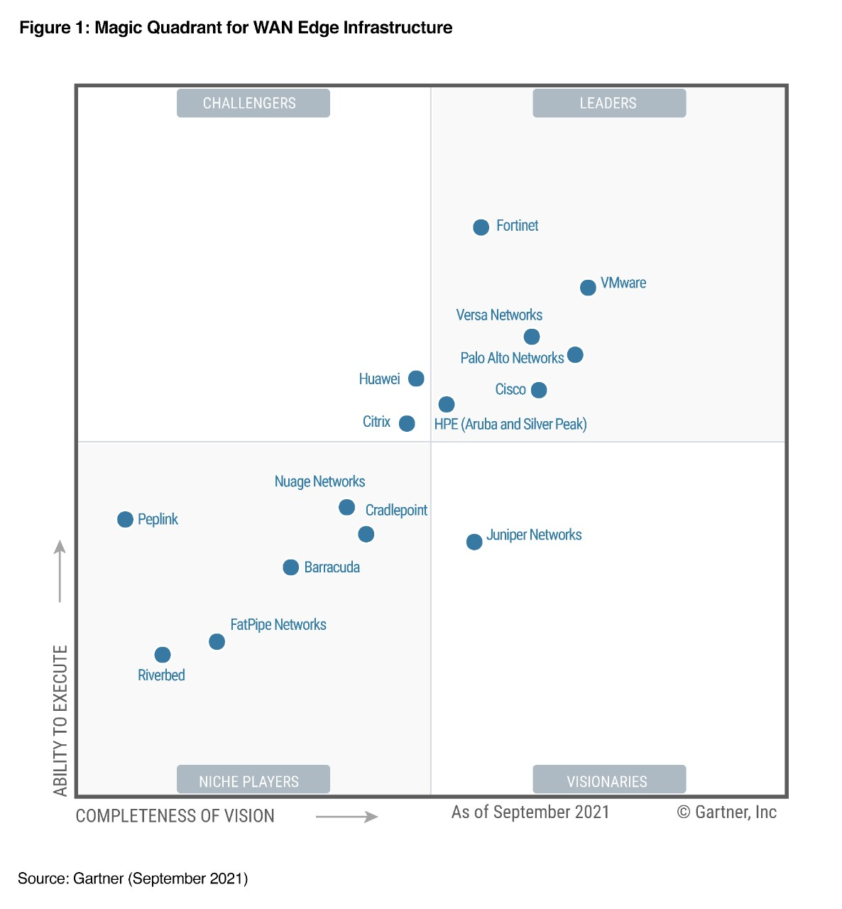
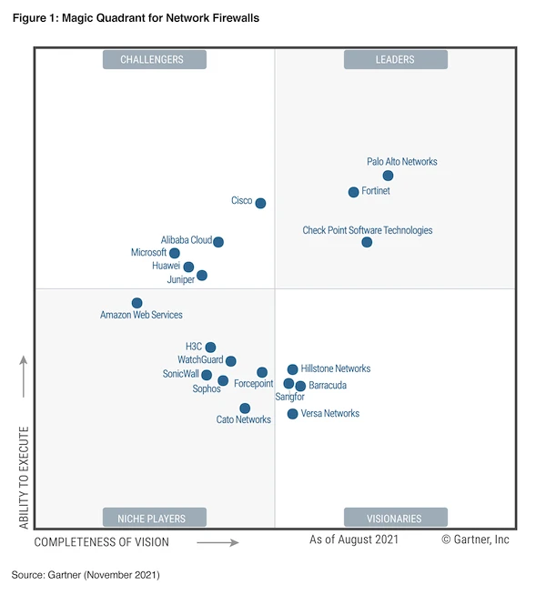
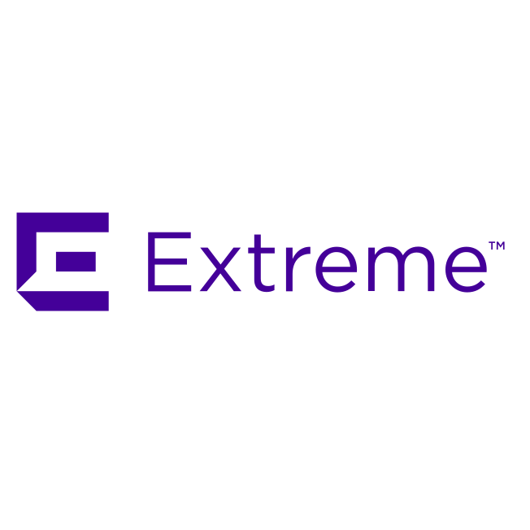

<!-- _class: invert -->

<!-- _paginate: false -->

# Networking Vendors

<!-- _footer: 🧑🏻‍🏫 Pedro Durán -->

---

<!-- _class: invert -->

# Gartner Magic Quadrants

---

# Enterprise Wired and Wireless LAN Infrastructure

---

# Data Center and Cloud Networking

---

# WAN Edge Infrastructure

---

# Network Firewalls

---

<!-- _class: invert -->

# Networking Vendors

---

---
<!-- _header: "" -->

# Switches 
- **EX Series Switch:** Access, Aggregation and Core
- **QFX Series Switch:** Spine-and-leaf

# Routers
- **MX Series Universal Router Platforms:** SDN
- **PTX Series Routers:** WAN core, Data Center
- **ACX Series Routers:** Metro access, Aggregation, Data Center
- **JRR200 Route Reflector Appliance:** Large service providers, Data Center, Enterprise Networks
- **SRX Series Gateways**

---
<!-- _header: "" -->
# Network & Firewall Security
- **SRX Series Gateways**
- **vSRX Virtual Firewall**
- **cSRX Container Firewall**

# Network Automation
- **Juniper Apstra**
- **Paragon Planner, Pathfinder, Active Assurance, Insights**

💻 **Operating System:** Junos OS

---

---

<!-- _header: "" -->

# Switches

- **Aruba CX Switches:** Access, Aggregation, Campus Core and Data Center

# Access Points
- Indoor access points
- Outdoor and ruggedized access points
- Remote and hospitality access points

---

<!-- _header: "" -->

# Aruba wireless gateways and controllers
- **Aruba 9200 Series Campus Gateways** 
- **Aruba 7200 Series Mobility Controllers**

# WAN
- **Aruba EdgeConnect Enterprise:** SD-WAN

# Security
- **Aruba ClearPass:** Network Access Control (NAC)

💻 **Operating System:** AOS-CX

---

---

<!-- _header: "" -->

# Switches
- **ExtremeSwitching**

# Routing
- **ExtremeRouting**

# Wireless
- **ExtremeWireless**

💻 **Operating System:** ExtremeXOS (EXOS)

---

---
<!-- _header: "" -->

# Switches
- **CloudEngine Series Switches:** Access, Aggregation and Core. Data Center
- **Agile Switches:** Aggregation and Core
- **S2700 Series Switches:** Access

# Routers
- **NetEngine Series 5000E:** Core
- **NetEngine Series 40E:** WAN Aggregation
- **NetEngine AR6100 Series Enterprise Router**: Branch
- **NetEngine AR650 Series Enterprise Routers**: SOHO
- **NetEngine AR1000V Virtual Router:** SD-WAN

---
<!-- _header: "" -->

# WLAN: Access points and access controllers
- **AirEngine**: Indoor, outdoor, access controllers

# Security
- **HiSecEngine:** Firewall and Application Security Gateway
- **AntiDDoS1000 Series:** DDoS Protection Systems

💻 **Operating System:** Huawei Versatile Routing Platform (VRP)

---

---

<!-- _header: "" -->

# Switches
- **Cisco Catalyst Series:** Access, Core and Distribution
- **Cisco Meraki Series:** Access, Core and Distribution
- **Cisco Nexus Series:** Data center and cloud

# Routers
- **ISR Series:** Integrated Services Router. Branch
- **NCS Series:** Network Convergence System. WAN Aggregation, Service Provider
- **ASR Series:** Aggregation Services Router. WAN Aggregation, Service Provider
- **Cisco 8000 Series:** Service Provider
- **Virtual:** IOS XRv 9000, Catalyst 8000V, CSR 1000V

---
<!-- _header: "" -->

# SD-WAN
- **Cisco Catalyst 8000 family**

# Security
- **Cisco ISE:** Identity Services Engine
- **Cisco Firepower:** Firewall

# Wireless
- **Cisco Catalyst 9000:** Access Points, Wireless Controllers, DNA Center, Meraki Dashboard

💻 **Operating System:** IOS, NX-OS